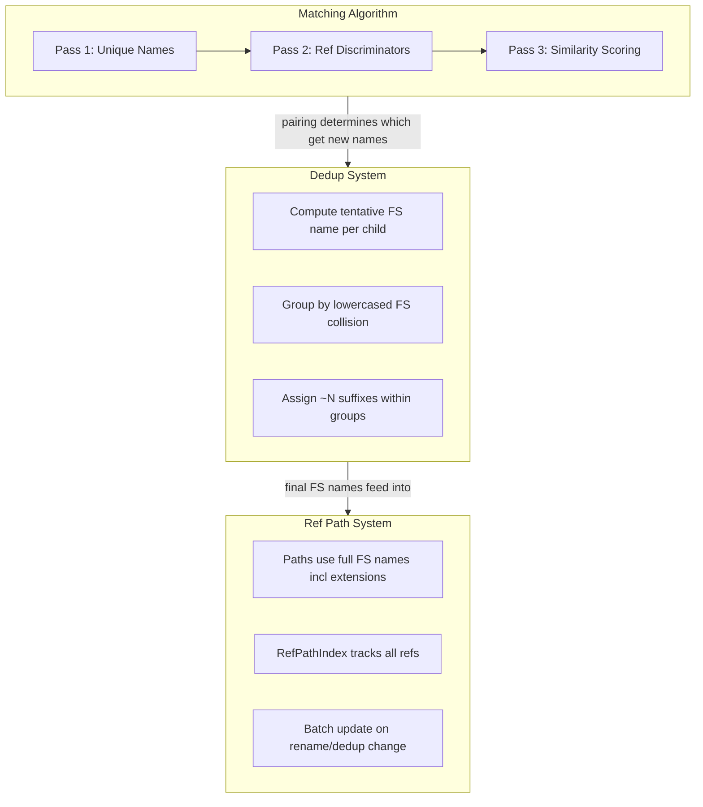

# Ambiguous Path Handling

## Architecture

The feature introduces three interlocking subsystems that replace the current "skip duplicates" approach:




**Execution order per sync operation:** Matching runs first (pairs instances), dedup runs second (assigns filesystem names), ref paths are computed last (using final filesystem names).

**Performance target:** System must handle large games (10K+ instances) with <100ms latency per operation. Architecture must not have O(n^2) bottlenecks on the full tree. The matching algorithm should only run on the affected subtree when possible. Optimization can be deferred but the structure must support it.

---

## Phase 1: Foundation - Remove Blacklist and Restructure Dedup

### 1a. Remove duplicate-skip blacklist (Rust)

`**[src/snapshot_middleware/dir.rs](src/snapshot_middleware/dir.rs)`** -- Remove the duplicate child detection and skip logic in `syncback_dir_no_meta()`:

- Lines 151-181: `child_name_counts` / `duplicate_names` HashSet construction
- Lines 235-239, 321-324: `if duplicate_names.contains(...) { continue; }` guards
- Related stats recording (`record_duplicate_names_batch`)

`**[src/snapshot_middleware/project.rs](src/snapshot_middleware/project.rs)`** -- Replace `bail!` on duplicate names with dedup suffix handling. Adapt the rbxm-ambiguous branch's case-insensitive detection (skip + warn), but instead of skipping, route through the new dedup system. **Important:** project KEYS are unique by JSON definition and do NOT participate in dedup themselves. Only filesystem children under project nodes need dedup when they collide. Evaluate whether to remove the warn-and-skip guard from the rbxm branch or keep it as a safety net.

`**[src/syncback/mod.rs](src/syncback/mod.rs)`** -- Remove `has_duplicate_children` detection used for skipping. Keep the infrastructure for detecting duplicates since it feeds into the dedup system.

### 1b. Remove duplicate-skip blacklist (Plugin)

Take the rbxm-ambiguous branch changes directly:

`**[plugin/src/Reconciler/diff.lua](plugin/src/Reconciler/diff.lua)`** -- Remove `findDuplicateNames()`, `ambiguousIds`, `scanForDuplicates()`, all `if ambiguousIds[id] then` guards, and the `skippedDuplicateCount` tracking. Duplicate-named instances now flow through diff normally.

`**[plugin/src/ChangeBatcher/encodeInstance.lua](plugin/src/ChangeBatcher/encodeInstance.lua)`** -- Remove `skippedDuplicateCount`, remove child duplicate skip loop, keep `isPathUnique` as a debug log (not a skip). Return single function instead of wrapper.

### 1c. Restructure syncback to two-pass child processing

`**[src/snapshot_middleware/dir.rs](src/snapshot_middleware/dir.rs)`** `syncback_dir_no_meta()` -- Replace the current one-at-a-time `with_joined_path()` loop with:

**Pass 1 -- Tentative names:** Iterate ALL children, call `get_best_middleware()` for each, compute tentative filesystem name (slug + extension for files, directory name for dirs). Also determine whether each instance would be file or directory (for init-style collision detection).

**Pass 2 -- Dedup grouping:** Group children by lowercased tentative filesystem name. Within each collision group (size > 1), assign ~N suffixes. The matching algorithm's pairing (Phase 2) determines which instances preserve existing filenames and which get new suffixes.

### 1d. Change dedup key semantics in file_names.rs

`**[src/syncback/file_names.rs](src/syncback/file_names.rs)`** -- The current `dedup_key` is a bare slug (without extension). Change it to be the **full filesystem name component** (slug + extension for files, directory name for dirs), lowercased.

Current dedup key for `Script "Foo"` = `"foo"` (bare slug).
New dedup key for `Script "Foo"` = `"foo.server.luau"` (full filesystem name).

This means:

- `Folder "Foo"` (key: `"foo"`) and `Script "Foo"` (key: `"foo.server.luau"`) do NOT collide -- correct.
- `Script "Foo" (server)` and `Script "Foo" (server)` both key: `"foo.server.luau"` -- collision, dedup applied.
- `Folder "Foo"` and init-style `Script "Foo"` both key: `"foo"` (both directories) -- collision, dedup applied.

Update `deduplicate_name()` to accept the full filesystem name as input and apply the suffix to the stem before the compound extension: `Foo~1.server.luau`, not `Foo.server~1.luau`.

### 1e. Suffix cleanup rules

Implement in a shared helper (used by syncback, change_processor, and api.rs):

- **Gap-tolerant deletion:** Deleting `~1` from `{Foo, Foo~1, Foo~2}` leaves `{Foo, Foo~2}`. No renumbering.
- **Base-name promotion:** Deleting `Foo` (base) from `{Foo, Foo~1, Foo~2}` promotes `Foo~1` to `Foo`. `Foo~2` stays.
- **Group-to-1 cleanup:** Deleting from `{Foo, Foo~1}` leaves one instance -- remove its suffix entirely (rename to clean name).

---

## Phase 2: Matching Algorithm

### 2a. Rust syncback matching (`src/syncback/matching.rs` -- new file)

Core 3-pass algorithm operating on `WeakDom` instances (syncback context):

```
Input:  new_children: Vec<Ref>  (from Roblox file WeakDom)
        old_children: Vec<Ref>  (from filesystem WeakDom)
        new_dom: &WeakDom, old_dom: &WeakDom
        hashes: &HashMap<Ref, Hash>  (precomputed by hash_tree)
Output: MatchResult { matched: Vec<(new_ref, old_ref)>,
                      unmatched_new: Vec<new_ref>,
                      unmatched_old: Vec<old_ref> }
```

**Pass 1 -- Unique names (O(n)):** Build name-count maps for both sides. Any name that appears exactly once on both sides is an instant match. **Within same-Name groups, ClassName is a fast first discriminator:** if two siblings share name "Part" but one is Part and one is MeshPart, and each (Name, ClassName) pair is unique on both sides, match them in Pass 1 without needing Pass 2/3. **Fast path:** if all names are unique (or all resolved by name+class), return immediately (skip P2+P3).

**Pass 2 -- Ref discriminators:** For remaining unmatched groups (same true Name), use pre-resolved Ref properties to differentiate. If instance A has a Ref pointing to a target already matched in P1, and only one candidate on the other side has the equivalent Ref, that's a match. Also consider incoming refs (other matched instances pointing TO a candidate). **Unmatched ref targets:** if a Ref target is itself in an unmatched ambiguous group (not resolved in Pass 1), treat it as a weaker signal -- compare target names/classes without requiring a confirmed match. Do NOT recursively match the target's group. If insufficient, the instance falls through to Pass 3.

**Pass 3 -- Similarity scoring:** For still-unmatched groups, narrow by ClassName first, then compute pairwise similarity using precomputed blake3 subtree hashes. Greedy best-match-first assignment: pick highest similarity pair, remove both, repeat. Tiebreaker: DOM child order (index in parent's children list).

**Ref pre-resolution (prerequisite):** Before any pass, resolve Ref properties on both sides. On the new side (Roblox file), Refs are WeakDom referents -- build a `Ref -> instance_path` map. On the old side (filesystem), Refs may be stored as `Rojo_Ref_`* attributes -- parse and resolve.

### 2b. Integrate into syncback_dir_no_meta (dir.rs)

In `syncback_dir_no_meta()`:

1. Call matching algorithm to pair `new_inst.children()` with old children
2. For matched pairs: preserve existing filesystem assignment (old instance keeps its filename)
3. For unmatched new: generate new filename via dedup system (Phase 1c)
4. For unmatched old: mark for deletion

### 2c. Forward sync matching (`src/snapshot/matching.rs` -- new file)

Same 3-pass algorithm but operating on `InstanceSnapshot` vs `RojoTree` instances:

```
Input:  snapshot_children: Vec<InstanceSnapshot>
        tree_children: Vec<Ref>  (RojoTree instance IDs)
        tree: &RojoTree
Output: MatchResult { matched, unmatched_snapshot, unmatched_tree }
```

Key differences from syncback version:

- **True Name resolution from filesystem:** On the filesystem side, resolving the true Instance.Name is non-trivial. Resolution chain: (1) `name` field in `.meta.json5` if present (overrides filename), (2) `name` field in `.model.json5`, (3) filename stem after stripping extensions and script suffixes (if no meta override). The matching algorithm must resolve all true Names before building groups. On the tree/plugin side, `Instance.Name` / `instance.name()` is readily available.
- **Ref pre-resolution fallback order:** Try the old RojoTree FIRST (most refs target existing instances). If the path can't be resolved in the old tree (target is a new instance), fall back to walking the snapshot tree. The snapshot is only a subtree (the re-snapshotted directory), so this fallback only works for refs within the same subtree. Refs to new instances outside the current snapshot remain unresolved and are skipped during matching (treated as nil).
- Snapshot children have `Rojo_Ref_`* as string paths in attributes -- resolve against tree (then snapshot) before matching
- Tree children have Refs as UIDs -- already resolved
- Hash infrastructure: snapshot side doesn't have precomputed hashes yet -- compute structural fingerprint on demand

### 2d. Integrate into patch_compute.rs

Replace the greedy name+class matching in `compute_children_patches()` with the forward sync matching algorithm. The current code:

```6:17:src/snapshot/patch_compute.rs
// Current: greedy first-match by name+class
.find(|(instance_index, instance_child_id)| {
    if paired_instances[*instance_index] { return false; }
    snapshot_child.name == instance_child.name()
        && snapshot_child.class_name == instance_child.class_name()
})
```

Becomes: call to matching algorithm, then iterate matched pairs for recursive `compute_patch_set_internal()`, add unmatched snapshots as `PatchAdd`, add unmatched tree children as `removed_instances`.

### 2e. Matching cache

Add an optional cache mapping `parent_ref -> (children_list_hash, match_assignments)` to avoid re-running the full algorithm when children haven't changed. Invalidate per-parent when a child is added, removed, or renamed under that parent. During two-way sync, each `/api/write` mutation invalidates the affected parent's cache.

---

## Phase 3: Ref Path System

### 3a. Switch to filesystem-name-based paths

`**[src/rojo_ref.rs](src/rojo_ref.rs)**` -- `ref_target_path()`:

Current: uses `escape_ref_path_segment(&inst.name)` producing instance-name paths like `"Workspace/A\/B"`.

New: uses the **full filesystem name** of each instance (slug + extension + dedup suffix for files; directory name + dedup suffix for dirs). Path from DataModel's children downward.

Examples:

- `Folder "Foo"` -> segment `"Foo"`
- `ModuleScript "Foo"` -> segment `"Foo.luau"`
- `Script "Foo"` (server) -> segment `"Foo.server.luau"`
- `Script "Foo"` with children (init-style) -> segment `"Foo"` (directory)
- Dedup'd `ModuleScript "Foo"` -> segment `"Foo~1.luau"`

Remove `escape_ref_path_segment()`, `unescape_ref_path_segment()`, `split_ref_path()`. Path splitting becomes a simple `path.split('/')` since filesystem names can't contain `/` (slugified to `_`).

### 3b. Filesystem-name resolution in tree.rs

`**[src/snapshot/tree.rs](src/snapshot/tree.rs)`** -- `get_instance_by_path()`:

Current: walks tree matching each segment against `child.name` (instance name).

New: walks tree matching each segment against the **filesystem name** of each child. Derive from:

1. `instigating_source` filename/dirname (for file-backed instances)
2. Fallback: compute what the filesystem name WOULD be (slugify name + middleware extension) for instances without instigating_source (e.g., inside .rbxm files, newly added)

### 3c. Update ref_properties.rs

`**[src/syncback/ref_properties.rs](src/syncback/ref_properties.rs)`:**

`link_referents()` currently writes path-based (`Rojo_Ref`_*) using instance-name paths. Update to use filesystem-name paths (the dedup'd filenames assigned during syncback).

`collect_referents()` currently uses `is_path_unique` to decide between path-based and ID-based linking. With the dedup system, ALL paths are unique (filesystem names are unique by definition). Simplify: always use path-based linking for file-backed instances. Fall back to `$id`/`Rojo_Target`_* only for instances without filesystem backing (inside .rbxm files).

### 3d. Update patch_apply.rs

`**[src/snapshot/patch_apply.rs](src/snapshot/patch_apply.rs)`:**

Update the ref resolution in `finalize_patch_application()` to use the new filesystem-name-based `get_instance_by_path()`.

### 3e. Ref path update infrastructure

Extend `RefPathIndex` and `update_ref_paths_after_rename()` in [change_processor.rs](src/change_processor.rs) to handle all cases:

- Instance rename -> slug change -> all refs to it and descendants update
- Dedup reassignment -> suffix change -> all refs update
- Reparenting -> entire ancestor path changes -> all refs update
- Script type transition -> extension change -> all refs through this instance update
- File-to-folder transition -> segment format change -> all refs update
- Batch writes: collect ALL affected ref updates, write each file once

---

## Phase 4: Two-Way Sync Integration

### 4a. change_processor.rs

`**[src/change_processor.rs](src/change_processor.rs)`:**

- **VFS echo prevention for dedup renames:** When suffix cleanup renames files (e.g., `Attachment~1` -> `Attachment`), call `suppress_path()` / `suppress_path_any()` for both old and new paths before the rename. **New instance additions must NOT be suppressed** -- the VFS watcher needs to pick up new files for forward sync.
- **Dedup suffix cleanup on deletion:** When a child deletion triggers suffix cleanup (base-name promotion or group-to-1), perform the rename and ref path updates.
- **Self-initiated rename tagging:** Tag dedup-triggered renames so `handle_vfs_event()` recognizes them as self-initiated and skips re-snapshotting.

### 4b. api.rs

`**[src/web/api.rs](src/web/api.rs)`:**

- **Two-pass /api/write:** First pass: apply ALL mutations (renames, property changes, adds, removes) to the tree. Second pass: recompute all affected ref slug paths based on final tree state. This ensures refs always use newest slugs.
- **4 file format branches in `syncback_updated_properties()`:** Each branch must compute the correct dedup'd filename for the meta/model file. When an instance has a dedup suffix, the meta path includes it: `Foo~1.meta.json5`, `Foo~1/init.meta.json5`, etc.
- **Added instances in dedup groups:** `syncback_added_instance()` must check for filesystem-name collisions with existing siblings and assign appropriate ~N suffix.
- **Dual write path consistency:** File writes and PatchSet sent to ChangeProcessor must use the same dedup'd names.

---

## Phase 5: Plugin Updates

### 5a. Lua matching algorithm (plugin/src/Reconciler/matching.lua -- new file)

`**[plugin/src/Reconciler/hydrate.lua](plugin/src/Reconciler/hydrate.lua)`:**

Replace the current name+class greedy matching with the 3-pass algorithm:

- **Pass 1:** Unique name matching (same as Rust)
- **Pass 2:** Ref discriminators. Server sends virtual instances with UIDs. Plugin resolves UIDs via instanceMap. If a Ref property on a virtual instance points to UID-7 (already matched in P1), and only one Studio candidate has the equivalent Ref, match.
- **Pass 3:** Structural fingerprinting with XXH32. Fingerprint = hash of (child count + sorted child name+class pairs). Do NOT hash full property values (too expensive). For actual similarity scoring, compare properties directly with early-exit ordering: ClassName -> Tags -> Attributes -> scalar properties -> Source (last, most expensive).

`**[plugin/src/XXH32.luau](plugin/src/XXH32.luau)`** -- New file containing the XXH32 implementation from the spec (lines 239-350 of the prompt).

**Caching:** Compute structural fingerprints LAZILY (only for instances entering Pass 3). Cache for duration of the matching call, not across calls.

### 5b. ChangeBatcher updates

`**[plugin/src/ChangeBatcher/init.lua](plugin/src/ChangeBatcher/init.lua)`:** Handle duplicate-named instances flowing through the batcher without skipping.

### 5c. Confirmation dialog

Dedup suffix renames, ref path updates, and meta file changes triggered by the matching algorithm must appear in the review UI in Always and Initial sync modes. No silent application.

---

## Phase 6: Cherry-Picks from rbxm-ambiguous

Selectively take these from the `rbxm-ambiguous` branch:

- **Plugin relaxations** (diff.lua, encodeInstance.lua) -- already described in Phase 1b
- **Roundtrip test improvements** (`[tests/tests/syncback_roundtrip.rs](tests/tests/syncback_roundtrip.rs)`) -- Vec-based `compare_children` (handles duplicates correctly), Tags comparison in `compare_properties`
- **project.rs case-insensitive detection** -- case-insensitive name counting for duplicate detection (adapt for dedup instead of skip)
- **macOS ref_properties test ignore** -- platform-specific test attribute

**Do NOT take:** `ambiguous_container` metadata, `find_rbxm_container`, `reserialize_rbxm_container`, rbxm fallback block, ambiguous test fixtures that output .rbxm files.

**Non-requirement: no .rbxm transition logic.** Syncback rewrites the filesystem from scratch (clean) or matches instances to existing files (incremental) -- either way, old .rbxm containers simply don't get recreated. User-intentional .rbxm files placed manually in their project still load fine via `snapshot_rbxm` during forward sync -- that's unchanged. Do not build migration code for converting old .rbxm files.

---

## Phase 7: Testing

### Shared test vectors

Create structured test data (JSON or Rust structs) defining:

- Two lists of instance descriptions (name, class, properties, refs, children)
- Expected match pairing output

Both Rust implementations and the Lua implementation must produce identical pairings for all vectors.

### Test scenarios (minimum required from spec)

**Dedup:** Two identical Folders, Folders with different children, Folders with identical content (tiebreaker test), Folder + Script same name (no dedup), Folder + init-style Script (dedup), natural tilde name ("Foo~1" slugifies differently), third duplicate added, suffix cleanup (group-to-1), gap tolerance, base-name promotion, idempotency, roundtrip.

**Ref paths:** Basic ref survives syncback, ref to dedup'd instance, ref survives gap-tolerant deletion, ref survives base-name promotion, ref survives group-to-1, ref survives rename, ref survives reparent, deeply nested through dedup layers, cross-file ref update, ref to deleted instance, tilde-named instance ref, two-way sync ref update, concurrent ref+rename, forward sync manual edit, fallback to $id, mass ref stress test (50+ instances).

**Matching:** ClassName discriminator, Ref discriminator, property similarity, matching stability, preserves existing pairings, fast path verification.

**Dedup collision:** Folder + ModuleScript (no collision), Folder + Folder (collision), Server + Client script (no collision), Server + Server (collision), ModuleScript + ModuleScript, slug collision ("Foo?" + "Foo*"), case-insensitive collision ("Foo" + "foo").

**Cross-system integration:** Full roundtrip with duplicates, incremental syncback after rename, two-way sync add/delete, forward sync edit dedup'd file, slugify+dedup interaction, project file + filesystem duplicates.

**Sync invariants:** CLI syncback parity, 4 file format branches, compound extension dedup, InstigatingSource after dedup, file-to-folder transition with dedup, script type transition in dedup group, dual write path consistency, review dialogue with dedup, atomicity, determinism, idempotency, pre-seeded dedup.

### Test infrastructure

- Syncback test fixtures in `[rojo-test/syncback-tests/](rojo-test/syncback-tests/)`
- Build test fixtures in `[rojo-test/build-tests/](rojo-test/build-tests/)`
- Integration tests in `[tests/tests/](tests/tests/)`
- Generate .rbxm fixtures programmatically (see `tests/generate_ambiguous_fixtures.rs` from rbxm-ambiguous branch)

---

## Key Invariants to Preserve

1. **Round-trip identity:** syncback -> build -> compare = bit-identical trees
2. **CLI syncback parity:** two-way sync produces byte-identical filesystem output to CLI syncback
3. **Determinism:** same input always produces same filesystem output (sorted child ordering, deterministic suffix assignment)
4. **INSTIGATING SOURCE consistency:** dedup'd paths reflected in InstigatingSource::Path
5. **Compound extensions:** suffix before compound extension (`Foo~1.server.luau`, not `Foo.server~1.luau`)
6. **Meta pairing:** `Foo~1.server.luau` pairs with `Foo~1.meta.json5` (strip script suffix, keep dedup suffix)

---

## Key Files Changed


| File                                          | Change                                                       |
| --------------------------------------------- | ------------------------------------------------------------ |
| `src/syncback/file_names.rs`                  | Dedup key = full FS name; suffix on stem before compound ext |
| `src/syncback/dir.rs` (snapshot_middleware)   | Two-pass child processing; remove blacklist                  |
| `src/syncback/matching.rs` (NEW)              | 3-pass matching algorithm for syncback                       |
| `src/snapshot/matching.rs` (NEW)              | 3-pass matching algorithm for forward sync                   |
| `src/snapshot/patch_compute.rs`               | Replace greedy matching with algorithm                       |
| `src/snapshot/patch_apply.rs`                 | Update ref resolution for FS-name paths                      |
| `src/snapshot/tree.rs`                        | `get_instance_by_path()` uses FS names                       |
| `src/rojo_ref.rs`                             | FS-name paths; remove escape/split; update `ref_target_path` |
| `src/syncback/ref_properties.rs`              | FS-name-based linking; simplify path uniqueness              |
| `src/change_processor.rs`                     | VFS echo for dedup renames; suffix cleanup                   |
| `src/web/api.rs`                              | Two-pass write; dedup in all 4 branches                      |
| `src/snapshot_middleware/project.rs`          | Replace bail with dedup; case-insensitive                    |
| `plugin/src/Reconciler/hydrate.lua`           | 3-pass matching algorithm (Lua)                              |
| `plugin/src/Reconciler/diff.lua`              | Remove blacklist                                             |
| `plugin/src/ChangeBatcher/encodeInstance.lua` | Remove blacklist                                             |
| `plugin/src/XXH32.luau` (NEW)                 | Hash function for Lua-side fingerprinting                    |


