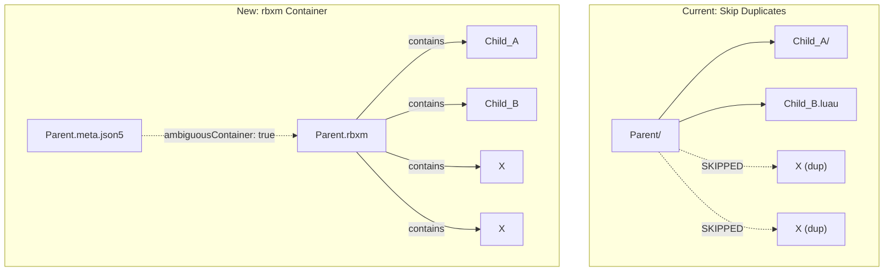

# Ambiguous Path rbxm Container System

## Architecture

### Key Concept

An **ambiguous container** is an instance whose direct children include two or more with the same name (case-insensitive). Instead of skipping duplicates, the parent instance is serialized as a single `.rbxm` file containing its entire subtree.




### Deepest-level rule

Only the most nested ancestor with duplicate children becomes a container. If `Outer/Inner` where only `Inner` has duplicate children, `Inner` becomes `Inner.rbxm` and `Outer` stays a directory.

### Lifecycle: creation, re-serialization, expansion

1. **Creation**: Duplicate children detected during syncback or two-way sync -- parent serialized as `.rbxm` + adjacent `.meta.json5` with `ambiguousContainer: true`
2. **Re-serialization**: Property/structure changes on instances inside the container trigger re-write of the `.rbxm` from the in-memory tree
3. **Expansion**: When duplicates are resolved (rename/delete), the container expands back to individual files; the `ambiguousContainer` flag distinguishes auto-created containers from user-intentional `.rbxm` files

### Container tracking on disk

Adjacent `.meta.json5` alongside the `.rbxm`:

```json5
{
  ambiguousContainer: true,
  name: "Real Name", // only if slugified
}
```

This prevents auto-expansion of user-intentional `.rbxm` files that happen to have unique-named children.

---

## Phase 1: Core Infrastructure

### 1a. Add `ambiguous_container` to InstanceMetadata

**File:** [src/snapshot/metadata.rs](src/snapshot/metadata.rs)

Add `pub ambiguous_container: bool` (default `false`) to `InstanceMetadata`. Add builder method. Include in serde (skip_serializing_if false).

### 1b. Add `ambiguousContainer` to AdjacentMetadata

**File:** [src/snapshot_middleware/meta_file.rs](src/snapshot_middleware/meta_file.rs)

Add `#[serde(default, skip_serializing_if = "Option::is_none")] pub ambiguous_container: Option<bool>` to `AdjacentMetadata`. Update `is_empty()`. Add `apply_ambiguous_container()` that sets the metadata flag on an `InstanceSnapshot`.

### 1c. Shared duplicate-children detector

**File:** [src/syncback/mod.rs](src/syncback/mod.rs) (exported helper)

```rust
pub fn has_duplicate_children(dom: &WeakDom, inst_ref: Ref) -> bool
```

Case-insensitive name comparison. Returns `true` on first duplicate found (early exit for performance).

### 1d. Find rbxm container ancestor

**File:** [src/snapshot/tree.rs](src/snapshot/tree.rs) (method on `RojoTree`)

```rust
pub fn find_rbxm_container(&self, instance_id: Ref) -> Option<(Ref, PathBuf)>
```

Walks up from `instance_id`. For each ancestor, checks if `instigating_source` is a `Path` ending in `.rbxm`. Returns the first match. Returns `None` if a non-rbxm `InstigatingSource` is found first (instance is outside any rbxm).

### 1e. Re-serialize rbxm container helper

**File:** [src/web/api.rs](src/web/api.rs) (or a shared helper module)

```rust
fn reserialize_rbxm_container(tree: &RojoTree, container_ref: Ref, rbxm_path: &Path) -> Result<Vec<u8>>
```

Uses `rbx_binary::to_writer(tree.inner(), &[container_ref])` to serialize the container and all children from the in-memory tree. Returns the binary bytes.

---

## Phase 2: Syncback -- rbxm Container Creation and Expansion

### 2a. Replace duplicate-skip with error in dir middleware

**File:** [src/snapshot_middleware/dir.rs](src/snapshot_middleware/dir.rs)

In `syncback_dir_no_meta` (around lines 151-181), replace the current logic that detects duplicates and then skips them in the processing loop. Instead, when duplicates are detected, return an `Err` with a descriptive message like `"directory has duplicate-named children: {names}"`. This triggers the existing rbxm fallback in the main syncback loop.

Remove the `duplicate_names` HashSet and the `continue` statements that skip duplicates (lines ~235-238, ~321-324).

### 2b. Extend rbxm fallback to all Dir-like middlewares

**File:** [src/syncback/mod.rs](src/syncback/mod.rs) (lines 524-552)

Currently the fallback only matches `Middleware::Dir`:

```rust
Err(err) if middleware == Middleware::Dir => { ... }
```

Extend to match all Dir variants. Add a helper `fn is_dir_middleware(m: Middleware) -> bool` that returns true for `Dir`, `ServerScriptDir`, `ClientScriptDir`, `ModuleScriptDir`, `PluginScriptDir`, `LegacyScriptDir`, `LocalScriptDir`, `CsvDir`. Use this in the match arm.

### 2c. Write adjacent meta file in fallback block

**File:** [src/syncback/mod.rs](src/syncback/mod.rs) (inside the fallback block, after rbxm creation)

After `new_middleware.syncback(&new_snapshot)` succeeds, build an `AdjacentMetadata` with:

- `ambiguous_container: Some(true)`
- `name`: set if `snapshot.needs_meta_name` is true (slugified name differs from real name)

Serialize to JSON5 and add to the `FsSnapshot` via `with_added_file`. The meta path is the rbxm path with extension replaced: `Container.rbxm` -> `Container.meta.json5` (use `path.with_extension("meta.json5")`).

### 2d. Expansion: rbxm back to directory when resolved

**File:** [src/syncback/mod.rs](src/syncback/mod.rs) in `get_best_middleware` (lines 937-995)

Add logic at the top of the function: if old middleware is `Rbxm` AND the old instance has `ambiguous_container: true` in its metadata, check if the NEW instance's children still have duplicates (using `has_duplicate_children`). If no duplicates remain:

- Fall through to the normal middleware selection (skipping the `old_middleware` preservation)
- The main loop will use Dir/ScriptDir instead of Rbxm
- The old `.rbxm` and `.meta.json5` files get removed via `removed_children` or explicit removal

Need to also handle the filesystem cleanup: in the main syncback loop, when the middleware changes from Rbxm to Dir, remove the old rbxm file and meta file. Add this to the `removed_children` processing or handle it explicitly.

---

## Phase 3: Forward Sync -- Meta File Support for rbxm

### 3a. Read adjacent meta file in snapshot_rbxm

**File:** [src/snapshot_middleware/rbxm.rs](src/snapshot_middleware/rbxm.rs) (in `snapshot_rbxm`, after creating the snapshot)

After creating the `InstanceSnapshot`, check for an adjacent `.meta.json5` file:

```rust
let meta_path = path.with_extension("meta.json5");
if let Ok(meta_contents) = vfs.read(&meta_path) {
    let meta: AdjacentMetadata = json5::from_str(&meta_contents)?;
    // Apply name override
    if let Some(name) = &meta.name {
        snapshot = snapshot.name(name.clone());
    }
    // Apply ambiguous_container flag
    let mut metadata = snapshot.metadata.clone();
    metadata.ambiguous_container = meta.ambiguous_container.unwrap_or(false);
    // Add meta path to relevant_paths
    let mut relevant = metadata.relevant_paths.clone();
    relevant.push(vfs.canonicalize(&meta_path)?);
    metadata.relevant_paths = relevant;
    snapshot = snapshot.metadata(metadata);
}
```

This ensures:

- The snapshot has the correct instance name (from meta `name` field)
- The `ambiguous_container` flag propagates to the RojoTree metadata
- Changes to the meta file trigger re-snapshotting

---

## Phase 4: Two-Way Sync Server

### 4a. Property updates for instances inside rbxm containers

**File:** [src/web/api.rs](src/web/api.rs) in `syncback_updated_properties`

Add a new early branch (before the 4 existing format branches, around line 2658). When `instigating_source` is `None`:

1. Call `tree.find_rbxm_container(update.id)` to find the container
2. If found: apply the property change to the in-memory tree (already happens upstream), then call `reserialize_rbxm_container()` and write the file with `suppress_path`
3. Return early (skip the normal meta file writing)
4. If NOT found: log warning and return (same as current behavior for missing instigating_source)

**File:** [src/change_processor.rs](src/change_processor.rs) in Source property handling (lines 1536-1576)

Same logic: when `instigating_source` is None, check for rbxm container ancestor. If found, re-serialize the rbxm.

### 4b. Instance addition under rbxm container

**File:** [src/web/api.rs](src/web/api.rs) in `syncback_added_instance`

When the parent is inside an rbxm container (parent has no `instigating_source` or parent's `instigating_source` is a `.rbxm`):

1. Add the instance to the in-memory tree
2. Find the container ancestor
3. Re-serialize the rbxm
4. Write the file with `suppress_path`
5. Do NOT create individual files on disk
6. Include the instance in the PatchSet so the plugin gets the addition

### 4c. Instance removal from rbxm container

**File:** [src/web/api.rs](src/web/api.rs) in removal handling

When removing an instance inside an rbxm container:

1. Remove from the in-memory tree
2. Find the container ancestor
3. Check if the container still has duplicates (`has_duplicate_children`)
4. If yes: re-serialize the rbxm, write file
5. If no: trigger expansion (see 4f)
6. Suppress VFS events

### 4d. Rename creating duplicate -- directory to rbxm transition

**File:** [src/change_processor.rs](src/change_processor.rs) in rename handling (lines 1094-1386)

After processing a rename, check if the parent now has duplicate children. If yes:

1. Serialize the parent's subtree as rbxm using `rbx_binary::to_writer(tree.inner(), &[parent_ref])`
2. Write `Parent.rbxm` and `Parent.meta.json5` with `ambiguousContainer: true`
3. Delete the old directory and all its files (recursively)
4. Update parent's `InstigatingSource` to the rbxm path
5. Clear `InstigatingSource` for all descendant instances (they're now inside the rbxm)
6. Suppress all VFS events for deleted files and new rbxm file

### 4e. Addition creating duplicate -- directory to rbxm transition

**File:** [src/web/api.rs](src/web/api.rs) in `syncback_added_instance`

After adding an instance, check if the parent now has duplicate children. If yes, trigger the same directory-to-rbxm transition as 4d.

### 4f. rbxm to directory transition (duplicate resolved)

**File:** [src/change_processor.rs](src/change_processor.rs) and [src/web/api.rs](src/web/api.rs)

When a rename or removal resolves the last duplicate under a container with `ambiguous_container: true`:

1. Read the container's children from the in-memory tree
2. Run a "mini-syncback" for each child: determine middleware, write individual files (scripts, directories, meta files)
3. Update `InstigatingSource` for each instance to point to its new file path
4. Delete the `.rbxm` and `.meta.json5` files
5. Suppress all VFS events

This is the most complex operation. Reuse existing logic from `syncback_added_instance` (which already knows how to write instances to disk) for each child. Process children in alphabetical order for determinism.

---

## Phase 5: Plugin Changes

### 5a. Relax duplicate-skip in encodePatchUpdate

**File:** [plugin/src/ChangeBatcher/encodePatchUpdate.lua](plugin/src/ChangeBatcher/encodePatchUpdate.lua)

Remove the path uniqueness check that causes property changes to be skipped for instances with duplicate siblings. The server handles these instances via rbxm re-serialization.

### 5b. Relax duplicate-skip in encodeInstance

**File:** [plugin/src/ChangeBatcher/encodeInstance.lua](plugin/src/ChangeBatcher/encodeInstance.lua)

Remove `isPathUnique()` check and `findDuplicateNames` child filtering that prevents encoding of instances with duplicate siblings. Keep `findDuplicateNames` as a logging utility (warn but don't skip). The server determines whether to create individual files or rbxm containers.

### 5c. Relax duplicate-skip in diff.lua

**File:** [plugin/src/Reconciler/diff.lua](plugin/src/Reconciler/diff.lua)

Remove `scanForDuplicates()`, `markSubtreeAmbiguous()`, and the `ambiguousIds` skip logic throughout `diffInternal`. Allow the diff system to process instances with duplicate names.

**Known limitation**: For duplicate-named instances, the ordered matching (first-match by name+class) may pair incorrectly during reconnection hydration. This is acceptable for the stepping-stone phase; Phase 2 (N-to-M matching) will address it.

### 5d. Remove duplicate filtering from server api.rs

**File:** [src/web/api.rs](src/web/api.rs)

Remove `filter_duplicate_children()`, `compute_tree_refs_with_duplicate_siblings()`, `is_tree_path_unique_with_cache()`, and the parent path uniqueness bail in `syncback_added_instance`. These are replaced by the rbxm container logic.

Keep `is_ref_path_unique()` for ref property handling (Phase 6).

### 5e. Remove duplicate filtering from syncback stats

**File:** [src/syncback/stats.rs](src/syncback/stats.rs)

Replace `record_duplicate_name()` and `record_duplicate_names_batch()` with a new `record_ambiguous_container()` that tracks how many containers were created. Update `log_summary()` accordingly.

---

## Phase 6: Ref Property Integration

### 6a. Refs in syncback rbxm containers

**File:** [src/syncback/ref_properties.rs](src/syncback/ref_properties.rs)

The existing `collect_referents()` (called before middleware syncback) adds `Rojo_Ref`_* attributes to instances. These attributes are serialized into the rbxm binary. No changes needed for the core mechanism.

However, update `is_path_unique_with_cache` handling: for instances inside an rbxm container, their paths may include duplicate-named segments. If the ref TARGET has a duplicate-named sibling, the path IS ambiguous; fall back to ID-based refs (`Rojo_Target_`* + `Rojo_Id`). If the target is uniquely named (even if inside an rbxm), use path-based refs.

### 6b. Refs during directory-to-rbxm transition

**File:** [src/change_processor.rs](src/change_processor.rs)

When converting directory to rbxm:

- `Rojo_Ref`_* attributes on instances OUTSIDE the container that point to instances INSIDE don't need changes (the target still exists in the tree, and on forward sync, the target will be reconstructed from the rbxm)
- `Rojo_Ref_`* attributes on instances INSIDE the container are preserved in the rbxm binary
- No re-linking needed for the transition itself

### 6c. Refs during rbxm-to-directory expansion

When expanding rbxm back to directory:

- Write `Rojo_Ref_`* attributes to the appropriate meta/model files for instances that have Ref properties
- Use the existing `link_referents()` / `upsert_rojo_ref_attribute()` helpers
- This is part of the "mini-syncback" in Phase 4f

---

## Edge Cases and Limitations

### ProjectNode parent

If the parent of duplicates has `InstigatingSource::ProjectNode`, we CANNOT convert it to rbxm. Fall back to current behavior: warn and skip duplicates. This is a known limitation.

**Test for this**: Write a test that asserts the correct behavior (individual files created, no data loss). The test should FAIL against the current implementation if duplicates are at the project root level. Leave it as a documented limitation for Phase 2.

### Case sensitivity

Duplicate detection is case-insensitive (matching the existing behavior in `dir.rs`). This is correct for Windows and macOS; on Linux with case-sensitive filesystems, "Folder" and "folder" could coexist but would collide on other platforms.

### Nested ambiguity

If both parent and child have duplicate children:

- Bottom-up processing: child is evaluated first, becomes rbxm
- Parent then has unique children (one of which is now an rbxm file)
- If parent ALSO had its own duplicates, parent becomes rbxm too (child's rbxm subsumed)

Syncback processes via a work queue (depth-first). Need to ensure the duplicate check happens BEFORE children are popped from the queue. The current architecture handles this naturally: the dir middleware processes all children at once, so if it detects duplicates, it errors before any children are enqueued.

### Script containers

If a Script with `Source` property has duplicate children, it becomes an rbxm. The Source property is preserved inside the binary. When expanded back to directory, it becomes an init script (`init.server.luau` etc.) with children.

### Atomicity during transitions

Directory-to-rbxm and rbxm-to-directory transitions involve multiple filesystem operations. Use `suppress_path()` for ALL affected paths to prevent VFS watcher races. Order operations to minimize inconsistent intermediate states:

- **Dir to rbxm**: Write rbxm first, then delete directory
- **rbxm to dir**: Create directory and files first, then delete rbxm

---

## Testing Strategy

### Design philosophy

Tests assert CORRECT behavior. If implementation fails a test, fix the IMPLEMENTATION, not the test. Tests should be designed to be difficult to pass -- they should catch real bugs.

### Syncback tests (Rust integration, `tests/tests/syncback.rs`)

Create test fixtures in `rojo-test/syncback-tests/` with input `.rbxl` files containing duplicate-named instances.

- **basic_duplicate_to_rbxm**: Two children named "X" under Folder -- Folder becomes .rbxm, meta has ambiguousContainer
- **nested_duplicate_deepest_level**: Only inner folder has duplicates -- inner becomes rbxm, outer stays directory
- **multiple_duplicate_groups**: Parent has A(x2) and B(x2) -- parent becomes single .rbxm
- **non_duplicate_siblings_captured**: Duplicates + unique siblings -- all captured in rbxm
- **duplicate_resolved_expansion**: Incremental syncback where duplicates are resolved -- rbxm expands to directory
- **slugified_rbxm_name**: Container name has forbidden chars -- slugified .rbxm name + meta with real name
- **dedup_rbxm_name_collision**: Container name collides with sibling -- ~N suffix on rbxm filename
- **refs_inside_rbxm**: Ref properties between instances inside same container -- preserved through roundtrip
- **refs_crossing_rbxm_boundary**: Ref from outside to inside and vice versa -- Rojo_Ref_* attributes correct
- **roundtrip_identity**: syncback then build -- instance trees must be bit-identical
- **idempotent**: Run syncback twice -- zero changes on second run
- **windows_invalid_chars**: Name with forbidden chars -- correct slugification and dedup
- **script_container**: Script with Source + duplicate children -- Source preserved in rbxm, roundtrips correctly
- **deep_nesting_100_levels**: Deep nesting inside container -- all levels preserved
- **all_property_types**: Properties of every Variant type -- preserved through rbxm roundtrip
- **project_node_parent_fallback**: Duplicates under ProjectNode -- warn and skip (known limitation)

### Two-way sync tests (Rust integration, `tests/tests/two_way_sync.rs`)

- **twoway_add_duplicate_triggers_rbxm**: Add instance with duplicate name -- parent transitions to rbxm
- **twoway_rename_creates_duplicate**: Rename to create duplicate -- directory transitions to rbxm
- **twoway_remove_resolves_duplicate**: Delete one duplicate -- rbxm transitions back to directory
- **twoway_rename_resolves_duplicate**: Rename away from duplicate -- rbxm expands
- **twoway_property_inside_rbxm**: Modify property inside container -- rbxm re-serialized, build verifies value
- **twoway_source_inside_rbxm**: Modify Script.Source inside container -- rbxm re-serialized correctly
- **twoway_add_child_inside_rbxm**: Add child to container -- rbxm re-serialized with new child
- **twoway_remove_child_inside_rbxm**: Remove child from container -- rbxm re-serialized without child
- **twoway_ref_inside_rbxm**: Update Ref property inside container -- Rojo_Ref_* updated in rbxm
- **twoway_transition_preserves_refs**: Directory-to-rbxm transition -- refs still resolve
- **twoway_expansion_preserves_refs**: rbxm-to-directory transition -- Rojo_Ref_* on individual files
- **twoway_batch_mixed**: Multiple changes in one batch -- mix of rbxm-contained and normal instances
- **twoway_rapid_transition**: Create duplicate then immediately resolve -- no orphaned files
- **twoway_concurrent_renames_in_batch**: Multiple renames creating/resolving duplicates in one write request

### Build tests (Rust integration, `tests/tests/build.rs`)

- **build_ambiguous_container**: Build project with .rbxm container -- output has correct hierarchy with duplicates
- **build_rbxm_with_cross_refs**: Build with refs crossing rbxm boundary -- refs resolve in output

### Forward sync tests (Rust, serve mode)

- **forward_sync_rbxm_container_change**: Modify .rbxm on disk during serve -- correct patch sent to plugin via WebSocket
- **forward_sync_rbxm_meta_change**: Modify adjacent .meta.json5 -- name change reflected in patch

### Plugin spec tests (Lua, `*.spec.lua`)

- **encodePatchUpdate_duplicate_siblings_not_skipped**: Property change on instance with duplicate siblings -- encoded, not nil
- **encodeInstance_duplicate_siblings_not_skipped**: New instance with duplicate siblings -- encoded, not nil
- **diff_duplicate_names_processed**: Diff with duplicate-named virtual instances -- not skipped
- **applyPatch_duplicate_named_children**: Apply patch adding duplicate-named children -- both created correctly

### Unit tests (Rust, `#[cfg(test)]`)

- **has_duplicate_children**: true/false cases, case-insensitive, empty children, single child
- **find_rbxm_container**: walks up correctly, returns None for non-rbxm, handles root
- **reserialize_rbxm_container**: serializes subtree correctly, includes all children
- **AdjacentMetadata serde**: ambiguousContainer field serializes/deserializes correctly, is_empty works

### Failing tests for known limitations

- **project_node_parent_full_sync**: Asserts that duplicates under ProjectNode SHOULD create per-child rbxm files. Expected to FAIL (we skip instead). Leave failing as acceptance criteria for Phase 2.
- **reconnection_hydration_duplicate_matching**: Asserts that reconnection correctly matches all duplicate-named instances. Expected to FAIL (ordered matching may mismatch). Leave failing for Phase 2.

