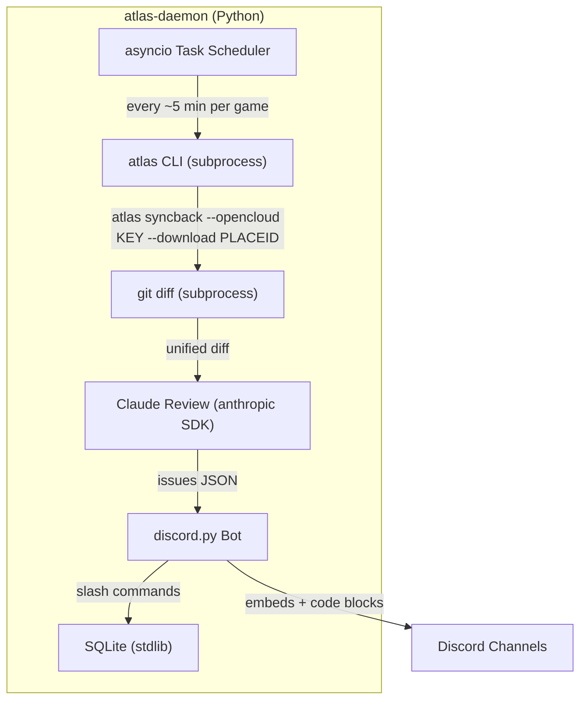

# Atlas Daemon - Automated Roblox Code Review Bot

Two-phase implementation: (1) add `--opencloud` support to the atlas Rust binary, then (2) build the Python Discord bot daemon that uses those commands.

---

## Phase 1: Rust -- Add `--opencloud` to Atlas CLI

### Inventory of Roblox API Calls


| File                               | Function                  | URL                                                  | Current Auth          | Needs `--opencloud`                                        |
| ---------------------------------- | ------------------------- | ---------------------------------------------------- | --------------------- | ---------------------------------------------------------- |
| [syncback.rs](src/cli/syncback.rs) | `download_place()`        | `assetdelivery.roblox.com/v1/asset/?id=`             | Cookie (required)     | YES -- use Asset Delivery API                              |
| [clone.rs](src/cli/clone.rs)       | `fetch_experience_name()` | `apis.roblox.com/universes/v1/places/{}/universe`    | Cookie (optional)     | YES -- same endpoint, add API key header                   |
| [clone.rs](src/cli/clone.rs)       | `fetch_experience_name()` | `games.roblox.com/v1/games?universeIds=`             | Cookie (optional)     | BEST-EFFORT -- may not support API key, graceful fallback  |
| [upload.rs](src/cli/upload.rs)     | `do_upload_legacy()`      | `data.roblox.com/Data/Upload.ashx`                   | Cookie                | NO -- legacy path, keep as-is                              |
| [upload.rs](src/cli/upload.rs)     | `do_upload_asset()`       | `apis.roblox.com/assets/v1/assets/{}`                | API key (`--api_key`) | ALIGN -- fall back to `--opencloud` if `--api_key` not set |
| [upload.rs](src/cli/upload.rs)     | `do_upload_place()`       | `apis.roblox.com/universes/v1/{}/places/{}/versions` | API key (`--api_key`) | ALIGN -- same fallback                                     |
| [studio.rs](src/cli/studio.rs)     | `get_universe_id()`       | `apis.roblox.com/universes/v1/places/{}/universe`    | Cookie (optional)     | YES -- add API key header                                  |


### 1. Global `--opencloud` Flag

Add to `GlobalOptions` in [src/cli/mod.rs](src/cli/mod.rs):

```rust
#[clap(long, env = "ATLAS_OPENCLOUD_KEY", global(true), hide = true)]
pub opencloud: Option<String>,
```

Hidden from help (power-user / daemon feature), also readable via `ATLAS_OPENCLOUD_KEY` env var.

### 2. Shared Auth Module: `src/roblox_api.rs`

New module consolidating all Roblox HTTP auth logic:

```rust
pub enum RobloxAuth {
    Cookie(String),
    ApiKey(String),
}

/// Resolve auth: prefer --opencloud API key, fall back to system cookie.
pub fn resolve_auth(opencloud_key: Option<&str>) -> anyhow::Result<RobloxAuth>;

/// Download a place file. Uses OpenCloud Asset Delivery API with API key,
/// or legacy assetdelivery.roblox.com with cookie.
pub fn download_place(place_id: u64, auth: &RobloxAuth) -> anyhow::Result<NamedTempFile>;

/// Resolve place_id -> universe_id. Works with both auth methods.
pub fn get_universe_id(place_id: u64, auth: &RobloxAuth) -> anyhow::Result<Option<u64>>;

/// Resolve place_id -> experience name. Best-effort with API key
/// (games.roblox.com may not support it), always works with cookie.
pub fn fetch_experience_name(place_id: u64, auth: &RobloxAuth) -> anyhow::Result<Option<String>>;
```

**OpenCloud download path** (when `RobloxAuth::ApiKey`):

```
GET https://apis.roblox.com/asset-delivery-api/v1/assetId/{place_id}
Header: x-api-key: <key>
Scope required: legacy-asset:manage
Response: JSON { "location": "<cdn_url>" }
-> GET <cdn_url> -> raw rbxl bytes
```

**Cookie download path** (when `RobloxAuth::Cookie`): existing logic from `syncback.rs:download_place()`, moved into this module.

### 3. Per-Command Changes

**[syncback.rs](src/cli/syncback.rs)**: Replace inline `download_place()` with call to `roblox_api::download_place()`. Pass `global.opencloud` through.

**[clone.rs](src/cli/clone.rs)**: Replace inline `fetch_experience_name()` with `roblox_api::fetch_experience_name()`. Pass `global.opencloud` through. Clone constructs a `SyncbackCommand` internally -- the global `--opencloud` flag propagates through to syncback's `download_place()` automatically. Result: `atlas --opencloud KEY clone PLACEID --path DIR` works end-to-end with no cookie needed.

**[studio.rs](src/cli/studio.rs)**: Replace inline `get_universe_id()` with `roblox_api::get_universe_id()`. Pass `global.opencloud` through.

**[upload.rs](src/cli/upload.rs)**: If `--api_key` is not set but `--opencloud` is, use `--opencloud` as the API key for Open Cloud upload paths. Legacy upload still requires cookie.

---

## Phase 2: Python Discord Bot Daemon

### Architecture

Python project at `tools/atlas-daemon/` that orchestrates the `atlas` binary via subprocess. Now that atlas supports `--opencloud`, the daemon simply passes the user's API key as a CLI flag -- no need for Python to download rbxl files directly.




### Project Structure

```
tools/atlas-daemon/
  pyproject.toml
  atlas_daemon/
    __init__.py
    __main__.py          -- CLI entry point (click)
    bot.py               -- discord.py bot, event handler, slash command tree
    commands/
      __init__.py
      approve_server.py  -- /approve-server [server_id] (global admin only)
      revoke_server.py   -- /revoke-server <server_id> (global admin only)
      add_game.py        -- /add-game <place_id> [#channel]
      remove_game.py     -- /remove-game <place_id>
      reset_game.py      -- /reset-game <place_id>
      set_api_key.py     -- /set-api-key <key> (ephemeral)
      status.py          -- /status
      list_games.py      -- /list-games
    daemon.py            -- Per-game sync loop (asyncio.create_task per game)
    review.py            -- Anthropic Claude code review + prompt
    db.py                -- SQLite schema, migrations, CRUD
    discord_fmt.py       -- Format issues + errors as Discord embeds
    security.py          -- API key encryption (Fernet), permission checks, server whitelist
    config.py            -- Env var loading, dataclass config
    atlas_cli.py         -- Subprocess wrappers for atlas commands
    review_prompt.txt    -- The code review system prompt
```

Note: `download.py` is no longer needed -- atlas handles download natively with `--opencloud`.

### Dependencies

```toml
[project]
name = "atlas-daemon"
requires-python = ">=3.11"
dependencies = [
    "discord.py>=2.4",
    "anthropic>=0.40",
    "cryptography>=43",
    "click>=8.1",
]
```

`httpx` removed -- no longer downloading in Python.

### Core Flows

#### 1. Atlas CLI Wrappers (`atlas_cli.py`)

```python
async def atlas_clone(place_id: int, path: Path, opencloud_key: str) -> None:
    """Initialize a new game project via atlas clone."""
    cmd = [
        config.atlas_binary, "--opencloud", opencloud_key,
        "clone", str(place_id),
        "--path", str(path),
        "--skip-git",
    ]
    proc = await asyncio.create_subprocess_exec(
        *cmd, stdout=asyncio.subprocess.PIPE, stderr=asyncio.subprocess.PIPE
    )
    stdout, stderr = await proc.communicate()
    if proc.returncode != 0:
        raise RuntimeError(f"atlas clone failed: {stderr.decode()}")

async def atlas_syncback(working_dir: Path, place_id: int, opencloud_key: str) -> str:
    """Download + syncback in one command."""
    cmd = [
        config.atlas_binary, "--opencloud", opencloud_key,
        "syncback",
        "--download", str(place_id),
        "--working-dir", str(working_dir),
        "--incremental",
        "--list",
    ]
    proc = await asyncio.create_subprocess_exec(
        *cmd, stdout=asyncio.subprocess.PIPE, stderr=asyncio.subprocess.PIPE
    )
    stdout, stderr = await proc.communicate()
    if proc.returncode != 0:
        raise RuntimeError(f"atlas syncback failed: {stderr.decode()}")
    return stdout.decode()
```

#### 2. Initial Game Setup (on `/add-game`)

Uses `atlas clone --opencloud` directly -- it handles everything: fetching the game name, creating the project, downloading the rbxl, and running syncback.

```python
async def init_game(place_id: int, server_id: str, opencloud_key: str) -> Path:
    game_dir = config.data_dir / server_id / str(place_id)

    # atlas clone handles: fetch name, create project, download rbxl, syncback
    await run(
        config.atlas_binary, "--opencloud", opencloud_key,
        "clone", str(place_id),
        "--path", str(game_dir),
        "--skip-git",  # we manage git ourselves
    )

    # Init git and commit baseline (no review on first sync)
    await run("git", "init", cwd=game_dir)
    await run("git", "add", ".", cwd=game_dir)
    await run("git", "commit", "-m", "Initial sync", cwd=game_dir)

    return game_dir
```

First sync is committed without review (everything is new, reviewing the entire codebase would be noise).

#### 3. Periodic Sync Loop (`daemon.py`)

```python
async def sync_loop(game: Game, bot: discord.Client):
    while True:
        try:
            api_key = decrypt_api_key(game.api_key_encrypted)

            # Download + syncback via atlas CLI
            output = await atlas_syncback(game.working_dir, game.place_id, api_key)

            # Check for changes
            diff = await git_diff(game.working_dir)
            if diff:
                # Filter to script changes only, chunk if too large
                script_diff = filter_script_changes(diff)
                if script_diff:
                    issues = await review_diff(script_diff, game)
                    new_issues = dedup_issues(issues, game.id)  # skip already-reported
                    if new_issues:
                        await post_issues(bot, game, new_issues)

                await git_commit(game.working_dir, f"Sync {datetime.utcnow().isoformat()}")
                update_last_sync(game.id)

        except Exception as e:
            await report_error_to_discord(bot, game, e)
            update_last_error(game.id, str(e))

        await asyncio.sleep(config.sync_interval)
```

#### 4. AI Code Review (`review.py`)

Modeled after Cursor's BugBot architecture (from their [blog](https://cursor.com/blog/building-bugbot)):

- BugBot runs **multiple parallel passes** with randomized diff order and uses **majority voting** to surface high-confidence issues
- It feeds prior review comments as context to avoid duplicates
- It uses a validator to filter false positives

We implement a simplified version of this pipeline.

**Step 1: Filter the diff to reviewable content**

Strip non-script changes before sending to Claude. The daemon only reviews Luau code -- binary models, meta files, and project files are noise.

```python
REVIEWABLE_EXTENSIONS = {".luau", ".lua"}

def filter_script_changes(raw_diff: str) -> str:
    """Parse unified diff, keep only hunks for script files."""
    filtered_hunks = []
    for file_diff in split_diff_by_file(raw_diff):
        path = extract_file_path(file_diff)
        if any(path.endswith(ext) for ext in REVIEWABLE_EXTENSIONS):
            filtered_hunks.append(file_diff)
    return "\n".join(filtered_hunks)
```

**Step 2: Send to Claude (full diff, no chunking unless truly massive)**

Claude Sonnet has a 200k token context window. A typical 5-minute diff for a game is well under this. Only chunk if the filtered diff exceeds ~150k tokens (rare -- would require hundreds of scripts changing simultaneously).

```python
client = anthropic.AsyncAnthropic(api_key=config.anthropic_key)

async def review_diff(diff: str, game: Game) -> list[Issue]:
    script_diff = filter_script_changes(diff)
    if not script_diff:
        return []

    # Build dedup context (see section 5)
    existing = db.get_unresolved_issues(game.id)
    existing_context = format_existing_issues(existing)

    token_estimate = len(script_diff) // 4
    if token_estimate > 150_000:
        return await _review_chunked(script_diff, existing_context)

    response = await client.messages.create(
        model="claude-sonnet-4-20250514",
        max_tokens=4096,
        system=load_system_prompt(),
        messages=[{"role": "user", "content": f"{existing_context}\n\nReview this diff:\n\n{script_diff}"}],
    )
    issues = parse_issues(response.content[0].text)
    return final_dedup(issues, game.id)
```

**Step 3: For oversized diffs, chunk by file and review in parallel**

```python
async def _review_chunked(diff: str, existing_context: str) -> list[Issue]:
    file_diffs = split_diff_by_file(diff)
    tasks = [
        _review_single_file(fd, existing_context)
        for fd in file_diffs
    ]
    results = await asyncio.gather(*tasks)
    return [issue for file_issues in results for issue in file_issues]
```

**The system prompt** (`review_prompt.txt`) instructs Claude to:

1. Analyze the unified diff line-by-line, focusing ONLY on added/changed lines (lines starting with `+`)
2. Flag issues in these categories: logic bugs, security vulnerabilities, performance problems, Roblox/Luau anti-patterns, race conditions from yielding
3. Output a JSON array: `[{"file": "path", "line_start": N, "line_end": N, "severity": "Low|Medium|High|Critical", "title": "short title", "explanation": "why this is a problem and what could go wrong", "suggestion": "corrected code snippet"}]`
4. Severity guide:
  - **Critical**: Will crash, corrupt data, or create security holes (infinite loop, data loss, remote code execution)
  - **High**: Likely to cause incorrect behavior (off-by-one, wrong event connection, race condition)
  - **Medium**: Could cause issues under certain conditions (missing nil check, unbounded table growth)
  - **Low**: Minor improvement opportunity (deprecated API usage, suboptimal pattern)
5. Luau-specific checks: 1-indexed arrays, `wait()` instead of `task.wait()`, `getfenv`/`setfenv`, 0-based loops, missing `task.cancel()`, unbounded `table.insert` without cleanup, yielding in `RenderStepped`/`Heartbeat`, `Instance.new` with parent as second arg (deprecated)
6. Do NOT flag: style preferences, formatting, naming conventions, missing comments, TODO items
7. If no issues found, return an empty array `[]`
8. Skip any issues already listed in the "existing unresolved issues" context

#### 5. Issue Deduplication

Claude will flag the same bug every sync cycle until it's fixed. We solve this at two layers.

**Layer 1: Prompt context (primary)**

Feed Claude the list of unresolved issues so it skips them. This mirrors how Cursor's BugBot "reads GitHub PR comments (top-level and inline) to avoid duplicate suggestions and build on prior feedback."

```python
def format_existing_issues(existing: list[DBIssue]) -> str:
    if not existing:
        return ""
    lines = ["Already-reported unresolved issues (do NOT re-report these):"]
    for e in existing:
        lines.append(f"- [{e.severity}] {e.file_path}:{e.line_start} -- {e.title}")
    return "\n".join(lines)
```

This context is prepended to the user message in every review call (see section 4).

**Layer 2: Hard dedup in Python (safety net)**

If Claude re-reports despite the context, catch exact matches before posting:

```python
def final_dedup(new_issues: list[Issue], game_id: int) -> list[Issue]:
    existing = db.get_unresolved_issues(game_id)
    existing_keys = {(e.file_path, e.title) for e in existing}
    return [i for i in new_issues if (i.file, i.title) not in existing_keys]
```

**Layer 3: Auto-resolution**

When a file with unresolved issues is modified in a subsequent diff, auto-resolve those issues:

```python
def auto_resolve_changed_files(diff: str, game_id: int) -> list[int]:
    """Mark issues as auto-resolved if their file was modified."""
    changed_files = extract_changed_file_paths(diff)
    resolved_ids = []
    for issue in db.get_unresolved_issues(game_id):
        if issue.file_path in changed_files:
            db.resolve_issue(issue.id, resolved_by="auto", reason="file modified")
            resolved_ids.append(issue.id)
    return resolved_ids
```

Auto-resolved issues get their Discord embed updated with a "Resolved -- code was modified" footer. This runs *before* the Claude review, so the auto-resolved issues don't appear in the dedup context (they might have been fixed, so Claude should re-check the new version).

#### 6. Discord Output Format

Each issue posted as a rich embed with buttons:

```
[Critical] Potential infinite loop in PlayerManager.server.luau
Line 47-52

  for i = 0, #players do  -- BUG: 0-indexed loop
    local player = players[i]
    if player then
      processPlayer(player)
    end
  end

Explanation: Luau arrays are 1-indexed. This loop starts at 0,
missing the last element. Use `for i = 1, #players do`.

Suggested fix:
  for i = 1, #players do
```

- Embeds color-coded: Low=0x2ecc71 (green), Medium=0xf1c40f (yellow), High=0xe67e22 (orange), Critical=0xe74c3c (red)
- Critical issues trigger `@here` mention
- Two buttons per issue:
  - "Mark Fixed" -- sets resolved=True in SQLite, updates embed to show who resolved it and when
  - "Copy Context" -- sends ephemeral message with full issue in a copyable code block (file path, line numbers, code, explanation, suggestion -- formatted for pasting into Cursor or a ticket)
- Issues grouped per sync cycle: one summary embed header, then individual issue embeds
- Auto-resolved issues get their embed edited with a strikethrough title and "Resolved -- code was modified" footer

**Summary embed** (posted once per sync cycle with issues):

```
Sync Review -- PlaceId 12345678
3 new issues found | 2 auto-resolved

  1 Critical  |  1 High  |  1 Medium  |  0 Low

Reviewed 4 changed scripts (127 lines added, 23 removed)
```

**Error reporting** (`discord_fmt.py`):

Every error type gets its own embed posted to the game's channel. Errors are not silent -- operators need to know immediately.


| Error Type                            | Embed Color | Content                                                                                        |
| ------------------------------------- | ----------- | ---------------------------------------------------------------------------------------------- |
| Download failure (OpenCloud 403/401)  | Red         | "API key may be invalid or missing `legacy-asset:manage` scope. Use `/set-api-key` to update." |
| Download failure (network)            | Red         | "Could not reach Roblox API. Will retry next cycle."                                           |
| Syncback crash (atlas exit code != 0) | Red         | Full stderr output in a code block, truncated to 1500 chars                                    |
| Claude API error (rate limit, auth)   | Orange      | "Review skipped this cycle. Changes were still committed."                                     |
| Claude parse error (invalid JSON)     | Orange      | "Claude returned unparseable response. Raw output logged."                                     |
| Git error                             | Red         | Full error message                                                                             |


```python
async def report_error(bot: discord.Client, game: Game, error: Exception, error_type: str):
    channel = bot.get_channel(int(game.channel_id))
    embed = discord.Embed(
        title=f"Sync Error -- PlaceId {game.place_id}",
        description=truncate(str(error), 1500),
        color=0xe74c3c,
    )
    embed.add_field(name="Error Type", value=error_type, inline=True)
    embed.add_field(name="Last Successful Sync", value=game.last_sync_at or "Never", inline=True)
    embed.set_footer(text="Will retry next cycle")
    await channel.send(embed=embed)
```

**Error throttling**: Don't spam the channel with the same error every 5 minutes. Track the last error message in the `games` table. If the current error is identical to `last_error`, only re-post after 1 hour of continuous failure (12 consecutive cycles). On the first occurrence of a *new* error, always post immediately.

#### 7. Discord Slash Commands


| Command           | Args                             | Permission           | Description                                           |
| ----------------- | -------------------------------- | -------------------- | ----------------------------------------------------- |
| `/approve-server` | `server_id` (optional)           | Global admin only    | Whitelist current server (or remote by ID)            |
| `/revoke-server`  | `server_id`                      | Global admin only    | Remove server from whitelist, stop all its sync loops |
| `/add-game`       | `place_id`, `channel` (optional) | Admin or has API key | Start monitoring a game in this server                |
| `/remove-game`    | `place_id`                       | Admin or game owner  | Stop monitoring, optionally delete local data         |
| `/reset-game`     | `place_id`                       | Admin or game owner  | Delete clone, re-sync from scratch                    |
| `/set-api-key`    | `key`                            | Any permitted user   | Set OpenCloud key (ephemeral, encrypted)              |
| `/status`         | --                               | Any permitted user   | Show monitored games, last sync, error counts         |
| `/list-games`     | --                               | Any permitted user   | List games in this server                             |


#### 8. Security Model

**Server whitelist (allowed_servers)**:

Every slash command and every bot action checks the server whitelist first. If the server is not in `allowed_servers`, the bot responds with an ephemeral "This server is not authorized. Ask an admin to run `/approve-server`." and does nothing else. This is the first check in every interaction handler -- no exceptions.

```python
async def check_server_allowed(interaction: discord.Interaction) -> bool:
    if not db.is_server_allowed(str(interaction.guild_id)):
        await interaction.response.send_message(
            "This server is not authorized. Ask a bot admin to approve it.",
            ephemeral=True,
        )
        return False
    return True
```

The `allowed_servers` table is managed exclusively by global admins:


| Command                                                      | Who can run it    | What it does                                                 |
| ------------------------------------------------------------ | ----------------- | ------------------------------------------------------------ |
| `/approve-server` (no args, run in target server)            | Global admin only | Adds current server to whitelist                             |
| `/approve-server <server_id>` (run from any approved server) | Global admin only | Adds a remote server by ID                                   |
| `/revoke-server <server_id>`                                 | Global admin only | Removes server, stops all its sync loops, keeps data on disk |


On bot startup, the daemon loads all approved servers and only starts sync loops for games in those servers.

**Full permission model:**

- **Global admins** (seeded in DB on first run): Discord user IDs `176643682689089545`, `1010301288946339920`
- **Per-user API keys**: Provided via `/set-api-key` (ephemeral response, never logged, never visible to other users). Encrypted with Fernet (symmetric, derived from `ATLAS_DAEMON_ENCRYPTION_KEY` env var) before SQLite storage.
- **Server isolation**: Games scoped to `<server_id>/<place_id>`. Multiple servers can independently monitor the same place with separate working directories and separate API keys.
- **Rate limiting**: Configurable max games per server (default 5, via `ATLAS_DAEMON_MAX_GAMES_PER_SERVER`).
- **Command permissions**: Non-admin users can only manage games they added (`added_by` field). Admins can manage any game in any approved server.

#### 9. SQLite Schema

```sql
-- Server whitelist. No entry = bot refuses all commands in that server.
CREATE TABLE allowed_servers (
    discord_server_id TEXT PRIMARY KEY,
    server_name TEXT,                          -- cached for /status display
    approved_by TEXT NOT NULL,                 -- discord user ID of admin who approved
    approved_at TEXT DEFAULT (datetime('now'))
);

-- Global admin users. Seeded on first run with hardcoded IDs.
CREATE TABLE admins (
    discord_user_id TEXT PRIMARY KEY,
    added_at TEXT DEFAULT (datetime('now'))
);

-- Monitored games. FK to allowed_servers ensures orphan cleanup on revoke.
CREATE TABLE games (
    id INTEGER PRIMARY KEY AUTOINCREMENT,
    discord_server_id TEXT NOT NULL REFERENCES allowed_servers(discord_server_id) ON DELETE CASCADE,
    place_id INTEGER NOT NULL,
    channel_id TEXT NOT NULL,
    api_key_encrypted BLOB NOT NULL,          -- Fernet-encrypted OpenCloud key
    added_by TEXT NOT NULL,                   -- discord user ID
    working_dir TEXT NOT NULL,                -- absolute path to game's project directory
    last_sync_at TEXT,
    last_error TEXT,                          -- last error message (for throttling)
    last_error_at TEXT,                       -- when last_error first occurred
    error_count INTEGER DEFAULT 0,           -- consecutive error count (for throttling)
    created_at TEXT DEFAULT (datetime('now')),
    UNIQUE(discord_server_id, place_id)
);

-- Reported issues. Tracks every issue for dedup + mark-as-fixed.
CREATE TABLE issues (
    id INTEGER PRIMARY KEY AUTOINCREMENT,
    game_id INTEGER NOT NULL REFERENCES games(id) ON DELETE CASCADE,
    discord_message_id TEXT,                  -- for editing the embed on resolve
    file_path TEXT NOT NULL,
    line_start INTEGER,
    line_end INTEGER,
    severity TEXT NOT NULL,                   -- Low, Medium, High, Critical
    title TEXT NOT NULL,
    explanation TEXT,
    suggestion TEXT,
    resolved INTEGER DEFAULT 0,
    resolved_by TEXT,                         -- discord user ID or "auto"
    resolved_reason TEXT,                     -- "manual", "file modified", etc.
    resolved_at TEXT,
    created_at TEXT DEFAULT (datetime('now'))
);

CREATE INDEX idx_issues_game_unresolved ON issues(game_id, resolved) WHERE resolved = 0;
CREATE INDEX idx_games_server ON games(discord_server_id);
```

#### 10. Configuration

```env
ATLAS_DAEMON_DISCORD_TOKEN=<bot token>
ATLAS_DAEMON_ANTHROPIC_KEY=<claude api key>
ATLAS_DAEMON_DATA_DIR=./atlas-daemon-data
ATLAS_DAEMON_ENCRYPTION_KEY=<fernet key>
ATLAS_DAEMON_SYNC_INTERVAL=300
ATLAS_DAEMON_MAX_GAMES_PER_SERVER=5
ATLAS_DAEMON_ATLAS_BINARY=atlas
```

#### 11. CLI Interface

```bash
python -m atlas_daemon \
    --discord-token $TOKEN \
    --anthropic-key $KEY \
    --data-dir ./data \
    --sync-interval 300
```

## Audit Gap Resolution


| Gap                                  | Fix                                                                                                                                                                                                                                                                                                                                                       |
| ------------------------------------ | --------------------------------------------------------------------------------------------------------------------------------------------------------------------------------------------------------------------------------------------------------------------------------------------------------------------------------------------------------- |
| GAP 1: `atlas clone` uses cookie     | FIXED: `--opencloud` global flag on atlas CLI. `atlas --opencloud KEY clone PLACEID` works end-to-end with no cookie. Daemon calls `atlas clone` for init, `atlas syncback --download` for periodic syncs.                                                                                                                                                |
| GAP 2: No server whitelist           | FIXED: `allowed_servers` table with FK cascade to `games`. `/approve-server` and `/revoke-server` admin commands. Every interaction handler checks whitelist first -- no exceptions.                                                                                                                                                                      |
| GAP 3: Error reporting not specified | FIXED: Typed error embeds per failure mode (download, syncback, Claude, git) posted to game channel with color coding. Error throttling: same error only re-posted after 1 hour (12 consecutive cycles). Error state tracked via `last_error`, `last_error_at`, `error_count` in `games` table.                                                           |
| GAP 4: No diff size handling         | FIXED: `filter_script_changes()` strips non-Luau files before review. Full filtered diff sent to Claude (200k context handles normal syncs). Only chunk by file + parallel review for truly massive diffs (>150k estimated tokens). First sync committed without review.                                                                                  |
| GAP 5: No issue deduplication        | FIXED: Three-layer approach. (1) Prompt context: unresolved issues fed to Claude so it avoids re-reporting. (2) Hard dedup: exact `(file_path, title)` match in Python as safety net. (3) Auto-resolution: issues in files modified by a subsequent diff auto-resolved before review, Discord embeds updated with "Resolved -- code was modified" footer. |


