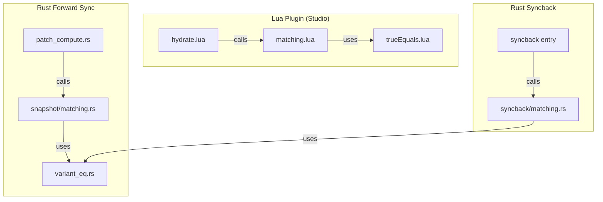

# Audit: Ambiguous Path Handling (Reconciler Changes)

## Scope

Files audited:

- [plugin/src/Reconciler/matching.lua](plugin/src/Reconciler/matching.lua) -- Lua matching algorithm (631 lines)
- [plugin/src/Reconciler/matching.spec.lua](plugin/src/Reconciler/matching.spec.lua) -- Lua matching tests
- [plugin/src/Reconciler/hydrate.lua](plugin/src/Reconciler/hydrate.lua) -- Integration with matching
- [plugin/src/Reconciler/reify.lua](plugin/src/Reconciler/reify.lua) -- Nil-instance guards for ambiguous exclusions
- [plugin/src/Reconciler/trueEquals.lua](plugin/src/Reconciler/trueEquals.lua) -- Shared value equality
- [plugin/src/Reconciler/diff.lua](plugin/src/Reconciler/diff.lua) -- Uses shared trueEquals
- [plugin/src/ChangeBatcher/encodeInstance.lua](plugin/src/ChangeBatcher/encodeInstance.lua) -- Duplicate detection helpers
- [src/snapshot/matching.rs](src/snapshot/matching.rs) -- Rust forward sync matching
- [src/syncback/matching.rs](src/syncback/matching.rs) -- Rust syncback matching
- [src/variant_eq.rs](src/variant_eq.rs) -- Rust property comparison

---

## Architecture Summary




All three implementations use the same algorithm:

1. **Fast path**: Group by `(Name, ClassName)` -- 1:1 groups instant-match
2. **Ambiguous groups**: Pairwise recursive `computeChangeCount` scoring
3. **Greedy assignment**: Sort by cost ascending, pick lowest-cost unmatched pair
4. **Depth limit**: `MAX_SCORING_DEPTH = 3` prevents O(n^k) explosion
5. **Session caching**: `MatchingSession` avoids redundant recursive scoring

---

## Findings

### FINDING 1: Stale header comment in encodeInstance.lua (Low -- misleading docs)

The file header at lines 12-16 states:

```1:17:plugin/src/ChangeBatcher/encodeInstance.lua
--[[
	// ...
	DUPLICATE HANDLING:
	- Instances with duplicate-named siblings at ANY level of the path are skipped
	- This matches the behavior in ref_properties.rs::is_path_unique
	- A path is ambiguous if duplicates exist anywhere from the instance to the root
	- A warning is logged when duplicates are encountered
]]
```

But the actual code at lines 159-168 does **not** skip duplicates -- it logs a debug message and encodes normally:

```159:168:plugin/src/ChangeBatcher/encodeInstance.lua
encodeInstance = function(instance, parentId, _skipPathCheck)
	-- Log duplicate-named siblings as a debug message (server handles them via
	-- dedup suffixes) but do NOT skip encoding.
	if not _skipPathCheck and not isPathUnique(instance) then
		Log.debug(
			"Instance '{}' ({}) has duplicate-named siblings in path (server will handle via dedup)",
			instance:GetFullName(),
			instance.ClassName
		)
	end
```

The inline comment (line 161) is correct; the file-level docblock is stale from a prior implementation. **Fix: update the header comment.**

---

### FINDING 2: Tags/Attributes granularity divergence across implementations (Medium -- scoring asymmetry) -- RESOLVED

> **Resolved by [matching_algorithm_parity](matching_algorithm_parity_01524d4c.plan.md) Fix 2** (status: completed). Rust `countOwnDiffs` in both forward sync and syncback now extracts Tags/Attributes and scores them granularly (per-tag, per-attribute), matching the Lua behavior. Parity tests added (Fix 6).

~~The three `countOwnDiffs` implementations score Tags and Attributes differently.~~

Original analysis preserved below for reference:

The Lua implementation (`matching.lua` lines 282-307) counts each individual tag/attribute diff as +1. The Rust implementations previously counted the entire `Tags`/`Attributes` Variant as a single +1 diff. This meant 3 of 10 tags differing scored +1 in Rust but +3 in Lua, potentially causing different pairings.

---

### FINDING 3: Lua Ref scoring uses identity heuristic not present in Rust (Medium -- divergence) -- RESOLVED

> **Resolved by [matching_algorithm_parity](matching_algorithm_parity_01524d4c.plan.md) Fix 1** (status: completed). Both Rust `countOwnDiffs` functions now resolve Ref targets to `(Name, ClassName)` and score mismatches at `UNMATCHED_PENALTY`, matching the Lua behavior. Rust unit tests `ref_scoring_forward_sync` and `ref_scoring_syncback` added.

~~The Rust implementations had no equivalent of Lua's Ref identity heuristic.~~

Original analysis preserved below for reference:

The Lua `countOwnDiffs` scored Ref property mismatches using `RefIdentity` (name + className) at a cost of `UNMATCHED_PENALTY` (10,000). The Rust implementations compared `Variant::Ref` values as opaque IDs (+1 per mismatch), which were always different between contexts, making Refs useless for disambiguation.

---

### FINDING 4: Performance -- double cost computation in Lua matchChildren (Low -- perf only)

In `matchChildren`, ambiguous group costs are computed inline (lines 534-557) for assignment decisions but never stored in `session.costCache`. Then lines 604-607 recompute total cost by calling `computePairCost` for every matched pair:

```604:608:plugin/src/Reconciler/matching.lua
	local totalCost = 0
	for _, pair in ipairs(matched) do
		totalCost += computePairCost(session, pair.virtualId, pair.studioInstance, virtualInstances, math.huge, depth)
	end
	totalCost += (#unmatchedVirtual + #unmatchedStudio) * UNMATCHED_PENALTY
```

This means ambiguous group pairs have their full subtree cost computed **twice**: once during the scoring loop, once during totalCost. For 1:1 fast-path pairs, cost is computed **once** (only in totalCost), which is correct.

**Impact**: Wasted computation proportional to ambiguous group size squared. Since ambiguous groups are typically small (2-10 instances) and the depth limit caps recursion, this is acceptable. The `computePairCost` call does populate `session.costCache`, so subsequent recursive calls at deeper levels benefit.

**Fix (deferred)**: Store the computed cost from the ambiguous scoring loop and reuse it in the totalCost sum instead of calling `computePairCost` again.

---

### FINDING 5: `trueEquals` lacks fuzzy equality for compound float types (Low -- edge case)

`trueEquals.lua` provides fuzzy float comparison for: `number`, `Color3`, `Vector3`, `Vector2`, `CFrame`. It falls through to `return false` for all other types (line 111).

The Rust `variant_eq.rs` provides fuzzy comparison for additional float-containing types: `UDim`, `UDim2`, `NumberRange`, `NumberSequence`, `ColorSequence`, `Rect`, `PhysicalProperties`, `Ray`, `Region3`, `Float32`, `Float64`, `Font`.

In Luau, `UDim2 == UDim2` uses `__eq` which may or may not apply float tolerance. If Roblox's `__eq` does exact comparison, two UDim2 values that differ by float precision would fail `==` and then fail `trueEquals` (which returns false for unrecognized types). This would inflate match costs slightly.

**Impact**: Unlikely to cause wrong pairings since the inflation would be symmetric across all candidates. But it could trigger unnecessary reconciler updates (diff sees a change that isn't really a change).

**Fix (deferred)**: Add UDim2, NumberRange, NumberSequence, Rect handlers to `trueEquals`. These are uncommon in ambiguous matching scenarios but would improve diff accuracy.

---

### FINDING 6: Reconciler integration is clean (Positive)

**hydrate.lua** (lines 33-45) correctly filters out missing virtual children before calling `matchChildren`, and passes a shared `MatchingSession` through recursive hydration:

```32:48:plugin/src/Reconciler/hydrate.lua
	-- Filter out virtual children missing from virtualInstances
	local validVirtualIds: { string } = {}
	for _, childId in ipairs(virtualChildIds) do
		if virtualInstances[childId] then
			table.insert(validVirtualIds, childId)
		else
			Log.warn(
				"Hydration: virtualInstances missing child ID {} (parent: {} '{}')",
				childId,
				rootId,
				virtualInstance.Name
			)
		end
	end

	local result =
		Matching.matchChildren(session, validVirtualIds, existingChildren, virtualInstances, rootId, rootInstance)
```

**reify.lua** (lines 52-57) defensively handles nil virtual instances (excluded from patch):

```52:57:plugin/src/Reconciler/reify.lua
	if virtualInstance == nil then
		-- This child was intentionally excluded from the patch (e.g., due to
		-- ambiguous paths with duplicate-named siblings). Skip it gracefully.
		return
	end
```

**diff.lua** (line 133) uses the shared `trueEquals` module, ensuring matching and diff agree on equality:

```133:133:plugin/src/Reconciler/diff.lua
				if not trueEquals(existingValue, decodedValue) then
```

Session sharing through recursive hydration is correct. The `--!native` and `--!optimize 2` directives on `matching.lua` and `trueEquals.lua` ensure native codegen for hot paths.

---

### FINDING 7: Test coverage is solid but lacks cross-implementation parity tests (Low) -- RESOLVED

> **Resolved by [matching_algorithm_parity](matching_algorithm_parity_01524d4c.plan.md) Fix 6** (status: completed). Parity tests added: `parity_forward_vs_syncback` (Rust), `round_trip_matching_identity` (Rust integration), `parity_with_rust_fixture` (Lua spec).

**Lua tests** (`matching.spec.lua`): 15+ test cases covering session caching, totalCost computation, Ref scoring, 2x2 and 3x3 ambiguous groups, recursive matching, edge cases, and now cross-implementation parity fixtures.

**Rust forward sync tests** (`src/snapshot/matching.rs`): 12+ test cases including property-based matching, depth limit, session cache, default-omission tests, and Ref scoring.

**Rust syncback tests** (`src/syncback/matching.rs`): 6+ test cases covering basics, class grouping, unmatched, duplicates, stability, session cache, and Ref scoring.

**Integration test**: `ref_ambiguous_path_no_crash` and `ref_ambiguous_target_no_crash` in `tests/tests/two_way_sync.rs` verify that Ref properties with ambiguous paths don't crash.

---

## Summary Table


| #   | Finding                                      | Severity | Status   | Fix Effort         |
| --- | -------------------------------------------- | -------- | -------- | ------------------ |
| 1   | Stale header comment in encodeInstance.lua   | Low      | RESOLVED | -- (prior session) |
| 2   | Tags/Attributes granularity divergence       | Medium   | RESOLVED | -- (parity plan)   |
| 3   | Lua Ref identity heuristic missing in Rust   | Medium   | RESOLVED | -- (parity plan)   |
| 4   | Double cost computation in Lua matchChildren | Low      | **Fix**  | Small              |
| 5   | trueEquals lacks compound float types        | Low      | **Fix**  | Small              |
| 6   | Reconciler integration is clean              | Positive | N/A      | N/A                |
| 7   | No cross-implementation parity tests         | Low      | RESOLVED | -- (parity plan)   |


Additionally, the parity plan also resolved a float epsilon divergence (Fix 3: Rust `variant_eq.rs` now uses a 0.0001 epsilon matching Lua's `trueEquals`), and a VCache session-level caching optimization (Fix 5), partially mitigating Finding 4.

**Overall assessment**: The ambiguous path handling feature is well-implemented and correct. The matching algorithm is sound, the three implementations are now fully aligned (via the parity plan fixes), and the integration points (hydrate, reify, diff) are clean. No round-trip identity violations found.

---

## Actionable Fixes

### Fix A: Eliminate double cost computation in Lua matchChildren (Finding 4)

- **File:** `plugin/src/Reconciler/matching.lua`
- **Problem:** In `matchChildren`, the ambiguous scoring loop (lines 528-575) computes full subtree costs for each pair, but these costs are only stored in `scoredPairs` for sorting. Then the totalCost loop (lines 615-618) calls `computePairCost` for **every** matched pair (including ambiguous ones), recomputing the same costs from scratch. The `computePairCost` function does check `session.costCache`, but the ambiguous scoring loop never writes to it, so nothing is cached.
- **Solution:** Track the winning cost for each matched pair during greedy assignment and sum them directly, instead of calling `computePairCost` again. For 1:1 fast-path matches (which have no pre-computed cost), call `computePairCost` only for those.

Concretely in `matchChildren`:

1. Add a `matchedCosts: { [number]: number }` table (keyed by match index in `matched` array)
2. In the ambiguous greedy assignment loop (lines 585-595), store the pair's cost from `scoredPairs` alongside each match
3. In the totalCost loop, use the stored cost for ambiguous pairs and only call `computePairCost` for 1:1 fast-path pairs (which don't have a pre-computed cost)

### Fix B: Add compound float type fuzzy equality to trueEquals (Finding 5)

- **File:** `plugin/src/Reconciler/trueEquals.lua`
- **Problem:** `trueEquals` handles `number`, `Color3`, `Vector3`, `Vector2`, `CFrame` with fuzzy float comparison, but falls through to `return false` for `UDim`, `UDim2`, `NumberRange`, `NumberSequence`, `ColorSequence`, `Rect`. Since these types contain floats, Luau's `==` operator may fail on precision differences, causing phantom diffs in both matching and diff.
- **Solution:** Add handlers before the final `return false` (line 111):
  - `UDim2`: decompose via `.X.Scale`, `.X.Offset`, `.Y.Scale`, `.Y.Offset` -- fuzzyEq on Scale, exact on Offset (integer)
  - `UDim`: decompose via `.Scale`, `.Offset` -- fuzzyEq on Scale, exact on Offset
  - `NumberRange`: fuzzyEq on `.Min`, `.Max`
  - `Rect`: fuzzyEq on `.Min.X`, `.Min.Y`, `.Max.X`, `.Max.Y`
  - `NumberSequence`: compare `.Keypoints` length, then per-keypoint fuzzyEq on `.Time`, `.Value`, `.Envelope`
  - `ColorSequence`: compare `.Keypoints` length, then per-keypoint fuzzyEq on `.Time` + color3Eq on `.Value`

These match the Rust `variant_eq.rs` coverage exactly.