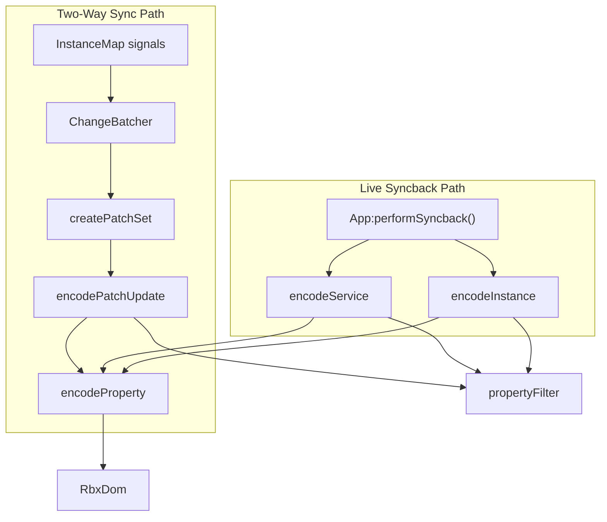

# ChangeBatcher Encoding Refactors -- Audit Report

## Scope

4 files changed: +132 / -63 across 13 commits.


| File                             | Change Type     | Lines                            |
| -------------------------------- | --------------- | -------------------------------- |
| `encodeService.lua`              | New (108 lines) | +108                             |
| `encodeInstance.lua`             | Modified        | +24 / -53                        |
| `encodeInstance.spec.lua`        | Modified        | +3 / -4                          |
| `encodeInstance.stress.spec.lua` | Modified        | -6 (removed skippedCount checks) |


---

## Architecture Summary




`encodeService` is new and serves the live syncback feature. `encodeInstance` was refactored to delegate duplicate handling to the server.

---

## Finding 1: Stale Header Comment (Bug)

**Severity: Moderate** | **File:** `[encodeInstance.lua](plugin/src/ChangeBatcher/encodeInstance.lua)` lines 1-17

The module header comment claims:

```
DUPLICATE HANDLING:
- Instances with duplicate-named siblings at ANY level of the path are skipped
```

But the code was changed to do the opposite -- duplicates are now **encoded** (not skipped), with a debug log, and the server handles dedup. The header directly contradicts the code behavior.

**Fix:** Update the header to reflect the new behavior.

---

## Finding 2: Duplicated Encoding Filter Logic (Code Quality)

**Severity: Moderate (small refactor candidate)** | **Files:** `[encodeService.lua](plugin/src/ChangeBatcher/encodeService.lua)`, `[encodeInstance.lua](plugin/src/ChangeBatcher/encodeInstance.lua)`

The property encoding filter is copy-pasted across both files with only minor differences:


| Logic                                         | `encodeService.lua` | `encodeInstance.lua` |
| --------------------------------------------- | ------------------- | -------------------- |
| SKIP_PROPERTIES (Parent, Name, Archivable)    | Lines 7-11          | Lines 34-38          |
| Skip Attributes/Tags (handled separately)     | Line 33             | Lines 217-219        |
| Scriptability check (ReadWrite, Read, Custom) | Lines 37-39         | Lines 224-226        |
| DoesNotSerialize check                        | Line 40             | Line 227             |
| UNENCODABLE_DATA_TYPES filter                 | Line 45             | Line 233             |
| Attributes encoding (pcall + descriptor)      | Lines 70-81         | Lines 121-138        |
| Tags encoding (pcall + descriptor)            | Lines 83-94         | Lines 141-157        |


If either filter is updated (e.g., adding a new skip property, changing the scriptability check), the other must be updated identically or a divergence bug is introduced.

**Fix:** Extract a shared `iterEncodableProperties(className, callback)` helper that handles the filter logic once. Both `encodeService` and `encodeInstance` would call it. The Attributes/Tags encoding blocks could also be extracted to a shared `encodeAttributesAndTags(instance, properties)` function (the `encodeAttributes`/`encodeTags` functions in `encodeInstance.lua` already do this but aren't exported).

---

## Finding 3: No Tests for `encodeService.lua` (Test Gap)

**Severity: Moderate** | **File:** `encodeService.lua` (new, 108 lines, no spec file)

Every other encoding module has a `.spec.lua` test:

- `encodeInstance.spec.lua` (exists)
- `encodeInstance.stress.spec.lua` (exists)
- `encodePatchUpdate.spec.lua` (exists)
- `encodeProperty.spec.lua` (exists)
- `**encodeService.spec.lua` -- MISSING**

`encodeService` handles Ref property encoding via ObjectValue carriers (a tricky serialization path), service-level property filtering, and the carrier index calculation. These all warrant test coverage.

**Fix:** Add `encodeService.spec.lua` covering:

- Basic property encoding for a service (e.g., Lighting)
- Ref property carrier creation and index correctness
- Attributes/Tags encoding on services
- EXCLUDE_PROPERTIES filtering (Lighting.ClockTime)
- Empty service (no properties, no children)

---

## Finding 4: `EXCLUDE_PROPERTIES` Undocumented (Documentation)

**Severity: Low** | **File:** `[encodeService.lua](plugin/src/ChangeBatcher/encodeService.lua)` lines 13-15

```lua
local EXCLUDE_PROPERTIES = {
    Lighting = { ClockTime = true },
}
```

`ClockTime` (Float32) and `TimeOfDay` (String) are linked properties on Lighting -- they represent the same value in different formats, and both have `Serialization: "Serializes"`. Excluding `ClockTime` avoids sending a redundant/conflicting representation alongside `TimeOfDay`. This is a reasonable design choice, but there is no comment explaining the reasoning. If someone sees `TimeOfDay` behaving oddly, they won't know `ClockTime` was intentionally excluded or why.

**Fix:** Add a comment explaining the linked-property reason.

---

## Finding 5: Misleading `ServiceChunk` Doc Comment (Documentation)

**Severity: Low** | **File:** `[src/web/interface.rs](src/web/interface.rs)` lines 30-42

The doc comment on `ServiceChunk` states:

> `refs` maps property names to 1-based indices into this combined range (0 = nil). Indices <= child_count point directly to a child instance. Indices > child_count point to an ObjectValue carrier.

But the server code in `[serve.rs](src/cli/serve.rs)` lines 198-204 treats `refs` values as **1-based indices into the carrier slice only** (not the combined range):

```rust
let carriers = &service_range[carrier_start..carrier_end];
for (prop_name, &idx) in &chunk.refs {
    if idx == 0 || (idx as usize) > carriers.len() { continue; }
    ref_entries.push((prop_name.clone(), carriers[idx as usize - 1]));
}
```

And the plugin sets `refs[propertyName] = #refTargets` (1-based into refTargets only). The "indices into combined range" and "indices <= child_count point to a child" parts of the comment are incorrect -- carriers never point to children.

**Fix:** Update the doc comment to say `refs` maps property names to 1-based indices into the carrier slice.

---

## Positive Changes (No Action Needed)

### P1: Module-Level Mutable State Removed (encodeInstance.lua)

The old code had `local skippedDuplicateCount = 0` at module scope, mutated across calls and reset inside a wrapper function. This was a shared mutable state pattern that risked stale counts if the wrapper wasn't used. The new code removes this entirely -- clean improvement.

### P2: Duplicate Handling Delegated to Server

Previously, `encodeInstance` skipped any instance whose path contained duplicate-named siblings, silently losing data. Now all instances are encoded and sent to the server, which handles filesystem name collisions via the dedup suffix system (`~2`, `~3`, etc.). This is the correct design -- the server has the filesystem context needed to resolve collisions, while the plugin should send complete data.

### P3: `Custom` Scriptability Added

The filter now includes `propertyMeta.scriptability == "Custom"` alongside `ReadWrite` and `Read`. The reflection database has 9 `Custom` scriptability properties. After accounting for those handled separately (Attributes, Tags, Source, Contents), this adds coverage for `Scale` (NumberValue), `WorldPivotData` (Model), `PropertiesSerialize` (StyleSheet), and `MaterialColors` (Workspace) -- all of which serialize and were previously silently dropped.

### P4: Simplified Wrapper Function

The `encodeInstanceWithDuplicateTracking` wrapper was replaced with a simple `return function(instance, parentId)` that calls `encodeInstance(instance, parentId, false)`. Tests updated to match (no more second `skippedCount` return value).

### P5: Tests Updated Correctly

Both `encodeInstance.spec.lua` and `encodeInstance.stress.spec.lua` are updated to assert that duplicates ARE included (e.g., `expect(#encoded.children).to.equal(3)` instead of `1`). All `skippedCount` assertions removed.

---

## Summary


| #   | Finding                                    | Severity | Type                  |
| --- | ------------------------------------------ | -------- | --------------------- |
| 1   | Stale header comment in encodeInstance.lua | Moderate | Bug (misleading docs) |
| 2   | Duplicated encoding filter logic           | Moderate | Code quality          |
| 3   | No tests for encodeService.lua             | Moderate | Test gap              |
| 4   | EXCLUDE_PROPERTIES undocumented            | Low      | Documentation         |
| 5   | Misleading ServiceChunk doc comment        | Low      | Documentation         |


No critical or round-trip-identity issues found. The encoding logic is correct, the server-side consumption matches, and the refactors improve the codebase. The main action items are updating stale comments, adding a test file, and extracting the duplicated filter logic.