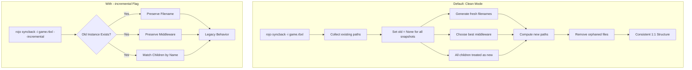

# Destructive Syncback Mode (Clean by Default)

## Root Cause Analysis

Your inconsistency stems from three preservation mechanisms in syncback:

### 1. File Name Preservation (`[src/syncback/file_names.rs](src/syncback/file_names.rs)` lines 19-34)

When an old instance exists, the **existing filename is always preserved**, even if the instance was renamed:

```rust
if let Some(old_inst) = old_inst {
    if let Some(source) = old_inst.metadata().relevant_paths.first() {
        source.file_name()  // Returns OLD filename, ignores new instance name
    }
}
```

### 2. Middleware Preservation (`[src/syncback/mod.rs](src/syncback/mod.rs)` lines 353-357)

When an old instance exists, its middleware format is preserved:

```rust
} else if let Some(old_middleware) = old_middleware {
    // Use old middleware, even if a clean sync would choose differently
    middleware = old_middleware;
}
```

This means a `Part.rbxm` stays as `.rbxm` instead of potentially becoming a `Part/` directory with children.

### 3. Name-Based Child Matching (`[src/snapshot_middleware/dir.rs](src/snapshot_middleware/dir.rs)` lines 196-216)

Children are matched by name between old and new DOMs. If a child exists in both, it inherits the old structure:

```rust
if let Some(old_child) = old_child_map.remove(new_child.name.as_str()) {
    // Existing child - pass old reference, preserving its structure
    children.push(snapshot.with_joined_path(*new_child_ref, Some(old_child.id()))?);
} else {
    // New child - gets fresh structure
    children.push(snapshot.with_joined_path(*new_child_ref, None)?);
}
```

## Solution: Clean Mode by Default with `--incremental` Flag

Make clean (destructive) mode the default behavior, with an `--incremental` flag to opt into the legacy structure-preserving behavior.

### Ensuring No Residue Files

The key challenge: if we set `old = None`, the `removed_children` logic won't work (nothing to compare against). We need a two-phase approach:

1. **Phase 1**: Collect ALL existing paths from the old tree before syncback
2. **Phase 2**: After computing new paths, remove any old paths that aren't in the new set

This guarantees no orphaned files remain.

### Changes Required

#### 1. Add CLI Flag (`[src/cli/syncback.rs](src/cli/syncback.rs)`)

Add `--incremental` flag (clean mode is now default):

```rust
/// If provided, syncback will preserve existing file structure and middleware
/// formats when possible. Without this flag, syncback creates a fresh project
/// layout that exactly matches the input file.
#[clap(long, short = 'n')]
pub incremental: bool,
```

#### 2. Pass Flag to `syncback_loop` (`[src/cli/syncback.rs](src/cli/syncback.rs)`)

```rust
let snapshot = syncback_loop(
    session_old.vfs(),
    &mut dom_old,
    dom_new,
    session_old.root_project(),
    self.incremental,  // false = clean mode (default)
)?;
```

#### 3. Modify `syncback_loop` Signature (`[src/syncback/mod.rs](src/syncback/mod.rs)`)

```rust
pub fn syncback_loop(
    vfs: &Vfs,
    old_tree: &mut RojoTree,
    mut new_tree: WeakDom,
    project: &Project,
    incremental: bool,  // false = clean mode (default)
) -> anyhow::Result<FsSnapshot>
```

#### 4. Collect Existing Paths Before Syncback (`[src/syncback/mod.rs](src/syncback/mod.rs)`)

Before the main loop, collect all existing filesystem paths (respecting ignore patterns):

```rust
// Collect all existing paths from old tree for cleanup in clean mode
let existing_paths: HashSet<PathBuf> = if !incremental {
    let mut paths = HashSet::new();
    for ref_id in descendants(old_tree.inner(), old_tree.get_root_id()) {
        if let Some(inst) = old_tree.get_instance(ref_id) {
            for path in inst.metadata().relevant_paths.iter() {
                // Skip paths matching ignore patterns
                if is_valid_path(&ignore_patterns, project_path, path) {
                    paths.insert(path.clone());
                }
            }
        }
    }
    paths
} else {
    HashSet::new()
};
```

#### 5. Set `old = None` in Clean Mode (`[src/syncback/mod.rs](src/syncback/mod.rs)`)

```rust
let mut snapshots = vec![SyncbackSnapshot {
    data: syncback_data,
    old: if incremental { Some(old_tree.get_root_id()) } else { None },
    new: new_tree.root_ref(),
    path: project.file_location.clone(),
    middleware: Some(Middleware::Project),
}];
```

#### 6. Remove Orphaned Files After Syncback (`[src/syncback/mod.rs](src/syncback/mod.rs)`)

After the main loop, remove any existing paths that weren't written to:

```rust
// In clean mode, remove any existing paths that weren't overwritten
if !incremental {
    let added_paths: HashSet<&Path> = fs_snapshot.added_paths().iter().map(|p| p.as_path()).collect();
    
    for old_path in &existing_paths {
        // Skip if this path (or a parent) is being written to
        if added_paths.contains(old_path.as_path()) {
            continue;
        }
        // Skip if a parent directory is being added (the new structure will replace it)
        if added_paths.iter().any(|p| old_path.starts_with(p)) {
            continue;
        }
        
        if old_path.is_dir() {
            fs_snapshot.remove_dir(old_path);
        } else {
            fs_snapshot.remove_file(old_path);
        }
    }
}
```

#### 7. Skip Hash Comparison in Clean Mode (`[src/syncback/mod.rs](src/syncback/mod.rs)`)

The hash-based skipping should be disabled in clean mode since we want to rewrite everything:

```rust
// Skip hash comparison in clean mode - we want to rewrite everything
if incremental {
    if let Some(old_ref) = snapshot.old {
        match (old_hashes.get(&old_ref), new_hashes.get(&snapshot.new)) {
            (Some(old), Some(new)) => {
                if old == new {
                    log::trace!(
                        "Skipping {inst_path} due to it being identically hashed as {old:?}"
                    );
                    continue;
                }
            }
            _ => unreachable!("All Instances in both DOMs should have hashes"),
        }
    }
}
```

### Data Flow Diagram




### Usage

```bash
# Default: Clean mode (creates fresh, consistent layout)
rojo syncback -i game.rbxl

# Preview what clean mode would do
rojo syncback -i game.rbxl --list --dry-run

# Legacy behavior (preserves existing structure)
rojo syncback -i game.rbxl --incremental
rojo syncback -i game.rbxl -n

# Combine flags
rojo syncback -i game.rbxl --incremental --list
```

### Project-Level Configuration (Optional Enhancement)

If you want to make incremental mode the default for a specific project without passing the flag, we could also add:

```json5
{
  "syncbackRules": {
    "incremental": true  // Opt into legacy behavior per-project
  }
}
```

This would be read in `syncback_loop` and combined with the CLI flag (CLI takes precedence).