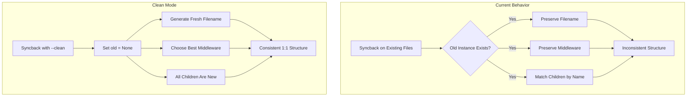

# Destructive Syncback Mode

## Root Cause Analysis

Your inconsistency stems from three preservation mechanisms in syncback:

### 1. File Name Preservation (`[src/syncback/file_names.rs](src/syncback/file_names.rs)` lines 19-34)

When an old instance exists, the **existing filename is always preserved**, even if the instance was renamed:

```rust
if let Some(old_inst) = old_inst {
    if let Some(source) = old_inst.metadata().relevant_paths.first() {
        source.file_name()  // Returns OLD filename, ignores new instance name
    }
}
```

### 2. Middleware Preservation (`[src/syncback/mod.rs](src/syncback/mod.rs)` lines 353-357)

When an old instance exists, its middleware format is preserved:

```rust
} else if let Some(old_middleware) = old_middleware {
    // Use old middleware, even if a clean sync would choose differently
    middleware = old_middleware;
}
```

This means a `Part.rbxm` stays as `.rbxm` instead of potentially becoming a `Part/` directory with children.

### 3. Name-Based Child Matching (`[src/snapshot_middleware/dir.rs](src/snapshot_middleware/dir.rs)` lines 196-216)

Children are matched by name between old and new DOMs. If a child exists in both, it inherits the old structure:

```rust
if let Some(old_child) = old_child_map.remove(new_child.name.as_str()) {
    // Existing child - pass old reference, preserving its structure
    children.push(snapshot.with_joined_path(*new_child_ref, Some(old_child.id()))?);
} else {
    // New child - gets fresh structure
    children.push(snapshot.with_joined_path(*new_child_ref, None)?);
}
```

## Solution: Add `--clean` Flag

Add a `--clean` flag that makes syncback treat all instances as "new" by setting `old` references to `None`, ensuring consistent output regardless of existing filesystem state.

### Changes Required

#### 1. Add CLI Flag (`[src/cli/syncback.rs](src/cli/syncback.rs)`)

Add `--clean` flag to the command definition:

```rust
/// If provided, syncback will ignore existing file structure and create
/// a fresh project layout. This ensures consistent output regardless of
/// existing filesystem state.
#[clap(long)]
pub clean: bool,
```

#### 2. Pass Flag to `syncback_loop` (`[src/cli/syncback.rs](src/cli/syncback.rs)`)

Modify the `syncback_loop` call to pass the clean flag:

```rust
let snapshot = syncback_loop(
    session_old.vfs(),
    &mut dom_old,
    dom_new,
    session_old.root_project(),
    self.clean,  // New parameter
)?;
```

#### 3. Modify `syncback_loop` (`[src/syncback/mod.rs](src/syncback/mod.rs)`)

Update function signature and initial snapshot:

```rust
pub fn syncback_loop(
    vfs: &Vfs,
    old_tree: &mut RojoTree,
    mut new_tree: WeakDom,
    project: &Project,
    clean_mode: bool,  // New parameter
) -> anyhow::Result<FsSnapshot>
```

When `clean_mode` is true, set the initial `old` reference to `None`:

```rust
let mut snapshots = vec![SyncbackSnapshot {
    data: syncback_data,
    old: if clean_mode { None } else { Some(old_tree.get_root_id()) },
    new: new_tree.root_ref(),
    path: project.file_location.clone(),
    middleware: Some(Middleware::Project),
}];
```

#### 4. Track Removed Files in Clean Mode (`[src/syncback/mod.rs](src/syncback/mod.rs)`)

In clean mode, we need to remove all existing files in the target paths. Add logic to collect existing paths for removal:

```rust
if clean_mode {
    // Collect all existing paths under the project tree for removal
    for ref_id in descendants(old_tree.inner(), old_tree.get_root_id()) {
        if let Some(inst) = old_tree.get_instance(ref_id) {
            for path in inst.metadata().relevant_paths.iter() {
                if path.is_dir() {
                    fs_snapshot.remove_dir(path);
                } else {
                    fs_snapshot.remove_file(path);
                }
            }
        }
    }
}
```

#### 5. Update Child Snapshot Creation (`[src/snapshot_middleware/dir.rs](src/snapshot_middleware/dir.rs)`)

The `SyncbackSnapshot::with_joined_path` method already handles `old = None` correctly - it will create a fresh child snapshot without old references.

### Data Flow Diagram




### Usage

```bash
# Current behavior (preserves existing structure)
rojo syncback -i game.rbxl

# Destructive mode (ignores existing structure, creates fresh layout)
rojo syncback -i game.rbxl --clean

# Combine with other flags
rojo syncback -i game.rbxl --clean --list --dry-run
```

### Alternative Consideration

If you also want to support project-level configuration (so you don't need to pass `--clean` every time), we could add a `syncbackRules.cleanMode: true` option in the project file. Let me know if you'd prefer that approach.