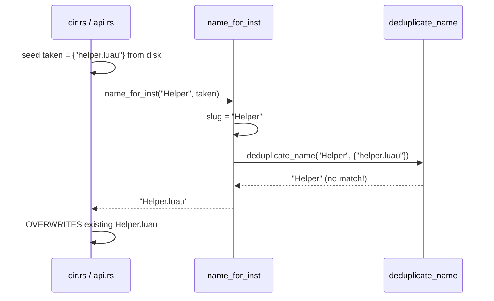

# Fix dedup key propagation (no extension awareness outside file_names.rs)

## The Defect

`deduplicate_name` compares bare slugs against `taken_names`. But callers populate `taken_names` from filesystem entries (`vfs.read_dir` / `fs::read_dir`), which have extensions. Bare slug `"helper"` does not match `"helper.luau"`, so file-format collisions go undetected.



## Root Cause

The callers violate the `taken_names` contract. Per the original plan: `taken_names` should contain **claimed names** (bare slugs), not filenames with extensions. The defect is in what goes INTO the set, not in `deduplicate_name` itself.

## The Fix (zero extension awareness outside file_names.rs)

Two changes, both inside the existing architecture:

### 1. `name_for_inst` returns the dedup key

`name_for_inst` already computes the bare slug (`deduped`) internally. For file middleware, it appends the extension AFTER dedup to produce the filename. We expose the pre-extension slug as a third return value so callers can insert it into `taken_names`.

```
Current:  (filename, needs_meta)
Proposed: (filename, needs_meta, dedup_key)
```

- **Old inst path:** `dedup_key` = the slug portion of the existing filename. `name_for_inst` already receives `middleware`, so it can strip `extension_for_middleware(middleware)` from the filename. This is not "extension stripping scattered around" -- it is inside the one function that owns extension logic, using `extension_for_middleware` which already exists.
- **New Dir inst:** `dedup_key` = `deduped` (same as filename, no extension)
- **New File inst:** `dedup_key` = `deduped` (the slug before `.{extension}` was appended)

Callers insert `dedup_key.to_lowercase()` into `taken_names`. They never see or touch an extension.

### 2. Replace disk seeding with tree-based seeding

Instead of reading filenames from disk (which contain extensions), seed `taken_names` from the **existing tree's children** by slugifying their instance names:

```rust
// Seed from old tree children's slugified instance names
for child_ref in parent.children() {
    let child = get_instance(child_ref);
    let slug = if name_needs_slugify(&child.name) {
        slugify_name(&child.name).to_lowercase()
    } else {
        child.name.to_lowercase()
    };
    taken_names.insert(slug);
}
```

This is architecturally correct -- instance names are the authoritative source, and slugifying them produces the same bare slugs that `name_for_inst` would produce. No filesystem reads, no extensions, no parsing.

**What about orphaned files?** Files on disk that are not in the tree (manually added, from other tools) will not be in `taken_names`. A new instance could overwrite them. This is acceptable -- those files are not part of Rojo's model. The old `encode_path_name` system had the same behavior, and upstream PR #1187 does not do disk seeding either.

## Affected Files

### [src/syncback/file_names.rs](src/syncback/file_names.rs)

- Change `name_for_inst` return type to include `dedup_key: String`
- Old inst path: derive `dedup_key` by stripping `.{extension_for_middleware(middleware)}` suffix from the filename (single strip, inside the function that already owns extensions)
- New inst paths: `dedup_key` = the `deduped` variable (already computed, just return it)

### [src/syncback/snapshot.rs](src/syncback/snapshot.rs)

- `with_joined_path` and `with_base_path` call `name_for_inst` and return the result. Update them to propagate the `dedup_key` so callers in dir.rs/project.rs can use it.

### [src/snapshot_middleware/dir.rs](src/snapshot_middleware/dir.rs)

- Remove `vfs.read_dir` seeding entirely
- The loop already processes old+new children interleaved; old children go through `name_for_inst`'s old-inst path, which returns the dedup_key. Accumulate `dedup_key` instead of `file_name()`
- New children's dedup_keys are also accumulated

### [src/snapshot_middleware/project.rs](src/snapshot_middleware/project.rs)

- Remove `vfs.read_dir` seeding in `or_insert_with`
- Accumulate `dedup_key` from `with_base_path` results instead of `file_name()`

### [src/web/api.rs](src/web/api.rs)

- Replace `fs::read_dir` seeding with tree-sibling slugified names
- `parent_instance.children()` gives child refs, `tree.get_instance(ref)` gives instance names, slugify them into `taken_names`

### Tests

- Fix the "limitation documentation" tests to assert correct dedup behavior for file-format instances
- The nightmare tests that use `process_new_children_with_disk_seed` switch to tree-style seeding with bare slugs
- The `twoway_sync_dedup` tests test file-format collisions properly

## Edge Case: Old inst with unknown middleware

For old instances, `name_for_inst` receives `middleware` as a parameter (determined by `get_best_middleware`). It uses `extension_for_middleware(middleware)` to derive the dedup_key. For Dir middleware, extension is empty, so dedup_key = filename. For all file middleware, the extension is known and strippable. There is no "unknown extension" case.
