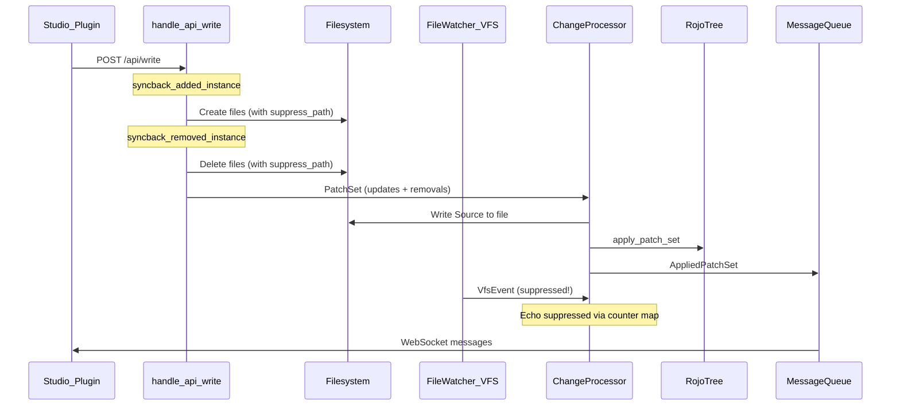

# Fix All Sync System Issues

## Data Flow Context



All fixes target eliminating the problems in this flow.

---

## Files Changed (5 unpushed commits)

| File | Lines Changed | Changes |
|------|--------------|---------|
| `src/web/api.rs` | +1050 | Syncback methods, echo suppression wiring, property persistence, format detection, path encoding fixes, model-to-meta conversion |
| `src/change_processor.rs` | +589 | VFS event handling, recovery mechanism, rename/ClassName logic, find_init_file, INFO logging |
| `src/serve_session.rs` | +19 | `suppressed_paths` field (counter-based HashMap), accessor method |
| `crates/memofs/src/lib.rs` | +11/-4 | Removed unwatch-on-Remove from `commit_event` |
| `tests/rojo_test/serve_util.rs` | +5/-1 | `post_api_write` reqwest timeout increased to 60s |

**Note:** Integration tests in `tests/tests/serve.rs` and `tests/tests/syncback_format_transitions.rs` were added in earlier commits already on origin. This changeset modifies only the core implementation and test utilities.

---

## Issue 1 — [HIGH] Standalone script children created as siblings

**File:** `src/web/api.rs` — `syncback_added_instance`

**Problem:** When a new child is added to a standalone script parent (e.g., `MyModule.luau`), the parent path resolves to the directory containing the script, so the child is created as a sibling instead of inside a `MyModule/` directory.

**Fix:** Two shared helpers extract the conversion logic:

- `convert_standalone_script_to_directory()` — handles `.luau`/`.lua` scripts, moves content to `init.{suffix}.luau`, renames adjacent meta files
- `convert_standalone_instance_to_directory()` — handles `.model.json5`, `.txt`, `.csv`, and other non-script types

Both are called from `syncback_added_instance` when the parent path is a file (not directory).

---

## Issue 2 — [HIGH] Non-Source property updates not persisted to disk

**Files:** `src/web/api.rs` — `handle_api_write`, `syncback_updated_properties`

**Problem:** `ChangeProcessor::handle_tree_event` only writes `Source` to disk. All other property changes (Attributes, etc.) are applied to the in-memory tree only and lost on restart.

**Fix:** New method `syncback_updated_properties` on `ApiService`:

- Filters non-Source properties using `filter_properties_for_meta` (respects reflection database defaults, skips Ref/UniqueId, filters internal RBX* attributes)
- Determines file structure (directory → `init.meta.json5`, standalone script → `Name.meta.json5`, non-script → updates model file in place)
- Uses `merge_or_build_meta` to read existing meta, merge changes, and write back
- **Post-fix:** Guards against `InstigatingSource::ProjectNode` to prevent writing meta JSON to project files (would corrupt them)
- **Post-fix:** Derives standalone script meta file base name from `inst_path.file_stem()` with suffix stripping (`.server`, `.client`, `.plugin`, `.local`, `.legacy`) instead of `instance.name()`, preserving Windows-invalid character encoding (e.g., `%3F` for `?`)

---

## Issue 3 — [MEDIUM] Potential `.model.json` / `.model.json5` duplicates

**File:** `src/web/api.rs` — `ExistingFileFormat`, `detect_existing_script_format`

**Problem:** `detect_existing_script_format` returned `Standalone` without the actual file path. New files were always created as `.model.json5`, potentially alongside an existing `.model.json`.

**Fix:** `ExistingFileFormat` now carries the detected path:

```rust
enum ExistingFileFormat {
    None,
    Standalone(PathBuf),
    Directory(PathBuf),
}
```

All match arms in `syncback_instance_to_path_with_stats` use the carried path. Format transitions (standalone ↔ directory) clean up old files and meta files.

---

## Issue 4 — [MEDIUM] Removed instances leave stale window in tree

**Files:** `src/web/api.rs`, `src/change_processor.rs`

**Problem:** `handle_api_write` sent `removed_instances: Vec::new()` even when removals happened.

**Fix:** Removed IDs are included in the PatchSet. `ChangeProcessor::handle_tree_event` guards file deletion with existence checks and handles both files and directories.

---

## Issue 5 — [MEDIUM] Tree lock held during filesystem I/O

**File:** `src/web/api.rs` — `handle_api_write`

**Problem:** The tree mutex was held during all synchronous filesystem operations.

**Fix:** Two-phase approach:
- **Phase 1 (with lock):** Gather parent paths, existing children, duplicate sibling cache, removal paths
- **Phase 2 (without lock):** Execute all filesystem operations

---

## Issue 6 — [LOW] Can't add children to project-defined parents

**File:** `src/web/api.rs` — `syncback_added_instance`

**Problem:** `InstigatingSource::ProjectNode` returns the project file path, not the filesystem directory.

**Fix:** Match on `InstigatingSource` variants. For `ProjectNode`, resolve `node.path` (`$path` field) relative to the project file directory.

---

## Issue 7 — [LOW → HIGH] File watcher echo after syncback

**Files:** `src/serve_session.rs`, `src/change_processor.rs`, `src/web/api.rs`

**Problem:** When the API writes files to disk, the file watcher picks them up and creates redundant re-snapshots and WebSocket messages. Under rapid writes (e.g., 50 rapid syncs), this feedback loop caused the server to become unresponsive.

**Fix:** Counter-based echo suppression:

1. `ServeSession` holds `suppressed_paths: Arc<Mutex<HashMap<PathBuf, usize>>>` — values are counts, not booleans, to handle rapid writes to the same file correctly
2. `ApiService` gets the map via `serve_session.suppressed_paths()` and calls `suppress_path()` before every `fs::write`, `fs::remove_file`, `fs::remove_dir_all`, and `fs::create_dir_all` across all syncback methods
3. `suppress_path()` inserts both the canonicalized path (for VFS event matching) and the raw path (as fallback), incrementing the counter each time
4. `ChangeProcessor::handle_vfs_event` checks the map before processing — if found, decrements counter (removes at zero), commits the event to VFS for consistency, but skips patching

**Note:** The original plan specified a `HashSet` with one-shot removal. This was changed to `HashMap<PathBuf, usize>` because rapid writes to the same file (e.g., 50 writes to `init.luau`) would insert the same path once but generate 50 VFS events — only the first would be suppressed. The counter ensures all expected events are suppressed.

---

## Issue 8 — [INFO] Rename/ClassName persistence

**File:** `src/change_processor.rs` — `handle_tree_event`

**Problem:** Name and ClassName changes were logged as warnings and only applied to in-memory tree.

**Fix for renames:** File/directory rename via `fs::rename`, plus adjacent meta file rename.

**Fix for ClassName changes:** Script-to-script class transitions rename the init file extension. Cross-category changes (script ↔ non-script) log a warning.

**Post-fix (directory-format scripts):** The original implementation checked `path.file_name().starts_with("init.")` to detect init files, but for directory-format scripts the `InstigatingSource::Path` is the *directory* (e.g., `src/MyModule/`), not the init file. This caused `is_init` to always be false, and the code attempted to rename the directory to a file name. Fixed by adding `find_init_file()` which searches the directory for known init file candidates in priority order.

**Post-fix (continue → Option flow):** The `None` branch of `find_init_file()` originally used `continue`, which exited the entire `for update in &patch_set.updated_instances` loop iteration. This skipped all subsequent processing for that update, including `changed_metadata` handling and the `changed_properties` loop that writes Source to disk. If a user changed both ClassName and Source in a single update, and the init file couldn't be found, the Source change was silently dropped (data loss). Fixed by restructuring to `Option`-based control flow: `init_result` is `Option<(PathBuf, PathBuf)>`, with `if let Some(...)` doing the rename and `else` logging the warning — the rest of the update always runs.

---

## Issue 9 — [CRITICAL] File watcher loses track of files after rapid delete+recreate

**Files:** `src/change_processor.rs`, `crates/memofs/src/lib.rs`

**Reproduction:** Cursor agent modifies a file, user clicks "undo", file is deleted and immediately recreated. Rojo thinks the file is deleted even though it exists on disk.

**Root cause — three contributing factors:**

1. `commit_event(Remove)` unwatched the path, preventing future event detection
2. Create/Write events silently dropped at `trace` level when `canonicalize` failed
3. Race condition: `notify_debouncer_full` could coalesce rapid Remove+Create into just Remove

**Fix — five layers of defense:**

1. **Pedantic INFO logging** for all VFS events and decisions (canonicalize results, patch application summaries, path resolution)
2. **Stop unwatching on Remove** in `memofs::VfsInner::commit_event` — stale watches are harmless
3. **Recovery check** in `compute_and_apply_changes` — before removing an instance, verify the path is genuinely gone from the real filesystem via `std::fs::metadata` (bypassing VFS state)
4. **Retry canonicalize** for Create/Write events — 50ms delay then retry, warn if still fails
5. **Post-Remove sweep** via `pending_recovery` — paths removed from the tree are re-checked after 200ms; if the file has reappeared, trigger a re-snapshot. Runs after every event and on a 500ms periodic timer.

---

## Post-Implementation Fixes

These issues were discovered during CI runs and agent review after the initial implementation.

### Fix: .model.json5 → init.meta.json5 conversion loses inline children

**File:** `src/web/api.rs` — `convert_standalone_instance_to_directory`

**Problem:** The `.model.json5` format supports a `children` field for inline child instances, but `init.meta.json5` (parsed as `DirectoryMetadata`) does not. The original code copied raw bytes, silently losing inline children.

**Fix:** Parse the `.model.json5` as JSON and extract only the fields `DirectoryMetadata` supports (`className`, `properties`, `attributes`, `ignoreUnknownInstances`, `id`). If inline `children` are present and non-empty, log a warning. Falls back to raw-copy only if JSON parsing fails.

### Fix: Meta file path uses decoded name instead of encoded file stem

**File:** `src/web/api.rs` — `syncback_updated_properties`

**Problem:** Used `instance.name()` (decoded, e.g., `What?`) to construct the adjacent meta file path. On Windows with `encodeWindowsInvalidChars` enabled, the actual file uses encoded names (e.g., `What%3F.luau`). This mismatch caused `fs::write` failures on Windows and meta files that wouldn't be found when reading.

**Fix:** Derive the base name from `inst_path.file_stem()` with known script suffix stripping (`.server`, `.client`, `.plugin`, `.local`, `.legacy`), matching exactly what `AdjacentMetadata::read_and_apply_all` does.

---

## Commits (unpushed)

1. **`0968e742`** — Initial implementation of all 9 issues (core syncback methods, VFS recovery, logging, memofs change)
2. **`f4f07744`** — Refactor suppression from `HashSet` to counter-based `HashMap<PathBuf, usize>`; wire `suppress_path()` into `ApiService` before all fs operations
3. **`f38c96e1`** — Add `find_init_file()` for directory-format scripts; fix ClassName rename targeting directory instead of init file
4. **`e6944e31`** — Fix `continue` → `Option` flow in ClassName handler; guard `syncback_updated_properties` against `ProjectNode` sources
5. **`dc1a9129`** — Parse `.model.json5` → `init.meta.json5` field extraction; derive meta file base name from `file_stem()` instead of `instance.name()`

## Testing

- **Integration tests** in `tests/tests/serve.rs` cover syncback operations (add, remove, update, format transitions) — added in prior pushes, not part of this diff
- **Format transition tests** in `tests/tests/syncback_format_transitions.rs` cover standalone ↔ directory conversions including a 50-rapid-sync stress test — added in prior pushes, not part of this diff
- **Test utility** `post_api_write` in `tests/rojo_test/serve_util.rs` — reqwest timeout increased to 60s (this diff)
- **Stress tests** in `crates/memofs/src/std_backend.rs` provide unit-level coverage for the debouncer — pre-existing
- **CI result:** 606 Rust tests passed, 397 plugin tests passed, 0 failures
