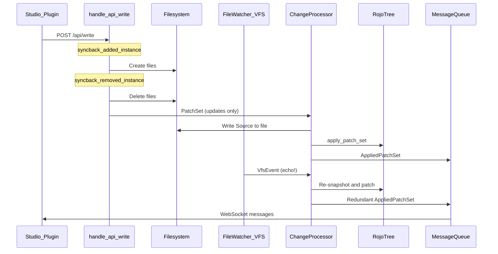
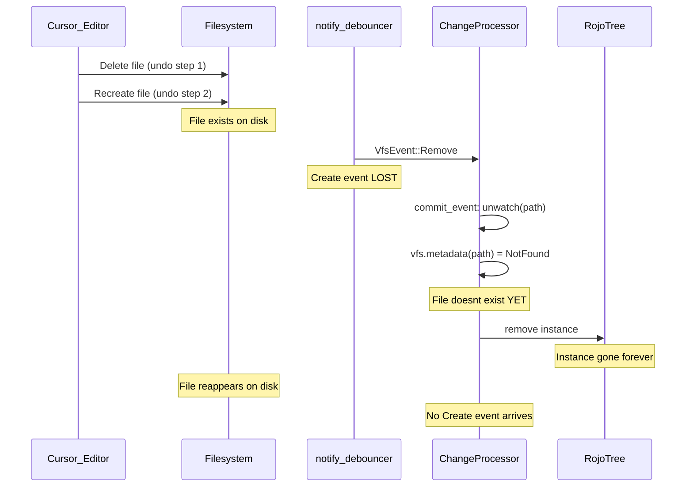

# Fix All Sync System Issues

## Data Flow Context




All fixes target eliminating the problems in this flow.

---

## Issue 1 — [HIGH] Standalone script children created as siblings

**File:** [src/web/api.rs](src/web/api.rs) — `syncback_added_instance` (line ~528)

**Problem:** When a new child is added to a standalone script parent (e.g., `MyModule.luau`), the parent path resolves to the directory containing the script, so the child is created as a sibling instead of inside a `MyModule/` directory.

**Fix:** After resolving `parent_path` and finding it is a file (not a directory), check if the parent is a script class. If so, convert it to directory format before creating the child:

1. Create directory `parent_dir/ParentName/`
2. Move `ParentName.luau` to `ParentName/init.luau` (with correct suffix for Script/LocalScript)
3. Delete the old standalone file
4. Remove any adjacent `.meta.json5` (move content to `init.meta.json5` inside the new dir)
5. Set `parent_dir` to the new directory
6. Proceed with normal child creation

The conversion logic already exists in `syncback_update_existing_instance` (lines 620-670). Extract it into a shared helper:

```rust
fn convert_standalone_to_directory(
    &self,
    parent_path: &Path,
    parent_name: &str,
    class_name: &str,
) -> anyhow::Result<PathBuf>
```

---

## Issue 2 — [HIGH] Non-Source property updates not persisted to disk

**Files:** [src/web/api.rs](src/web/api.rs) — `handle_api_write` (line ~300), [src/change_processor.rs](src/change_processor.rs) — `handle_tree_event` (line ~299)

**Problem:** `ChangeProcessor::handle_tree_event` only writes `Source` to disk. All other property changes (Attributes, etc.) are applied to the in-memory tree only and lost on restart.

**Fix:** In `handle_api_write`, before sending the PatchSet, process non-Source property changes for each `updated_instance`:

1. Look up the instance in the tree to get its `instigating_source` path
2. Determine the meta file path:
  - Scripts in directories: `dir/init.meta.json5`
  - Standalone scripts: `parent/Name.meta.json5`
  - Model files: update the `.model.json5` directly
3. Read existing meta file (if any), merge changed properties, write back
4. Reuse existing helpers: `filter_properties_for_meta`, `build_meta_object`, `variant_to_json`

Add a new method to `ApiService`:

```rust
fn syncback_updated_properties(
    &self,
    update: &InstanceUpdate,
    tree: &RojoTree,
) -> anyhow::Result<()>
```

This processes properties **other than Source** (Source is handled by ChangeProcessor already). The method:

- Gets the instance from the tree
- Gets `instigating_source.path()`
- Determines if it's a directory or standalone file
- Reads existing meta/model file, merges changes, writes back

---

## Issue 3 — [MEDIUM] Potential `.model.json` / `.model.json5` duplicates

**File:** [src/web/api.rs](src/web/api.rs) — `ExistingFileFormat` enum and `detect_existing_script_format` (line ~864), `syncback_instance_to_path_with_stats` (line ~1362)

**Problem:** `detect_existing_script_format` returns just `Standalone` without the actual file path. New files are always created as `.model.json5`, potentially alongside an existing `.model.json`.

**Fix:** Make `ExistingFileFormat` carry the detected path:

```rust
enum ExistingFileFormat {
    None,
    Standalone(PathBuf),   // was: Standalone
    Directory(PathBuf),     // was: Directory
}
```

Update `detect_existing_script_format` to return the actual path found. Update all match arms in `syncback_instance_to_path_with_stats` to use the carried path when writing to an existing file:

- For `Standalone(path)`: write to `path` instead of always generating `.model.json5`
- For `Directory(path)`: use `path` for the directory

---

## Issue 4 — [MEDIUM] Removed instances leave stale window in tree

**File:** [src/web/api.rs](src/web/api.rs) — `handle_api_write` (line ~334), [src/change_processor.rs](src/change_processor.rs) — `handle_tree_event` (line ~249)

**Problem:** `handle_api_write` sends `removed_instances: Vec::new()` even when removals happened. The tree only updates when the file watcher detects deletions.

**Fix:**

1. In `handle_api_write`, include the removed IDs in the PatchSet:

```rust
tree_mutation_sender
    .send(PatchSet {
        removed_instances: request.removed.clone(),
        added_instances: Vec::new(),
        updated_instances,
    })
```

1. In `ChangeProcessor::handle_tree_event`, guard file deletion with an existence check to avoid spurious error logs when files were already deleted by `syncback_removed_instance`:

```rust
InstigatingSource::Path(path) => {
    if path.exists() {
        log::info!("Two-way sync: Removing file {}", path.display());
        if let Err(err) = fs::remove_file(path) { ... }
    } else {
        log::trace!("File already removed: {}", path.display());
    }
}
```

Also handle directory removal (currently only `fs::remove_file`, should also check `fs::remove_dir_all`).

---

## Issue 5 — [MEDIUM] Tree lock held during filesystem I/O

**File:** [src/web/api.rs](src/web/api.rs) — `handle_api_write` (line ~277)

**Problem:** The tree mutex is held during all synchronous filesystem operations in `syncback_added_instance`, blocking other threads.

**Fix:** Split the operation into two phases:

**Phase 1 — Gather (with lock):** Collect all information needed from the tree:

- Parent paths for each added instance
- Existing child lookups (for dedup)
- Duplicate sibling cache
- Instigating source paths for removed instances

Store results in a `Vec<SyncbackAction>` enum:

```rust
enum SyncbackAction {
    CreateNew { added: AddedInstance, parent_dir: PathBuf },
    UpdateExisting { added: AddedInstance, existing_path: PathBuf },
    Remove { path: PathBuf, is_dir: bool },
    Skip { name: String, reason: String },
}
```

**Phase 2 — Execute (without lock):** Release tree lock, then execute all filesystem operations from the collected actions.

---

## Issue 6 — [LOW] Can't add children to project-defined parents

**File:** [src/web/api.rs](src/web/api.rs) — `syncback_added_instance` (line ~520)

**Problem:** When parent's `instigating_source` is `InstigatingSource::ProjectNode`, `.path()` returns the project file path, not the filesystem directory for children.

**Fix:** After getting the instigating source, handle `ProjectNode` separately:

```rust
let parent_dir = match instigating_source {
    InstigatingSource::Path(path) => {
        if path.is_dir() { path.clone() } else { path.parent().unwrap().to_path_buf() }
    }
    InstigatingSource::ProjectNode { path: project_path, node, .. } => {
        if let Some(path_node) = &node.path {
            let fs_path = path_node.path();
            let resolved = if fs_path.is_relative() {
                project_path.parent().unwrap().join(fs_path)
            } else {
                fs_path.to_path_buf()
            };
            if resolved.is_dir() { resolved } else { resolved.parent().unwrap().to_path_buf() }
        } else {
            anyhow::bail!(
                "Cannot add '{}' - parent '{}' is defined in project file without $path",
                added.name, name
            );
        }
    }
};
```

This uses the `node.path` (`$path` field from [src/project.rs](src/project.rs) `ProjectNode` struct, line ~372) resolved relative to the project file directory.

---

## Issue 7 — [LOW] File watcher echo after syncback

**Files:** [src/serve_session.rs](src/serve_session.rs), [src/change_processor.rs](src/change_processor.rs), [src/web/api.rs](src/web/api.rs)

**Problem:** When the API writes files to disk, the file watcher picks them up and creates redundant patches.

**Fix:** Add a write-suppression set shared between API and ChangeProcessor:

1. Add to `ServeSession`:

```rust
suppressed_paths: Arc<Mutex<HashSet<PathBuf>>>
```

1. In `syncback_added_instance` / `syncback_removed_instance` / `syncback_instance_to_path_with_stats`, before each `fs::write` / `fs::remove_*` / `fs::create_dir_all`, add the path to the suppression set.
2. In `ChangeProcessor::handle_vfs_event`, check the suppression set before processing:

```rust
fn handle_vfs_event(&self, event: VfsEvent) {
    let event_path = match &event {
        VfsEvent::Create(p) | VfsEvent::Write(p) | VfsEvent::Remove(p) => p.clone(),
    };

    // Check and remove from suppression set (one-shot suppression)
    {
        let mut suppressed = self.suppressed_paths.lock().unwrap();
        if suppressed.remove(&event_path) {
            self.vfs.commit_event(&event).expect("Error applying VFS change");
            log::trace!("Suppressed echo event for {}", event_path.display());
            return;
        }
    }

    // ... normal processing ...
}
```

Still commit the event to VFS (so VFS stays consistent), but skip patch computation and message broadcasting.

---

## Issue 8 — [INFO] Rename/ClassName persistence

**File:** [src/change_processor.rs](src/change_processor.rs) — `handle_tree_event` (line ~287)

**Problem:** Name and ClassName changes are logged as warnings and only applied to in-memory tree.

**Fix for renames:** Replace `log::warn!("Cannot rename instances yet.")` with:

1. Get instance's `instigating_source` path
2. Compute new path based on new name (preserve extension/format)
3. Rename file or directory on disk (`fs::rename`)
4. Update any adjacent meta file name (e.g., `OldName.meta.json5` -> `NewName.meta.json5`)

**Fix for ClassName changes:** Replace `log::warn!("Cannot change ClassName yet.")` with:

1. For script classes: compute old and new file extensions
2. Rename the file (e.g., `Foo.server.luau` -> `Foo.client.luau`)
3. For non-script to script or vice versa: convert between `.model.json5` and `.luau` formats

ClassName changes are complex — scope the initial implementation to script class transitions only (Script <-> LocalScript, etc.) and log a warning for cross-category changes (script to non-script).

---

## Issue 9 — [CRITICAL] File watcher loses track of files after rapid delete+recreate

**Files:** [src/change_processor.rs](src/change_processor.rs), [crates/memofs/src/lib.rs](crates/memofs/src/lib.rs), [crates/memofs/src/std_backend.rs](crates/memofs/src/std_backend.rs)

**Reproduction:** Cursor agent modifies a file, user clicks "undo", file is deleted and immediately recreated. Rojo thinks the file is deleted even though it exists on disk. Restarting Rojo serve fixes it.

**Root cause analysis — three contributing factors:**




**Factor 1: `commit_event(Remove)` unwatches the path** ([crates/memofs/src/lib.rs](crates/memofs/src/lib.rs) line 239)

```rust
fn commit_event(&mut self, event: &VfsEvent) -> io::Result<()> {
    if let VfsEvent::Remove(path) = event {
        let _ = self.backend.unwatch(path);  // <-- problematic
    }
    Ok(())
}
```

If the removed path was directly watched (in the `watches` set), it gets unwatched from `notify`. When the path is recreated, the parent's recursive watch *might* cover it, but on Windows this is unreliable for detecting the recreation event.

**Factor 2: Create/Write events silently dropped when `canonicalize` fails** ([src/change_processor.rs](src/change_processor.rs) line 183)

```rust
Err(_) => {
    log::trace!(  // <-- INVISIBLE at normal log levels
        "Skipping create/write event for {:?} - path no longer exists",
        path
    );
    Vec::new()
}
```

On Windows, `canonicalize` calls `GetFinalPathNameByHandleW`, which can fail if the file is still being written/locked by another process. The Create event is silently dropped at `trace` level — completely invisible.

**Factor 3: Genuine race condition between file operations and event processing.** The `notify_debouncer_full` with 50ms timeout can coalesce a rapid Remove+Create into just a Remove on Windows if `ReadDirectoryChangesW` misses the recreation or the debouncer's cache only tracks the removal.

**Fix — four layers of defense:**

### Layer 1: Pedantic INFO-level logging for ALL file watcher decisions

Change ALL event and decision logging in `handle_vfs_event` from `debug`/`trace` to `info`:

```rust
fn handle_vfs_event(&self, event: VfsEvent) {
    // Log EVERY event at INFO for diagnostics
    match &event {
        VfsEvent::Create(path) => log::info!("VFS event: CREATE {}", path.display()),
        VfsEvent::Write(path) => log::info!("VFS event: WRITE {}", path.display()),
        VfsEvent::Remove(path) => log::info!("VFS event: REMOVE {}", path.display()),
        _ => log::info!("VFS event: OTHER {:?}", event),
    }
    // ...
    // Log EVERY decision point:
    // - "Canonicalize succeeded: {path}" / "Canonicalize FAILED: {path} - {err}"
    // - "apply_patches found IDs: {ids:?} at path: {path}"
    // - "compute_and_apply_changes: path exists={exists}, result={added/removed/updated}"
    // - "Patch applied: {summary}"
}
```

Also log at INFO in `compute_and_apply_changes`:

- Whether `vfs.metadata(path)` found the file or not
- Whether the snapshot produced changes
- What instances were added/removed/updated

### Layer 2: Stop unwatching paths on Remove events

In [crates/memofs/src/lib.rs](crates/memofs/src/lib.rs), remove the unwatch from `commit_event`:

```rust
fn commit_event(&mut self, event: &VfsEvent) -> io::Result<()> {
    // NOTE: We intentionally do NOT unwatch on Remove.
    // The path may be recreated immediately (editor undo), and unwatching
    // causes future events to be missed. Stale watches are harmless —
    // notify silently ignores events for non-existent paths, and the
    // watch will be cleaned up when the parent is unwatched.
    Ok(())
}
```

This is safe because:

- `notify` silently handles watches on non-existent paths (no errors)
- The parent directory's recursive watch provides the actual coverage
- Stale entries in the `watches` set are harmless overhead

### Layer 3: Recovery check after Remove events that cause instance removal

In `compute_and_apply_changes` ([src/change_processor.rs](src/change_processor.rs) line 391), after the instance would be removed, verify the path doesn't exist on the REAL filesystem (bypassing any VFS state):

```rust
Ok(None) => {
    // Path not found in VFS. Before removing, verify it's truly gone
    // from the REAL filesystem. On Windows, rapid delete+recreate can
    // cause Remove events where the file has already been recreated.
    if std::fs::metadata(path).is_ok() {
        log::info!(
            "Recovery: path {} was reported removed but exists on disk. Re-snapshotting.",
            path.display()
        );
        // File was recreated — re-snapshot instead of removing
        let snapshot = match snapshot_from_vfs(&metadata.context, vfs, path) {
            Ok(snapshot) => snapshot,
            Err(err) => {
                log::error!("Recovery snapshot error: {:?}", err);
                return None;
            }
        };
        let patch_set = compute_patch_set(snapshot, tree, id);
        apply_patch_set(tree, patch_set)
    } else {
        // Path is genuinely gone
        let mut patch_set = PatchSet::new();
        patch_set.removed_instances.push(id);
        apply_patch_set(tree, patch_set)
    }
}
```

Note: This uses `std::fs::metadata` directly (not `vfs.metadata`) because the VFS may have stale state after `commit_event(Remove)` was called. The real filesystem is the source of truth.

### Layer 4: Retry canonicalize failures for Create/Write events

In `handle_vfs_event`, when `canonicalize` fails for a Create/Write event, retry with a short delay instead of silently dropping:

```rust
VfsEvent::Create(path) | VfsEvent::Write(path) => {
    match self.vfs.canonicalize(&path) {
        Ok(canonical_path) => self.apply_patches(canonical_path),
        Err(err) => {
            log::info!(
                "VFS: canonicalize failed for {} ({}), retrying...",
                path.display(), err
            );
            // Retry after brief delay — file may still be locked by editor
            std::thread::sleep(std::time::Duration::from_millis(50));
            match self.vfs.canonicalize(&path) {
                Ok(canonical_path) => {
                    log::info!("VFS: retry succeeded for {}", path.display());
                    self.apply_patches(canonical_path)
                }
                Err(err2) => {
                    log::warn!(
                        "VFS: Create/Write event DROPPED for {} after retry — \
                         canonicalize failed: {}. File may be desynchronized!",
                        path.display(), err2
                    );
                    Vec::new()
                }
            }
        }
    }
}
```

### Layer 5 (post-Remove sweep): After processing a Remove event that caused instance removal, schedule a filesystem re-check

Add a `pending_recovery` field to `JobThreadContext`:

```rust
struct JobThreadContext {
    tree: Arc<Mutex<RojoTree>>,
    vfs: Arc<Vfs>,
    message_queue: Arc<MessageQueue<AppliedPatchSet>>,
    /// Paths recently removed that should be re-checked after a delay
    pending_recovery: Mutex<Vec<(PathBuf, std::time::Instant)>>,
}
```

After each event is processed in the `select!` loop, check `pending_recovery` for paths older than 200ms. For each, verify the path on the real filesystem and trigger a re-snapshot if it exists:

```rust
loop {
    select! {
        recv(vfs_receiver) -> event => {
            task.handle_vfs_event(event?);
            task.process_pending_recoveries();
        },
        // ... other arms ...
        default(Duration::from_millis(500)) => {
            // Periodic check even when no events arrive
            task.process_pending_recoveries();
        }
    }
}
```

This catches the case where the Remove event was processed correctly (file was genuinely gone at that moment), but the file was recreated shortly after, and no Create event was generated.

---

## Testing Strategy

- Add integration tests in [tests/tests/serve.rs](tests/tests/serve.rs) for each fix
- Issue 1: Test adding a child to a standalone script via the write API, verify directory conversion
- Issue 2: Test property update persistence, verify meta file creation
- Issue 3: Test with existing `.model.json` files, verify no duplicates created
- Issue 4: Test removal appears in tree immediately after write response
- Issue 7: Test that syncback doesn't cause redundant WebSocket messages
- Issue 9: Test rapid delete+recreate of files, verify instance survives in tree. Test with both individual files and directories. Verify INFO logs capture all events.
- Use existing test utilities from [tests/rojo_test/serve_util.rs](tests/rojo_test/serve_util.rs)
- Existing stress tests in [crates/memofs/src/std_backend.rs](crates/memofs/src/std_backend.rs) (`stress_create_delete_recreate_cycles`, `stress_undo_redo_simulation`) provide unit-level coverage for the debouncer

