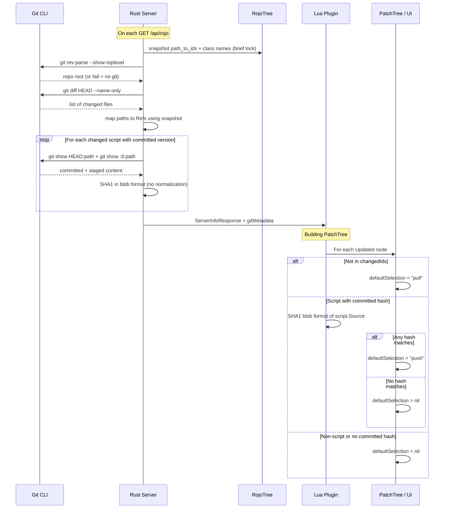

# Git-Based Sync Direction Defaults

## Summary

When the plugin shows the initial sync confirmation dialog, currently all items default to `nil` (unselected). This feature adds smart defaults based on git status:

- **File has no git changes** (same as HEAD): default to "Studio" (pull) -- any diff is because Studio was changed
- **File has git changes AND is a script AND Studio Source matches committed version**: default to "Atlas" (push) -- developer changed the file, Studio hasn't diverged from the last commit
- **Otherwise**: `nil` -- user must decide (both sides changed from committed, or non-script with changes)
- **No git repo**: all defaults remain `nil` (feature is no-op)

These defaults only apply to **Updated** items (where both Studio and filesystem have the instance). Added/Removed items remain `nil` to avoid destructive auto-selections.

**Hash comparison is scripts-only for now.** Non-script property/misc changes that are git-changed remain `nil` (deferred feature -- would require reproducing a bit-for-bit state on the Roblox side to compare).

Recomputed fresh on **each connect** (not cached).

## User Stories

1. **Scripts changed locally, hashes match Studio Source**: Developer changed scripts in git. Plugin receives committed SHA1 hashes. Studio's `script.Source` (non-draft version) matches the committed hashes. Result: **"Atlas" auto-selected** for those scripts.
2. **Scripts changed by someone else too**: Developer pulled commits that changed files, AND someone edited in Studio. Committed SHA1 won't match Studio Source. Result: **No bubble selected** -- user must decide.
3. **Property/misc changes in git**: Non-script files flagged as changed. Result: **No auto-selection** (deferred feature).
4. **No git changes on a file**: File is identical to HEAD. Any diff is because Studio was changed. Result: **"Studio" auto-selected**.

## Architecture




## Server Side (Rust)

### 1. Add `sha1` crate dependency

In [Cargo.toml](Cargo.toml), add under `[dependencies]`:

```toml
sha1 = "0.10"
```

We compute hashes ourselves using the git blob format scheme (`"blob <size>\0<content>"`) so both sides produce identical hashes from identical content.

### 2. New module: `src/git.rs`

All git interaction via `std::process::Command`.

- `**git_repo_root(project_root: &Path) -> Option<PathBuf>**`: Runs `git -C <dir> rev-parse --show-toplevel`. Returns `None` if not a git repo or git not installed.
- `**git_changed_files(repo_root: &Path) -> Option<HashSet<PathBuf>>**`: Runs `git -C <dir> diff HEAD --name-only` to get files differing from HEAD (covers staged + unstaged). Also runs `git -C <dir> ls-files --others --exclude-standard` for untracked files. Returns paths relative to repo root. **Edge case**: if HEAD doesn't exist (no commits yet), treat all tracked files as changed or return None gracefully.
- `**git_show_head(repo_root: &Path, rel_path: &Path) -> Option<String>`**: Runs `git -C <dir> show HEAD:<path>`. Returns committed content at HEAD. Returns `None` for new files.
- `**git_show_staged(repo_root: &Path, rel_path: &Path) -> Option<String>`**: Runs `git -C <dir> show :0:<path>`. Returns staged (index) content. Returns `None` if not staged or file doesn't exist in index.
- `**compute_blob_sha1(content: &str) -> String`**: Computes `SHA1("blob <byte_len>\0<content>")`. Returns 40-char lowercase hex string. No normalization.
- `**git_add(repo_root: &Path, paths: &[PathBuf])`**: Runs `git -C <dir> add -- <paths...>`. Stages files for commit. No-op if paths is empty.
- `**compute_git_metadata(path_snapshot: &PathSnapshot, project_root: &Path) -> Option<GitMetadata>`**: Takes a pre-extracted `PathSnapshot` (see section 4). Orchestrates git commands:
  1. Find repo root
  2. Get changed files set
  3. Map changed file paths to instance Refs using the path snapshot
  4. For each changed script: collect up to 2 hashes -- HEAD version and staged version (skip staged if identical to HEAD)
  5. Returns `None` if no git repo

### 3. Update data structures in [src/web/interface.rs](src/web/interface.rs)

**GitMetadata** (new struct for ServerInfoResponse):

```rust
#[derive(Debug, Serialize, Deserialize)]
#[serde(rename_all = "camelCase")]
pub struct GitMetadata {
    /// Instance IDs whose backing files have changes relative to HEAD
    pub changed_ids: Vec<Ref>,
    /// For changed script instances: SHA1 hashes of prior versions (git blob format).
    /// Contains 1-2 hashes per script: HEAD version and staged version (if different).
    /// Plugin checks if Studio Source matches ANY hash to default "Atlas".
    pub script_committed_hashes: HashMap<Ref, Vec<String>>,
}
```

Add to `ServerInfoResponse`:

```rust
#[serde(default, skip_serializing_if = "Option::is_none")]
pub git_metadata: Option<GitMetadata>,
```

**WriteRequest** (add `stage_ids` field):

```rust
pub struct WriteRequest {
    pub session_id: SessionId,
    pub removed: Vec<Ref>,
    #[serde(default)]
    pub added: HashMap<Ref, AddedInstance>,
    pub updated: Vec<InstanceUpdate>,
    /// Instance IDs whose backing files should be staged via git add.
    /// Includes: all push-accepted IDs + auto-selected pull-accepted IDs.
    #[serde(default)]
    pub stage_ids: Vec<Ref>,
}
```

**PatchSet** (add `stage_ids` field for change_processor):

Add to the existing PatchSet struct in [src/snapshot/patch.rs](src/snapshot/patch.rs):

```rust
/// Instance IDs whose backing files should be staged after writing.
/// Populated from WriteRequest.stage_ids, consumed by change_processor.
#[serde(default, skip)]
pub stage_ids: HashSet<Ref>,
```

### 4. Update `handle_api_rojo()` in [src/web/api.rs](src/web/api.rs) -- two-phase lock

**Critical**: Do NOT hold the tree lock while running git subprocesses.

**Phase 1 (with lock)**: Snapshot the data needed from the tree:

- `path_to_ids` entries (clone the relevant mappings)
- Instance class names for each Ref
- `instigating_source` paths

**Phase 2 (no lock)**: Run git commands and compute hashes using the snapshot.

```rust
// Phase 1: brief lock
let path_snapshot = {
    let tree = self.serve_session.tree();
    extract_path_snapshot(&tree) // Clone path_to_ids, class names, instigating sources
};
// Lock released here

// Phase 2: slow git work, no lock held
let git_metadata = compute_git_metadata(&path_snapshot, project_root);
```

### 5. Wire up in [src/serve_session.rs](src/serve_session.rs)

Expose `project_root()` from `ServeSession` (the project file's parent directory). Compute and store `git_repo_root` as `Option<PathBuf>` at session start for use by auto-staging in `handle_api_write` and change_processor.

### 5b. Auto-stage accepted files

After the user confirms sync selections, automatically `git add` affected files based on these rules:

- **Push (Atlas) accepted**: Always stage the backing file. The filesystem changes are being finalized into Studio, so they're ready to commit. Applies to ALL push items (auto-selected and manually-selected), including non-scripts.
- **Pull (Studio) accepted**: Only stage if the item was auto-selected (had a non-nil `defaultSelection`). Manually-chosen pulls are left unstaged so the user can diff them.

**Staging is split between two components** to handle the async Source write timing:

1. `**handle_api_write()` in [src/web/api.rs](src/web/api.rs)**: Stages files that api.rs writes directly -- additions (new files), removals (deleted files), and push-accepted files (already on disk, just need staging). Resolves Ref IDs to filesystem paths via `instigating_source` in the tree. Calls `git_add` in one batch. Also copies `stage_ids` into the PatchSet before sending to change_processor.
2. `**handle_tree_event()` in [src/change_processor.rs](src/change_processor.rs)**: After writing Source to disk (line ~1807), checks if the instance's Ref is in `patch.stage_ids`. If so, calls `git_add` on the written path. The change_processor receives `repo_root: Option<PathBuf>` during construction (computed once at session start).

**Why split?** Source writes are async -- api.rs sends the PatchSet to change_processor via a channel and returns immediately. If api.rs staged those files, it would stage the OLD content before change_processor writes the new content. Staging must happen AFTER the write.

**Plugin side** ([plugin/src/ServeSession.lua](plugin/src/ServeSession.lua)): In `__confirmAndApplyInitialPatch`, build the `stage_ids` list:

- For each push-selected item: always include in `stage_ids`
- For each pull-selected item: include only if the PatchTree node had `defaultSelection ~= nil`
- Always send the write request if there are either pull changes OR stage IDs (currently only sent when pullPatch is non-empty -- expand the condition to also fire when `stage_ids` is non-empty)

If not in a git repo (`repo_root` is `None`), all stage calls are no-ops.

## Plugin Side (Lua)

### 6. Add SHA1.luau to plugin

Copy the user-provided [SHA1.luau](c:\Users\Joe\Downloads\SHA1.luau) to `plugin/src/SHA1.luau`. This is a native-optimized SHA1 implementation that takes a `buffer` and returns a 40-char hex string.

### 7. Update `PatchTree.build()` in [plugin/src/PatchTree.lua](plugin/src/PatchTree.lua)

Add a 4th parameter `gitMetadata` (the `gitMetadata` table from `serverInfo`, may be nil).

At the start of `build()`, convert `changedIds` array to a Set for O(1) lookup:

```lua
local changedIdSet = nil
if gitMetadata and gitMetadata.changedIds then
    changedIdSet = {}
    for _, id in gitMetadata.changedIds do
        changedIdSet[id] = true
    end
end
```

For **Updated** nodes (around line 308-318), replace `defaultSelection = nil` with:

```lua
local defaultSelection = nil
if changedIdSet then
    if not changedIdSet[change.id] then
        defaultSelection = "pull"
    elseif instance:IsA("LuaSourceContainer")
        and gitMetadata.scriptCommittedHashes then
        local hashes = gitMetadata.scriptCommittedHashes[change.id]
        if hashes then
            local source = instance.Source
            local gitBlob = "blob " .. tostring(#source) .. "\0" .. source
            local studioHash = SHA1(buffer.fromstring(gitBlob))
            for _, hash in hashes do
                if studioHash == hash then
                    defaultSelection = "push"
                    break
                end
            end
        end
    end
end
```

**Key**: `script.Source` returns the non-draft (published) version when Script Drafts are enabled. Both sides use the git blob format `"blob <byte_length>\0<content>"` as SHA1 input. No normalization -- committed content is LF (repo standard), Studio Source is LF.

**Added** and **Removed** nodes: keep `defaultSelection = nil` (unchanged).

### 8. Update `PatchTree.build()` call sites in [plugin/src/App/init.lua](plugin/src/App/init.lua)

Must support both **"Initial"** and **"Always"** confirmation modes. In "Always" mode, every incoming WebSocket patch triggers the confirmation dialog via `__onWebSocketMessage` -> `__userConfirmCallback(instanceMap, patch, self.__serverInfo)`, so `serverInfo.gitMetadata` is available for ongoing patches too.

**Note**: Per-item push/pull/ignore selections for ongoing WebSocket patches (Always mode) are a pre-existing limitation (see `ServeSession.lua` line 311-314). The git defaults will be set in the PatchTree but the existing "Accept"/"Abort" handling for ongoing patches doesn't yet support them. This is not introduced by this feature.

Three call sites in `App:startSession()` and one approach to wire them:

**Cache `serverInfo` in a closure-scoped local** accessible to all callbacks:

```lua
local cachedServerInfo = nil
```

- **Line 867** (`setConfirmCallback`, initial + ongoing confirms): Has `serverInfo` directly. Cache it: `cachedServerInfo = serverInfo`. Pass `serverInfo.gitMetadata` to `PatchTree.build`. Works for both Initial and Always modes since `__onWebSocketMessage` passes `self.__serverInfo`.
- **Line 918** (`setPatchUpdateCallback`, patches merging during active confirmation): Doesn't receive `serverInfo`. Use cached: `cachedServerInfo and cachedServerInfo.gitMetadata`. This is safe because the confirm callback always fires first (sets `cachedServerInfo`) before any patch updates can arrive.
- **Line 659** (precommit hook, auto-accepted patches): For patches that bypass confirmation (e.g., "Never" mode), this builds a tree for the Connected page display. Use `cachedServerInfo and cachedServerInfo.gitMetadata`. Will be `nil` if no confirmation has happened yet (first connect stores it).

### 9. Import SHA1 in PatchTree.lua

```lua
local SHA1 = require(Plugin.SHA1)
```

## Key Design Decisions

- **Self-computed SHA1 with git blob format scheme**: Read content via `git show HEAD:<path>` and `git show :0:<path>` (staged), compute SHA1 using `"blob <size>\0<content>"`. Send both hashes (HEAD + staged if different) so the plugin can match against either version.
- **Two-phase tree lock**: Snapshot path mappings under brief lock, then release before running git subprocesses. Prevents blocking all API requests during I/O-bound git operations.
- **Auto-staging with asymmetric rules**: Push-accepted items are always staged (filesystem changes finalized). Pull-accepted items are only staged if auto-selected (manually-chosen pulls left unstaged for manual diff). Plugin sends `stage_ids` in the WriteRequest; server resolves to paths and runs `git add`.
- **Split staging responsibility**: api.rs stages additions, removals, and push files directly. change_processor stages Source writes after they complete (via `stage_ids` on PatchSet). This avoids staging old content before async writes finish.
- **Only Updated items get defaults**: Added (would destructively delete files if "pull") and Removed (IDs aren't in server tree) are left as `nil`
- **Scripts-only hash comparison**: Non-script property changes are deferred (see note below)
- **Git via subprocess**: No git2/libgit2 dependency, just `std::process::Command`. Graceful fallback if git not installed or not a repo. Per-file `git show` calls are acceptable for typical changed file counts; `git cat-file --batch` is a future optimization for large changesets.
- **Draft handling**: `script.Source` returns the non-draft version when Script Drafts are enabled, which is exactly what we compare against the committed version
- **Fresh computation per connect**: Not cached -- each `GET /api/rojo` recomputes git state
- **No normalization anywhere**: Committed content is LF (repo standard), Studio Source is LF, VFS normalizes reads. Both sides hash identical LF content.
- **Init-style scripts (init.luau) handled correctly**: `dir.rs` registers all init file paths (init.luau, init.server.luau, etc.) in `relevant_paths`, so `path_to_ids` maps `MyFolder/init.luau` to the correct Ref. `instigating_source` is the actual init file path (not the directory), so Source writes and git-add target the correct file. Git reports file-level changes (`MyFolder/init.luau`), matching the indexed path.
- **No-HEAD edge case**: If the repo has no commits (`git diff HEAD` fails), treat as "no git metadata" and return None. All defaults remain nil.

## Deferred: Non-Script (Attribute/Property/Tag) Hash Comparison

Hash comparison for non-script changes (properties, attributes, tags) is **not included in this feature** and would be significantly harder:

- Would require building a **deterministic payload** of the instance's properties/attributes/tags (possibly msgpack with guaranteed key ordering, including default values) to hash against the committed file content (meta.json5, model.json5, etc.)
- Even with a deterministic serialization, there is **no "draft" concept** for non-script properties in Studio. `script.Source` has the draft/non-draft distinction, but property values are always live. There's no way to get "the version before the user started editing" for properties.
- This makes the comparison fundamentally less useful: if a user drags a Part in Studio, the property is immediately the new value with no way to recover the "original" for comparison.
- For now, non-script changes that are git-changed simply get `defaultSelection = nil` (user must decide).

