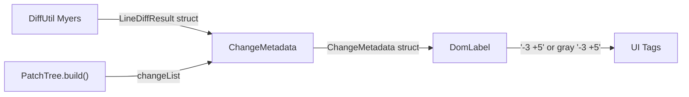

# Git-Style Change Metadata Module

## Current State

Change calculation is scattered across multiple files with an ad-hoc data flow:

- **[WhitespaceUtil.lua](plugin/src/WhitespaceUtil.lua)** uses LCS-based algorithm, returns a combined `(totalDiff, whitespaceDiff)` tuple -- no split between added/removed lines
- **[PatchTree.lua](plugin/src/PatchTree.lua)** lines 252-318 builds `changeInfo` inline during tree construction -- intermixed with changeList building, hard to follow
- **[DomLabel.lua](plugin/src/App/Components/PatchVisualizer/DomLabel.lua)** lines 519-528 displays "Lines 5" or "Whitespace 3" -- not git-style


## Target State




## Changes

### 1. Replace WhitespaceUtil with DiffUtil (Myers diff)

Delete [WhitespaceUtil.lua](plugin/src/WhitespaceUtil.lua) and create `plugin/src/DiffUtil.lua` with a proper line-level Myers diff algorithm -- the same algorithm git uses internally.

**Goal: exact match with GitHub's commit diff counts.** The `-3 +5` numbers must be identical to what GitHub shows in the file header of a commit diff. This means matching `git diff` behavior exactly:

- A modified line counts as 1 deletion + 1 insertion (old line removed, new line added) -- NOT as 1 "edit"
- Line splitting on `\n` (same as git)
- Lines compared byte-for-byte (no normalization for the primary count)
- Trailing newline handling: a missing final `\n` does NOT create a phantom line difference (match git's `\ No newline at end of file` behavior)

**Algorithm:** Myers O(ND) diff (see "An O(ND) Difference Algorithm and Its Variations", Myers 1986) -- the exact algorithm git uses internally. The existing [StringDiff.lua](plugin/src/App/Components/StringDiffVisualizer/StringDiff.lua) already has a character-level Myers bisect implementation (`_bisect`). DiffUtil adapts this for line-level diffing:

1. Split both strings into line arrays on `\n` (strip trailing empty line from final `\n` to avoid phantom diffs)
2. Run Myers diff on line arrays (each line is an atomic unit, compared as whole strings)
3. Walk the edit script: right moves = deletions (removed), down moves = insertions (added), diagonal = equal
4. The resulting `removed` and `added` counts are exactly what `git diff --stat` reports and what GitHub displays
5. For whitespace detection: run a second pass with normalized lines (trailing whitespace/`\r` stripped). If normalized diff has 0 changes, `isWhitespaceOnly = true`

**API:**

```lua
-- Lightweight: just counts (for display tags)
function DiffUtil.countLineDifferences(current: string, incoming: string): LineDiffResult

type LineDiffResult = {
    added: number,
    removed: number,
    isWhitespaceOnly: boolean,
    overflow: boolean,  -- true when line count diff > 100 (early bail, no exact split)
}

-- Full diff: returns edit script grouped into hunks (for future merge dialogue)
function DiffUtil.diffLines(current: string, incoming: string, contextLines: number?): DiffResult

type DiffLine = {
    type: "context" | "add" | "remove",
    content: string,
}

type DiffHunk = {
    oldStart: number,     -- 1-indexed line in old version
    oldCount: number,     -- lines from old version in this hunk
    newStart: number,     -- 1-indexed line in new version
    newCount: number,     -- lines from new version in this hunk
    lines: {DiffLine},    -- ordered lines with type markers
}

type DiffResult = {
    added: number,
    removed: number,
    isWhitespaceOnly: boolean,
    overflow: boolean,
    hunks: {DiffHunk},    -- contiguous change groups with context (default 3 lines, matching git)
}
```

Both functions share the same internal Myers diff engine. `countLineDifferences` is the fast path that discards the edit script after counting. `diffLines` retains it and groups into hunks with `contextLines` (default 3, matching git). `diffLines` is not consumed by anything yet -- it exists so the future merge dialogue has a ready-made hunk source.

**Performance:** Keep the existing early-bail when `math.abs(#currentLines - #incomingLines) > 100` to avoid expensive computation on massive diffs. Myers is O(ND) where D is the number of differences, so it's fast for similar files (common case).

**Test file:** Create `plugin/src/DiffUtil.spec.lua` (TestEZ pattern, same as [PatchSet.spec.lua](plugin/src/PatchSet.spec.lua)) covering:

- Identical strings (0 added, 0 removed)
- Empty to non-empty (pure additions)
- Non-empty to empty (pure removals)
- Mixed changes (some lines added, some removed, some unchanged)
- Whitespace-only changes (trailing spaces, tabs, mixed)
- Non-whitespace changes (isWhitespaceOnly = false)
- Overflow threshold (>100 line diff)
- Edge cases: single line, empty strings, nil/non-string inputs
- Accuracy: verify exact added/removed counts against known diffs that can be cross-checked with `git diff --stat`
- Modified lines: confirm a changed line counts as 1 removal + 1 addition (not 1 edit)
- Trailing newline: no phantom diff from presence/absence of final `\n`
- `diffLines` hunks: verify hunk boundaries, context lines (default 3), oldStart/newStart/oldCount/newCount match git's unified diff format
- `diffLines` hunks: adjacent changes merge into single hunk, separated changes produce separate hunks

### 2. Create ChangeMetadata module

New file: `plugin/src/ChangeMetadata.lua`

Provides `ChangeMetadata.compute(changeList)` which:

- Takes the already-built `changeList` array of `{prop, currentValue, incomingValue}` entries
- Scans for Source property to compute line diff via DiffUtil
- Counts non-Source property changes
- Returns a clean struct with both summary (for display) and detail (for future merge dialogue):

```lua
type PropertyDetail = {
    name: string,
    oldValue: any?,       -- nil for added instances
    newValue: any?,       -- nil for removed instances
    valueType: string,    -- typeof() result, for display/merge type dispatch
    isWarning: boolean?,  -- set later by updateMetadata
}

type ChangeMetadata = {
    -- Summary (drives the display tags and diff bar)
    linesAdded: number?,       -- nil if no Source change
    linesRemoved: number?,     -- nil if no Source change
    isWhitespaceOnly: boolean?, -- true only when ALL Source changes are whitespace
    overflow: boolean?,        -- true when diff exceeds 100 lines threshold
    propChanges: number?,      -- count of non-Source property changes
    failed: number?,           -- set later by updateMetadata
    edits: number?,            -- total edits (used by added instances and failure tracking)

    -- Detail (for future merge dialogue -- not consumed yet)
    hunks: {DiffHunk}?,        -- Source diff hunks from DiffUtil.diffLines(), nil if no Source change
    propertyDetails: {PropertyDetail}?, -- structured property changes with old/new values and types
}
```

`ChangeMetadata.compute()` populates both the summary fields (used now) and the detail fields (used later). The `hunks` come from `DiffUtil.diffLines()` when a Source change is present. The `propertyDetails` array is built from the changeList entries, giving the merge dialogue structured access to each property's old/new value and type without re-decoding.

### 3. Update PatchTree -- use ChangeMetadata module

In [PatchTree.lua](plugin/src/PatchTree.lua):

- Remove the inline metadata calculation (lines 253-318 simplified)
- After building `changeList`, call `ChangeMetadata.compute(changeList)` to get the metadata struct
- Keep changeList construction where it is (it's tree-building logic)
- Update `updateMetadata()` to work with the new struct fields (it currently sets `edits` and `failed`, which remain in the struct)

### 4. Update DomLabel -- git-style display

In [DomLabel.lua](plugin/src/App/Components/PatchVisualizer/DomLabel.lua):

- Replace the single "Lines X" / "Whitespace X" tag (lines 519-528) with two separate tags:
  - `-M` tag using `theme.Diff.Remove` (red) -- shown first
  - `+N` tag using `theme.Diff.Add` (green) -- shown second
- Each tag individually picks its color via `if isWhitespaceOnly then theme.Diff.WhitespaceOnly else theme.Diff.Remove` (and same pattern for Add). `isWhitespaceOnly` is only true when the entire Source change is whitespace -- so both go gray together naturally, but the code for each tag is independent
- When `overflow` is true, fall back to a single `100+` tag (current behavior, since we don't have exact split)
- Suppress a tag if its count is 0 (e.g., pure additions show only `+5`, no `-0`)

### 4a. Update Theme.lua with new diff colors

In [Theme.lua](plugin/src/App/Theme.lua), update the `Diff` section to add/replace colors used by the new tags:

- `Diff.Add` = `Color3.fromHex("47CB7C")` (green, for `+N` tags and bar segments)
- `Diff.Remove` = `Color3.fromHex("F21717")` (red, for `-M` tags and bar segments)
- `Diff.Property` = `Color3.fromHex("FFC601")` (yellow, for `2P` tag)

These replace the existing magenta placeholders for `Diff.Add`/`Diff.Remove` and add a new `Diff.Property` entry. DomLabel references these theme values instead of hardcoding hex colors.

### 5. Add mini diff bar (GitHub-style)

Add a small 5-segment colored bar next to the line change tags, like GitHub's `--stat` view. Each segment is a small square frame; the ratio of red-to-green segments reflects the ratio of removals-to-additions.

- A single fixed-width bar (e.g., 40x8px) with a `UICorner` for rounded ends
- Inside: a horizontal `UIListLayout` with child `Frame`s sized proportionally using `UDim2.fromScale(ratio, 1)` where `ratio = count / total`
  - Red section (`theme.Diff.Remove`) = `removed / total`
  - Green section (`theme.Diff.Add`) = `added / total`
  - Yellow section (`theme.Diff.Property`) = `propChanges / total`
  - Total = `removed + added + propChanges`
- Sections with 0 count are omitted (no zero-width frames)
- For whitespace-only line changes: the red/green sections become gray (`theme.Diff.WhitespaceOnly`), yellow section stays yellow if props exist
- For overflow (100+): skip the bar (no meaningful ratio)
- Placed after all tags: `-3 +5 3P <bar>` via the existing UIListLayout
- Clip children on the outer bar frame so the proportional fills stay within the rounded corners

### 6. Add hover tooltips to change tags

Add `TooltipText` or a custom tooltip on hover for each change tag:

- Line tags: `"N lines removed"` / `"N lines added"` (when whitespace-only: `"N lines removed (whitespace only)"` / `"N lines added (whitespace only)"`)
- Overflow: `"More than 100 lines changed"`
- Props tag: `"N property changes (excluding Source)"`
- Failed tag: `"N changes failed to apply"`

Implementation: Build a custom `Tooltip` component -- a small floating `TextLabel` that appears on `MouseEnter` of the tag, positioned above/below the tag. This gives full control over styling and positioning. Wrap the existing `ChangeTag` function component to accept an optional `tooltipText` prop and manage hover state internally.

### 7. Restyle Props tag for consistency

Change the "Props 2" tag to use the compact suffix format `2P` in yellow (`theme.Diff.Property`), matching the style of the `-3` / `+5` tags. This makes the full tag row read naturally as a single stat line: `-3 +5 2P` -- removals, additions, property changes. The `P` suffix distinguishes it from line changes while keeping it compact and visually consistent.