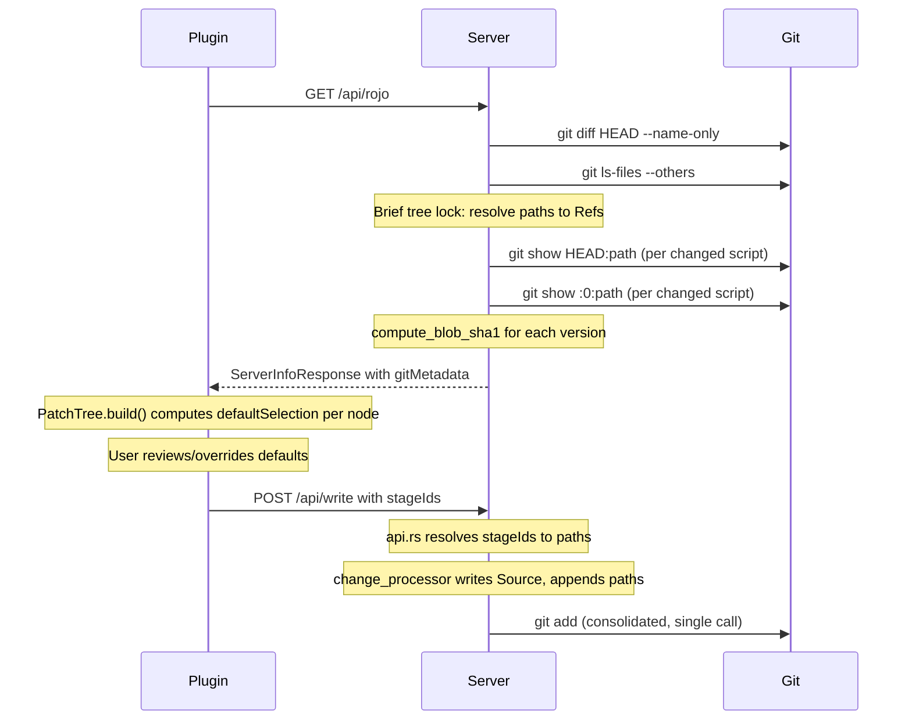

# Audit: Git-Based Sync Defaults

## Feature Summary

When the plugin connects during `atlas serve`, the server computes git metadata (which files changed, SHA1 hashes of committed/staged script content) and sends it to the plugin. The plugin uses this to auto-select sync directions in the confirmation dialog:

- **File unchanged in git** -> default "pull" (Studio changed it)
- **File changed + script + Studio Source matches committed hash** -> default "push" (developer changed file, Studio still has old version)
- **Otherwise** -> nil (user must decide)

After confirmation, accepted files are auto-staged via `git add`.




## Files Audited


| File                                                                                     | Lines      | Purpose                                                            |
| ---------------------------------------------------------------------------------------- | ---------- | ------------------------------------------------------------------ |
| `[src/git.rs](src/git.rs)`                                                               | 766        | Server-side git helpers: changed files, blob SHA1, auto-staging    |
| `[plugin/src/PatchTree.lua](plugin/src/PatchTree.lua)`                                   | 715        | Default selection logic, tree building                             |
| `[plugin/src/SHA1.luau](plugin/src/SHA1.luau)`                                           | 112        | Native SHA1 implementation                                         |
| `[src/web/interface.rs](src/web/interface.rs)`                                           | ~20 lines  | `GitMetadata` struct, `stage_ids` on `WriteRequest`                |
| `[src/web/api.rs](src/web/api.rs)`                                                       | ~30 lines  | `handle_api_rojo` metadata computation, `handle_api_write` staging |
| `[src/change_processor.rs](src/change_processor.rs)`                                     | ~40 lines  | Source write staging, rename path tracking                         |
| `[src/snapshot/patch.rs](src/snapshot/patch.rs)`                                         | ~10 lines  | `stage_ids`/`stage_paths` fields on `PatchSet`                     |
| `[plugin/src/App/init.lua](plugin/src/App/init.lua)`                                     | ~30 lines  | `autoSelectedIds` construction, `cachedServerInfo`                 |
| `[plugin/src/ServeSession.lua](plugin/src/ServeSession.lua)`                             | ~80 lines  | `stageIds` construction per selection type                         |
| `[plugin/src/App/StatusPages/Confirming.lua](plugin/src/App/StatusPages/Confirming.lua)` | 459        | Selection state management, `didUpdate` merge logic                |
| `[tests/tests/git_sync_defaults.rs](tests/tests/git_sync_defaults.rs)`                   | 952        | Integration tests                                                  |
| `[plugin/src/PatchTree.spec.lua](plugin/src/PatchTree.spec.lua)`                         | ~200 lines | Plugin unit tests for git defaults                                 |


---

## Verdict: No Critical Issues Found

The feature is well-designed and correctly implemented. The round-trip identity invariant is not directly affected by this feature -- git metadata is read-only advisory data that influences UI defaults, not filesystem writes. The auto-staging is purely additive (`git add`) and cannot corrupt the filesystem.

---

## Findings

### Finding 1: Performance -- O(N) Subprocess Spawning [Medium]

`compute_git_metadata` spawns **2 + 2N** git subprocesses for N changed scripts:

```35:35:src/git.rs
// 1 call
```

- `git diff HEAD --name-only` (1 process)
- `git ls-files --others --exclude-standard` (1 process)
- Per changed script: `git show HEAD:<path>` (N processes)
- Per changed script: `git show :0:<path>` (N processes)

On Windows, process creation is 10-100x slower than Linux. For 50 changed scripts, this is 102 subprocess spawns on every plugin connect.

**Recommendation**: Replace per-file `git show` calls with a single `git cat-file --batch` invocation that reads all file contents in one subprocess. This collapses 2N calls to 1. Not a correctness issue, but could cause noticeable connect latency on large repos with many changes. Defer unless users report slow connects.

### Finding 2: Windows Path Normalization Edge Case [Low]

Git commands return paths with `/` separators. `PathBuf::from("src/module.luau")` on Windows preserves the forward slashes. The tree lookup may fail if the tree stores paths with `\` separators.

```188:199:src/git.rs
        for rel_path in &changed_files {
            let abs_path = repo_root.join(rel_path);
            let canonical_path = std::fs::canonicalize(&abs_path).ok();

            let first = tree.get_ids_at_path(&abs_path);
            let ids = if !first.is_empty() {
                first
            } else if let Some(ref canon) = canonical_path {
                tree.get_ids_at_path(canon)
            } else {
                first
            };
```

The `canonicalize` fallback mitigates this, but `canonicalize` can fail (file deleted, permissions). When it fails, the instance won't appear in `changedIds` -- it degrades to "no default" which is safe.

**Recommendation**: No action needed. The fallback is sufficient and the failure mode is safe (user decides manually).

### Finding 3: `refresh_git_index` Duplicates Repo Detection [Low -- Code Quality]

`[src/git.rs:252-260](src/git.rs)` walks up the directory tree to find `.git`, but the repo root is already cached in `ServeSession.git_repo_root`.

```251:260:src/git.rs
pub fn refresh_git_index(project_dir: &Path) {
    let mut check_dir = Some(project_dir);
    let mut is_git_repo = false;
    while let Some(dir) = check_dir {
        if dir.join(".git").exists() {
            is_git_repo = true;
            break;
        }
        check_dir = dir.parent();
    }
```

Both call sites (`[src/cli/serve.rs:133](src/cli/serve.rs)` and `[src/cli/syncback.rs:282](src/cli/syncback.rs)`) could pass the known repo root instead. However, `syncback.rs` doesn't have a `ServeSession` -- it runs standalone. The current approach is correct for both call sites.

**Recommendation**: Accept as-is. The directory walk is negligible cost and keeps the function self-contained for both serve and CLI syncback contexts.

### Finding 4: Hash Parity Verified [No Issue]

The critical correctness requirement is that the Rust server and Luau plugin produce identical SHA1 hashes for the same content. Both implementations use the git blob format `"blob <byte_length>\0<content>"`:

**Rust** (`[src/git.rs:118-124](src/git.rs)`):

```118:124:src/git.rs
pub fn compute_blob_sha1(content: &str) -> String {
    let header = format!("blob {}\0", content.len());
    let mut hasher = Sha1::new();
    hasher.update(header.as_bytes());
    hasher.update(content.as_bytes());
    format!("{:x}", hasher.finalize())
}
```

**Luau** (`[plugin/src/PatchTree.lua:363-364](plugin/src/PatchTree.lua)`):

```363:364:plugin/src/PatchTree.lua
					local gitBlob = "blob " .. tostring(#source) .. "\0" .. source
					local studioHash = SHA1(buffer.fromstring(gitBlob))
```

- Rust `content.len()` = byte length. Luau `#source` = byte length. Consistent.
- Both use UTF-8 encoding. `\0` is the null byte in both languages.
- The `sha1` crate (Rust) and `SHA1.luau` (native Luau implementation with `--!native` + `--!optimize 2`) are standard SHA1.
- Integration tests in `[tests/tests/git_sync_defaults.rs](tests/tests/git_sync_defaults.rs)` verify against real `git hash-object` output.

### Finding 5: Draft Source Fallback is a Nice Touch [No Issue]

```372:384:plugin/src/PatchTree.lua
					if defaultSelection == nil then
						local ok, draft = pcall(ScriptEditorService.GetEditorSource, ScriptEditorService, instance)
						if ok and draft ~= source then
							local draftBlob = "blob " .. tostring(#draft) .. "\0" .. draft
							local draftHash = SHA1(buffer.fromstring(draftBlob))
							for _, hash in hashes do
								if draftHash == hash then
									defaultSelection = "push"
									break
								end
							end
						end
					end
```

When Script Drafts is enabled, `instance.Source` may not reflect the user's current editor content until they "commit" the draft. This fallback checks the draft source against committed hashes, ensuring the default selection is still accurate even with Script Drafts.

### Finding 6: Consolidated git_add Prevents index.lock Races [No Issue]

The staging pipeline correctly consolidates all paths into a single `git add` call:

```1875:1880:src/change_processor.rs
            // Consolidated git staging: one git_add call for all paths
            // ...
            if !pending_stage_paths.is_empty() {
                if let Some(ref repo_root) = self.git_repo_root {
                    crate::git::git_add(repo_root, &pending_stage_paths);
                }
            }
```

Pre-resolved paths from `api.rs` are merged with Source-write paths from `change_processor.rs`. Rename handling correctly updates `pending_stage_paths` (retains old path, pushes new path) at lines 1363-1368, 1531-1534, and 1713-1717. The batch staging test (`batch_stage_20_files_no_index_lock_race`) confirms this works for 20 files.

### Finding 7: Stale Git Metadata After Connect [Low -- By Design]

Git metadata is computed once per `GET /api/rojo` call (plugin connect/reconnect). If git state changes while the user reviews the confirmation dialog, the defaults may be stale. This is acceptable because:

1. The defaults are advisory -- the user can always override
2. Recomputing during the dialog would require a round-trip and could confuse the user if defaults change mid-review
3. Reconnecting (which triggers a fresh `GET /api/rojo`) gets fresh metadata

### Finding 8: Selection State Management in Confirming.lua is Correct [No Issue]

The `didUpdate` logic in `[Confirming.lua:107-132](plugin/src/App/StatusPages/Confirming.lua)` correctly handles streaming patch updates during confirmation:

1. Preserves existing selections for unchanged items
2. Unselects items in `changedIds` (forces re-review)
3. Merges new default selections for newly added items
4. Only overwrites if the item doesn't already have a selection

This prevents the confusing UX of defaults overriding conscious user choices during streaming updates.

### Finding 9: `autoSelectedIds` Staging Logic is Sound [No Issue]

The staging rules in `[ServeSession.lua:719-886](plugin/src/ServeSession.lua)`:

- **Push-accepted**: Always staged (lines 732, 792, 837) -- the user accepted the filesystem version
- **Pull-accepted + auto-selected**: Staged (lines 759-761, 806-808) -- high confidence automatic selection
- **Pull-accepted + manually selected**: NOT staged -- deliberate design choice: manually chosen pulls may need review before staging
- **Ignored**: Never staged

This is a thoughtful design that avoids staging files the user chose manually (they might want to `git diff` first).

---

## Test Coverage Assessment

**Excellent coverage across all three layers:**


| Layer              | File                               | Tests     | Coverage                                                 |
| ------------------ | ---------------------------------- | --------- | -------------------------------------------------------- |
| Unit (Rust)        | `src/git.rs`                       | 20+ tests | SHA1 parity, changed files, staging, edge cases          |
| Integration (Rust) | `tests/tests/git_sync_defaults.rs` | 20 tests  | Full pipeline: metadata, staging, renames, batch 20-file |
| Unit (Luau)        | `plugin/src/PatchTree.spec.lua`    | ~15 tests | Default selections, hash matching, edge cases            |


**Notable test scenarios covered:**

- No git repo (feature disabled)
- No commits yet (empty HEAD)
- Untracked, staged, unstaged, deleted files
- Init-style scripts (`init.luau` in directories)
- All script types (Module, Server, Client)
- Non-script changes (model files)
- Batch staging of 20 files (index.lock race prevention)
- Source write + staging interaction
- Rename + staging (new path staged, not old)
- Reconnect gets fresh metadata
- Draft source fallback
- Mixed push/pull batch operations

---

## Summary

The git-based sync defaults feature is **well-architected and correctly implemented**. Key design strengths:

1. **Three-phase tree lock** in `compute_git_metadata` minimizes lock contention
2. **Consolidated `git add`** prevents index.lock races
3. **Safe degradation** at every level (no git = no defaults, hash mismatch = user decides)
4. **Draft source fallback** handles Script Drafts edge case
5. **Thorough test coverage** across all three layers
6. **Clear separation of concerns**: server computes data, plugin makes UI decisions, staging is consolidated

The only actionable recommendation is the subprocess spawning optimization (Finding 1), which is a performance concern, not a correctness issue. It should be deferred unless users report slow plugin connects on repos with many changed files.