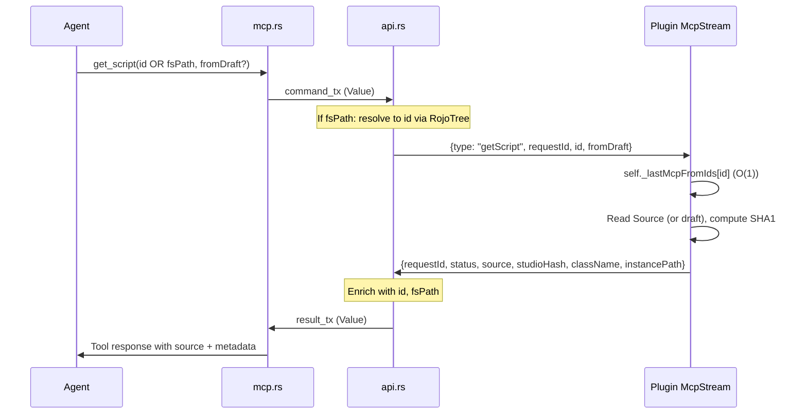

# MCP `get_script` Endpoint

## Design

The agent provides `id` (server Ref from a sync response) or `fsPath` (Atlas filesystem path). Both resolve to a server Ref which the plugin looks up via a shallow copy of `instanceMap.fromIds` retained from the last MCP sync. No raw instance paths, no QueryDescendants, no name ambiguity issues.

This endpoint exists for conflict resolution: agent calls `atlas_sync`, gets a conflict response with `id` and `fsPath` per change, then calls `get_script` to read the Studio version of conflicting scripts. The `studioHash` in the response feeds back into subsequent sync override verification.




## Channel Generalization

Change `McpSyncState` channels from typed structs to `serde_json::Value` so any command/result can flow through. This enables `get_script` and future endpoints without additional channel plumbing.

- Rename `McpSyncState` -> `McpState`
- Rename `sync_in_progress` -> `command_in_progress` (any MCP command blocks others)
- `command_tx: watch::Sender<Option<Value>>` (was `Option<McpSyncCommand>`)
- `result_tx: Mutex<Option<oneshot::Sender<Value>>>` (was `oneshot::Sender<McpSyncResult>`)

Each handler serializes its command struct to Value before sending, deserializes from Value on response.

## Retained InstanceMap (Shallow Copy)

**Critical:** `InstanceMap:stop()` iterates all entries and calls `removeInstance`, which sets `fromIds[id] = nil` for every entry. This is called by `ServeSession:__stopInternal()` during `endSession()`. Storing a reference to the InstanceMap object or its `fromIds` table gives an empty map after session teardown.

**Solution:** At the top of `setConfirmCallback` (before any branch that could trigger session teardown), make a shallow copy of `fromIds`:

```lua
serveSession:setConfirmCallback(function(instanceMap, patch, serverInfo)
    local retainedFromIds = {}
    for id, inst in instanceMap.fromIds do
        retainedFromIds[id] = inst
    end
    self._lastMcpFromIds = retainedFromIds

    -- ... rest of existing callback logic
end)
```

This copy:

- Survives `InstanceMap:stop()` because it's a separate table
- Is O(N) but fast (just string key -> Instance ref copies, typical project has a few thousand entries)
- Is replaced on the next MCP sync (each sync creates a fresh copy)
- Stale entries handled gracefully: if `instance.Parent == nil`, the instance was destroyed since the sync
- Cleared when MCP stream disconnects (`self._lastMcpFromIds = nil`)

**Note:** The `already_connected` early return (line 1131-1138 in `startMcpSync`) does NOT create a ServeSession, so `_lastMcpFromIds` is not updated in that case -- it retains whatever value it had from the last actual sync. This is correct behavior.

## get_script Input Schema

```json
{
  "id": "00abcdef01234567890abcdef0123456",
  "fsPath": "src/server/MyScript.server.luau",
  "fromDraft": false
}
```

- `id`: Server Ref (32-char hex) from a previous sync response. Looked up via retained `_lastMcpFromIds` on plugin.
- `fsPath`: Atlas filesystem path relative to project root. Resolved server-side to `id` via RojoTree.
- Priority: `id` > `fsPath`. At least one required.
- `fromDraft`: If true, read unsaved editor content via `ScriptEditorService:GetEditorSource`. Default: false.

## get_script Response

```
Script source for ServerScriptService/MyScript (Script):
Hash: a1b2c3d4e5...

<json>
{"status":"success","source":"print('hello')","studioHash":"a1b2c3...","className":"Script","instancePath":"ServerScriptService/MyScript","id":"00abcdef...","fsPath":"src/server/MyScript.server.luau","isDraft":false}
</json>
```

- `instancePath`: Human-readable instance path derived from `instance:GetFullName()` on the plugin side, reformatted from `game.A.B.C` to `A/B/C`. Included for readability and logging; not used for any lookup.

## Tool Description

The `get_script` tool definition in `handle_tools_list` must include a comprehensive description that teaches the agent the full workflow:

```
Read a script's source code from Roblox Studio. The id and fsPath parameters come from
a previous atlas_sync response's change entries.

If you haven't run atlas_sync yet, call atlas_sync(mode: "dryrun") first -- this
establishes the instance mapping without applying any changes, then you can call
get_script with the id or fsPath from that response.

Conflict resolution workflow:
1. atlas_sync(mode: "fastfail") -- get changes with studioHash, fail if unresolved
2. get_script(id: "...") -- read the Studio version of a conflicting script
3. Merge the Studio source with your local changes, write to filesystem
4. atlas_sync(overrides: [{id, direction: "push", studioHash: "...from get_script response..."}])

The studioHash in the response is the SHA1 of the git blob format of the script's Source
property. Pass it as the studioHash in sync overrides to verify the script hasn't changed
between your get_script call and the retry sync.
```

## Server-Side Resolution (api.rs)

When api.rs receives a `getScript` command from the channel:

1. **If `fsPath` present** (and no `id`): `project_root.join(fsPath)` -> `tree.get_ids_at_path(&abs_path)` -> get first Ref -> verify exists and is a script class -> inject as `id` in the command forwarded to plugin. Store fsPath for response enrichment.
2. **If `id` present**: optionally verify it exists in the tree and is a script class. Pass through to plugin. Resolve fsPath from tree metadata for response enrichment.
3. **On response from plugin**: enrich with `id` (Ref hex) and `fsPath`.

## Plugin-Side Resolution

The plugin receives `{ type: "getScript", requestId, id, fromDraft }`:

```lua
local fromIds = self._lastMcpFromIds
if not fromIds then
    -- error: "No previous sync session. Run atlas_sync(mode: \"dryrun\") first to establish the instance mapping."
end

local instance = fromIds[id]
if not instance then
    -- error: "Instance not found by id. The sync session may be stale, run atlas_sync again."
end
if instance.Parent == nil then
    -- error: "Instance was deleted since last sync. Run atlas_sync again."
end

if not instance:IsA("LuaSourceContainer") then
    -- error: "Instance is not a script (ClassName)"
end
```

After resolution:

1. Read source: if `fromDraft`, use `ScriptEditorService:GetEditorSource(instance)`; else `instance.Source`
2. Compute studioHash: `SHA1(buffer.fromstring("blob " .. #source .. "\0" .. source))`
3. Build instancePath: `string.gsub(instance:GetFullName(), "^game%.", ""):gsub("%.", "/")`
4. Return `{ requestId, status = "success", source, studioHash, className = instance.ClassName, instancePath }`

## Guards

- `command_in_progress` prevents concurrent MCP commands (channel has one result slot)
- `plugin_stream_connected` required (otherwise no way to communicate with Studio)
- NOT blocked by `active_api_connections > 0`: In api.rs, the `active_api_connections` guard must only apply to `sync` commands, not `getScript`. The command type routing checks the `type` field before this guard. Reading a script is safe during live sync; if no retained map exists, the plugin returns a clear error.
- If `id` or `fsPath` resolves to a non-script class in the tree, return error immediately from api.rs without plugin round-trip

## Files to Change

### Rust: `[src/web/mcp.rs](src/web/mcp.rs)`

- Rename `McpSyncState` -> `McpState`, generalize channels to `Value`
- Add `GetScriptCommand` struct: `{ request_id, id?, fs_path?, from_draft }`
- Add `GetScriptResult` struct: `{ status, source?, studio_hash?, class_name?, instance_path?, id?, fs_path?, is_draft?, message? }`
- Add `get_script` tool definition in `handle_tools_list` with full workflow description and inputSchema (id, fsPath, fromDraft)
- Add `handle_get_script` handler (parse params, validate at least one of id/fsPath, send command, format response)
- Update `handle_atlas_sync` to serialize/deserialize via Value
- Update all references from `McpSyncState` to `McpState`
- Tests: wire type serde, handler parse, response formatting

### Rust: `[src/web/api.rs](src/web/api.rs)`

- Update `McpSyncState` -> `McpState` references
- Update channel types to `Value` in MCP stream handler
- Add command type routing: check `type` field on received command Value BEFORE the `active_api_connections` guard. `sync` goes through the guard; `getScript` bypasses it.
- For `getScript`: resolve fsPath -> id via tree if needed, verify script class, forward to plugin with `id`, enrich result with id/fsPath on response
- For `sync`: existing behavior (forward, enrich fsPath on result)

### Rust: `[src/web/mod.rs](src/web/mod.rs)` (if `McpSyncState` is referenced)

- Update type references

### Plugin: `[plugin/src/McpStream.lua](plugin/src/McpStream.lua)`

- Add handler for `data.type == "getScript"`
- Call `self._onGetScriptCommand(data.requestId, data)`, expect Promise result
- Send JSON result back over WebSocket (same pattern as sync)

### Plugin: `[plugin/src/App/init.lua](plugin/src/App/init.lua)`

- **Shallow copy instanceMap.fromIds**: At the top of `setConfirmCallback` in `startMcpSync`, copy `instanceMap.fromIds` into `self._lastMcpFromIds`. This must happen before any branch (the copy survives `InstanceMap:stop()` which clears the original).
- Clear `self._lastMcpFromIds = nil` when MCP stream disconnects.
- Wire `onGetScriptCommand` callback in McpStream constructor.
- Add `handleMcpGetScript(requestId, params)` method:
  - Lookup via `self._lastMcpFromIds[id]`
  - Handle missing map ("Run atlas_sync first")
  - Handle stale entries (not found, Parent == nil)
  - LuaSourceContainer check
  - Source reading (regular + draft via ScriptEditorService)
  - SHA1 hash computation (using existing `SHA1.luau`)
  - Build instancePath from `instance:GetFullName()`
  - Return Promise resolving to result table

## Test Plan

### Rust unit tests (mcp.rs)

- `GetScriptResult` serde round-trip with all fields (including `instancePath`)
- `handle_tools_list` includes `get_script` tool with correct inputSchema and workflow description
- `handle_get_script` returns error when no plugin stream connected
- `handle_get_script` returns error when command already in progress
- `handle_get_script` requires at least one of id/fsPath
- Response formatting: success case includes `<json>` block, error case sets `isError`

### Rust integration (api.rs)

- `getScript` with `fsPath`: resolves via `get_ids_at_path`, injects `id`, forwards to plugin
- `getScript` with `id`: passes through, resolves `fsPath` for enrichment
- `getScript` with non-script `fsPath`: returns error before forwarding
- `getScript` with non-existent `fsPath`: returns error
- `getScript` bypasses `active_api_connections > 0` guard (command type routing)
- Result enrichment adds `id` and `fsPath`

### Plugin tests

- Shallow copy survives `InstanceMap:stop()`: copy retains entries after original is cleared
- Id lookup: found, not found, stale (Parent nil), no retained map
- Non-script instance: returns error
- Source reading: regular source, draft source via ScriptEditorService
- StudioHash: correct git blob format SHA1
- instancePath: correctly derived from GetFullName
- Retained map cleared on MCP stream disconnect
- `already_connected` early return does not update retained map

