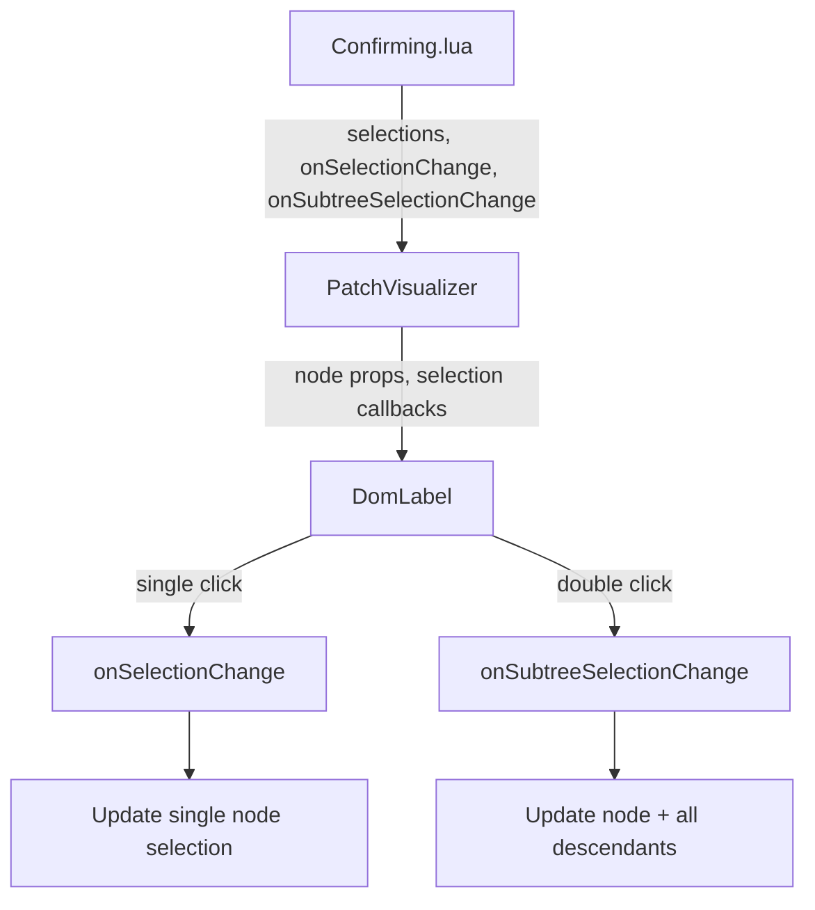

# Merge UI Button Improvements

## Key Files to Modify

- `[plugin/src/App/Components/PatchVisualizer/DomLabel.lua](plugin/src/App/Components/PatchVisualizer/DomLabel.lua)` - Selection buttons and hover behavior
- `[plugin/src/App/StatusPages/Confirming.lua](plugin/src/App/StatusPages/Confirming.lua)` - Remove "all" buttons, add subtree selection callback
- `[plugin/src/App/Components/PatchVisualizer/init.lua](plugin/src/App/Components/PatchVisualizer/init.lua)` - Pass patchTree to DomLabel

## Changes

### 1. Rename Buttons (DomLabel.lua)

In `SelectionRadio` function, change button text:

- "Pull" -> "Studio" (line 113)
- "Push" -> "Rojo" (line 137)

### 2. Remove "All" Button Helpers (Confirming.lua)

Remove these elements from the `Buttons` frame (lines 156-184):

- `PullAll` button
- `SkipAll` button  
- `PushAll` button

Keep the `setAllSelections` function as it will be repurposed for subtree selection.

### 3. Add Double-Click Cascade with Caret (DomLabel.lua)

Modify `SelectionOption` component:

- Add a "▼" caret character after the button text
- Track double-click using `clickCount` in the `Activated` event
- On double-click, call a new `onSubtreeSelectionChange` callback

Add to `SelectionRadio`:

- Pass `onSubtreeSelectionChange` prop to each option

### 4. Add Subtree Selection Callback (Confirming.lua)

Create new callback `onSubtreeSelectionChange(nodeId, selection)`:

```lua
self.onSubtreeSelectionChange = function(nodeId, selection)
    if not self.props.patchTree then return end
    
    local node = self.props.patchTree:getNode(nodeId)
    if not node then return end
    
    self:setState(function(state)
        local newSelections = table.clone(state.selections)
        -- Set this node if it has a patchType
        if node.patchType then
            newSelections[nodeId] = selection
        end
        -- Set all descendants
        self.props.patchTree:forEach(function(childNode)
            if childNode.patchType then
                newSelections[childNode.id] = selection
            end
        end, node)
        return { selections = newSelections }
    end)
end
```

### 5. Show Buttons on Hover for Parents Without Changes (DomLabel.lua)

For nodes where `patchType == nil` but `hasChildren == true`:

Add hover state tracking in `DomLabel`:

```lua
self:setState({ isHovered = false })
```

Add `MouseEnter`/`MouseLeave` events to the main Frame.

Modify `SelectionRadio` visibility logic:

- `visible = (props.patchType ~= nil) or (props.hasChildren and self.state.isHovered)`

The buttons for parent-only nodes will use `onSubtreeSelectionChange` directly (no single-click behavior needed since there's no selection to make for the node itself).

### 6. Pass Required Props Through Component Tree

In `PatchVisualizer/init.lua`, pass to DomLabel:

- `patchTree = patchTree`
- `onSubtreeSelectionChange = self.props.onSubtreeSelectionChange`

In `Confirming.lua`, pass to PatchVisualizer:

- `onSubtreeSelectionChange = self.onSubtreeSelectionChange`

## Component Flow




