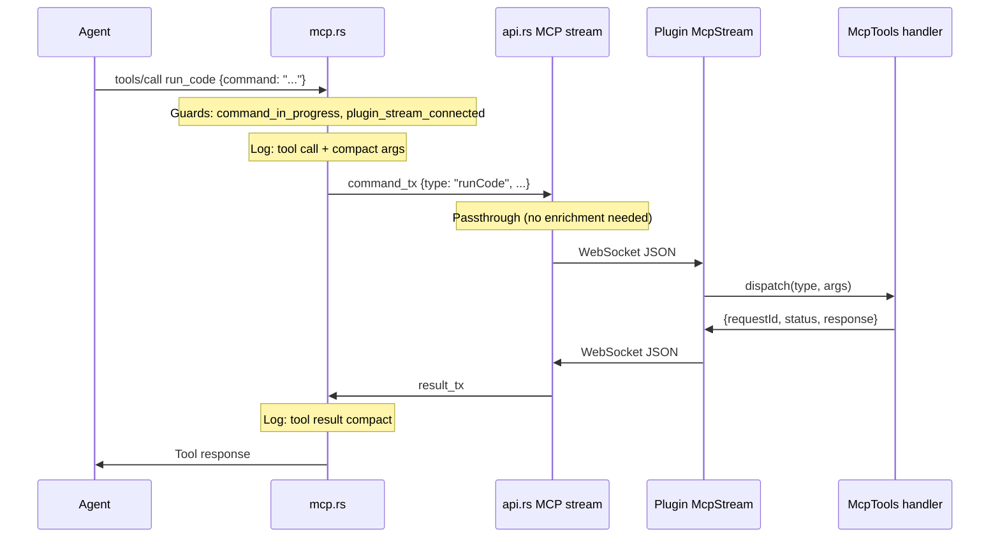

# Port MCP Studio Tools, Add Logging, Migrate to .md Docs

## Scope (from TODO lines 344-354)

1. Port 6 tools from local `D:\UserGenerated\studio-rust-mcp-server`: `run_code`, `insert_model`, `get_console_output`, `get_studio_mode`, `start_stop_play`, `run_script_in_play_mode`
2. Skip multi-studio tools (`list_studios`, `set_studio`, `get_studio`) -- not needed, Atlas has a single plugin connection
3. Add MCP logging (agent connect/disconnect, command JSON, result JSON -- compact, one line)
4. Migrate ALL tool descriptions (new + existing) to `.md` files with comprehensive workflow documentation

## Architecture

All 6 new tools are "passthrough" -- Rust forwards a JSON command to the plugin, plugin executes locally, returns a text result. No tree resolution or fsPath enrichment needed (unlike `atlas_sync` and `get_script`).




## 1. Rust: Generic Passthrough Dispatch (`src/web/mcp.rs`)

Create `dispatch_to_plugin()` helper to avoid repeating the guard/send/receive/format boilerplate for each tool. Existing `handle_atlas_sync` and `handle_get_script` have tool-specific logic and stay as-is.

```rust
async fn dispatch_to_plugin(
    id: Option<Value>,
    tool_type: &str,
    arguments: Value,
    mcp_state: Arc<McpState>,
) -> Response<Full<Bytes>> {
    // 1. command_in_progress CAS
    // 2. plugin_stream_connected check
    // 3. NO active_api_connections guard (passthrough tools are safe during live sync)
    // 4. Build { type, requestId, args: arguments }, send via command_tx
    // 5. Wait on result_rx
    // 6. Parse PluginToolResult { request_id, status, response }
    // 7. tool_response(id, status != "success", response)
}
```

Add `PluginToolResult` struct:

```rust
#[derive(Debug, Clone, Serialize, Deserialize)]
#[serde(rename_all = "camelCase")]
pub struct PluginToolResult {
    pub request_id: String,
    pub status: String,
    #[serde(default)]
    pub response: Option<String>,
}
```

### Tool Registration (`handle_tools_list`)

Add 6 tool entries. Each tool's `description` is loaded via `include_str!("mcp_docs/<tool>.md")`. Input schemas from the studio-rust-mcp-server structs:


| Tool                      | inputSchema properties                                                                                        |
| ------------------------- | ------------------------------------------------------------------------------------------------------------- |
| `run_code`                | `command: string` (required)                                                                                  |
| `insert_model`            | `query: string` (required)                                                                                    |
| `get_console_output`      | none                                                                                                          |
| `get_studio_mode`         | none                                                                                                          |
| `start_stop_play`         | `mode: enum["start_play", "run_server", "stop"]` (required)                                                   |
| `run_script_in_play_mode` | `code: string` (required), `timeout: integer` (optional), `mode: enum["start_play", "run_server"]` (required) |


### Tool Routing (`handle_tools_call`)

```rust
match tool_name {
    "atlas_sync" => handle_atlas_sync(...).await,
    "get_script" => handle_get_script(...).await,
    "run_code" | "insert_model" | "get_console_output" | "get_studio_mode"
    | "start_stop_play" | "run_script_in_play_mode" => {
        dispatch_to_plugin(id, tool_name, arguments, mcp_state).await
    }
    _ => { /* unknown tool error */ }
}
```

The `tool_name` is sent as `type` in the command JSON so the plugin knows which handler to dispatch to.

## 2. Rust: API-Side Passthrough (`src/web/api.rs`)

In `handle_mcp_stream_connection`, the command routing loop currently handles `sync` and `getScript` specially. All other command types become passthrough:

```rust
if cmd_type == "sync" && active_api_connections.load(...) > 0 {
    // existing: return already_connected
} else if cmd_type == "getScript" {
    // existing: resolve fsPath -> id, forward
} else {
    // NEW: passthrough -- forward command directly to plugin
    let json_cmd = serde_json::to_string(&cmd_value)?;
    websocket.send(Message::Text(json_cmd.into())).await...;
}
```

Response side: already works. When no `pending_get_script_context` exists and no `changes` array is present, the result passes through to `result_tx` unmodified.

## 3. Rust: .md Documentation Files

Create `src/web/mcp_docs/` directory with 8 `.md` files.

### `atlas_sync.md`

Comprehensive description covering:

- What it does (sync filesystem changes to Studio)
- Mode descriptions (standard/manual/fastfail/dryrun)
- Override system (id, direction, studioHash, expectedProperties)
- Sync workflow guidance:
  1. Basic: `atlas_sync()` -- auto-accepts if all git-resolved, else shows Studio UI
  2. Exploration: `atlas_sync(mode: "dryrun")` -- see changes without applying
  3. Fast: `atlas_sync(mode: "fastfail")` -- get changes, fail immediately if unresolved
  4. Conflict resolution: fastfail -> get_script -> merge -> sync with overrides
- Response format: human-readable summary + `<json>` block with structured data
- Change entry fields: path, id, direction, patchType, className, studioHash, defaultSelection, fsPath, properties

### `get_script.md`

Already has good content in the current inline description. Extract and expand:

- Purpose: read script source from Studio for conflict resolution
- Dryrun-first pattern: if no prior sync, call `atlas_sync(mode: "dryrun")` first
- Full conflict resolution workflow (numbered steps)
- Parameters: id vs fsPath, fromDraft
- Response: source, studioHash, className, instancePath
- studioHash format: SHA1 of git blob (`blob <len>\0<content>`)

### `run_code.md` through `run_script_in_play_mode.md`

Pull from the studio-rust-mcp-server `.md` files (already read above). These are concise (2-6 lines each). Adapt to Atlas context.

**Key addition to `run_code.md`**: Note that this runs in the Studio command bar context. Output from `print()`, `warn()`, `error()` is captured. Return values are included. Code has full Studio API access.

**Key addition to `start_stop_play.md`**: Note that starting play mode will temporarily disconnect the Atlas plugin connection. The plugin will reconnect automatically when play mode stops.

**Key addition to `run_script_in_play_mode.md`**: Note that this automatically starts play, runs the script, then stops play. Returns structured JSON result with success, value, error, logs, errors, duration, isTimeout.

### Use in `handle_tools_list`

Replace inline description strings with `include_str!("mcp_docs/atlas_sync.md")` etc.

## 4. Rust: MCP Logging

Add structured logging at key points in [src/web/mcp.rs](src/web/mcp.rs):

```rust
// In the top-level `call()` function, after parsing the JSON-RPC request:
// 1. Log initialize (agent connect)
if method == "initialize" {
    log::info!("MCP agent connected");
}

// 2. Log tool calls (compact JSON, one line)
// In handle_tools_call, before dispatching:
log::info!("MCP call: {} {}", tool_name, serde_json::to_string(&arguments).unwrap_or_default());

// 3. Log tool results (compact, one line)
// In each handler, after receiving result:
log::info!("MCP result: {} {}", tool_name, /* compact result summary */);
```

For results, keep it concise:

- `atlas_sync`: log status + change count
- `get_script`: log status + className
- Passthrough tools: log status + first ~200 chars of response

Also upgrade existing plugin stream logs:

- `"Plugin MCP stream connected"` -> keep at `info` (already there)
- `"Plugin MCP stream disconnected"` -> keep at `info` (already there)
- Add `log::info!("MCP agent disconnected")` -- but MCP is HTTP (stateless), so this maps to: no persistent connection to track. The `initialize` log suffices for connect; we don't have a reliable disconnect event. Note: if we wanted disconnect tracking, we'd need session tracking, which is out of scope.

## 5. Plugin: McpTools Module

Create `plugin/src/McpTools/` directory:

```
plugin/src/McpTools/
  init.luau             -- Dispatcher: maps tool type -> handler function
  RunCode.luau          -- Ported from studio-rust-mcp-server (with fixes)
  InsertModel.luau      -- Ported
  GetConsoleOutput.luau -- Ported
  GetStudioMode.luau    -- Ported
  StartStopPlay.luau    -- Ported
  RunScriptInPlayMode.luau -- Ported
  Utils/
    ConsoleOutput.luau  -- Ported (log accumulator)
    StudioModeState.luau -- Ported (play/stop state tracking)
    GameStopUtil.luau   -- Ported (cross-DataModel stop via plugin settings)
    DeepCopy.luau       -- Ported (for run_code output serialization)
```

### Dispatcher (`McpTools/init.luau`)

```lua
local tools = {
    runCode = require(script.RunCode),
    insertModel = require(script.InsertModel),
    getConsoleOutput = require(script.GetConsoleOutput),
    getStudioMode = require(script.GetStudioMode),
    startStopPlay = require(script.StartStopPlay),
    runScriptInPlayMode = require(script.RunScriptInPlayMode),
}

function McpTools.dispatch(toolType, args)
    local handler = tools[toolType]
    if not handler then
        error("Unknown MCP tool: " .. tostring(toolType))
    end
    return handler(args)
end
```

### Tool Handler Adaptations

Each handler is ported from the studio-rust-mcp-server with these changes:

- Replace `require("../Utils/X")` with `require(script.Parent.Utils.X)` (Roblox instance paths)
- Remove msgpack encoding (Atlas uses JSON over WebSocket)
- `run_code.luau`: uses `loadstring`/`getfenv` (necessary for command bar emulation, add selene exception)
- `insert_model.luau`: uses `InsertService:GetFreeModels` and `game:GetObjects` (deprecated but functional)
- `GameStopUtil.luau`: needs `plugin` reference. In Atlas, pass via module-level setter or require from App context.

### GameStopUtil Plugin Reference

The studio-rust-mcp-server uses `PluginUtils.plugin = plugin` at startup. Atlas needs the same. Two approaches:

**Option A (simpler)**: In `init.server.lua`, after plugin is available, set it on the McpTools utility:

```lua
local McpToolsGameStop = require(script.McpTools.Utils.GameStopUtil)
McpToolsGameStop.setPlugin(plugin)
```

**Option B**: Pass plugin as argument to handlers that need it.

Option A is simpler and matches the studio-rust-mcp-server pattern.

## 6. Plugin: McpStream Integration

In [plugin/src/McpStream.lua](plugin/src/McpStream.lua), add a generic tool handler callback:

### Constructor change

```lua
self._onToolCommand = options.onToolCommand
```

### MessageReceived handler addition

After the existing `getScript` handler (line ~129), add:

```lua
elseif data.requestId and tools_set[data.type] then
    Log.info("MCP stream: received {} command (requestId={})", data.type, data.requestId)
    local resultPromise = self._onToolCommand(data.requestId, data.type, data.args or {})
    resultPromise
        :andThen(function(result)
            if self._wsClient then
                local json = HttpService:JSONEncode(result)
                pcall(function() self._wsClient:Send(json) end)
            end
        end)
        :catch(function(err)
            -- send error result
        end)
```

Where `tools_set` is a set of known passthrough tool names:

```lua
local tools_set = {
    runCode = true, insertModel = true, getConsoleOutput = true,
    getStudioMode = true, startStopPlay = true, runScriptInPlayMode = true,
}
```

## 7. Plugin: Lifecycle Integration (`init.server.lua` + `App/init.lua`)

### ConsoleOutput Listener

In [plugin/src/init.server.lua](plugin/src/init.server.lua) (or `App/init.lua`), start the ConsoleOutput listener on plugin init:

```lua
local ConsoleOutput = require(script.McpTools.Utils.ConsoleOutput)
local connConsoleOutput = ConsoleOutput.startListener()
plugin.Unloading:Connect(function()
    connConsoleOutput:Disconnect()
end)
```

### GameStop Monitor

In `init.server.lua`, if running in Server DataModel (play mode), start the stop monitor:

```lua
local RunService = game:GetService("RunService")
if RunService:IsRunning() and RunService:IsServer() then
    local GameStopUtil = require(script.McpTools.Utils.GameStopUtil)
    task.spawn(GameStopUtil.monitorForStopPlay)
end
```

### App/init.lua: Wire onToolCommand

In the McpStream constructor call, add:

```lua
onToolCommand = function(requestId, toolType, args)
    return Promise.new(function(resolve, reject)
        local McpTools = require(script.McpTools)
        local ok, result = pcall(McpTools.dispatch, toolType, args)
        if ok then
            resolve({ requestId = requestId, status = "success", response = result or "" })
        else
            resolve({ requestId = requestId, status = "error", response = tostring(result) })
        end
    end)
end,
```

## 8. PlaceId Filtering

Already handled on the MCP stream WebSocket connection (`api.rs` lines 3737-3790). Since all tool commands flow through the same stream, placeId filtering applies to all tools automatically. No additional work needed.

## Key Design Decisions

1. **Passthrough pattern**: New tools don't need tree resolution or fsPath enrichment. They bypass `active_api_connections` guard (safe during live sync).
2. **No `active_api_connections` guard**: Unlike `atlas_sync`, the passthrough tools don't interfere with live WebSocket sync sessions. `get_script` already established this precedent.
3. `**command_in_progress` serialization**: All MCP commands (including new tools) are serialized -- only one at a time. This is a channel limitation (single command_tx + oneshot result_tx). Acceptable since MCP calls are agent-initiated and inherently sequential.
4. **Play mode timing for `start_stop_play`**: `StudioTestService:ExecutePlayModeAsync({})` returns quickly (before play fully activates). The response is sent back before the MCP stream disconnects due to plugin reload. If it was already in play mode, the call returns even faster. The 0.1s timeout detection pattern from studio-rust-mcp-server handles this correctly.
5. `**run_code` uses `loadstring`/`getfenv**`: These are technically deprecated but necessary for command bar context emulation. This is a known and accepted pattern copied from Roblox's own MCP server. Add `--!nolint DeprecatedApi` to the file.
6. **ConsoleOutput resets**: Console output accumulates between `run_code` / `run_script_in_play_mode` calls. Each call clears prior output. The `get_console_output` tool reads whatever has accumulated since the last reset.

## Files Changed

### New files

- `src/web/mcp_docs/atlas_sync.md`
- `src/web/mcp_docs/get_script.md`
- `src/web/mcp_docs/run_code.md`
- `src/web/mcp_docs/insert_model.md`
- `src/web/mcp_docs/get_console_output.md`
- `src/web/mcp_docs/get_studio_mode.md`
- `src/web/mcp_docs/start_stop_play.md`
- `src/web/mcp_docs/run_script_in_play_mode.md`
- `plugin/src/McpTools/init.luau`
- `plugin/src/McpTools/RunCode.luau`
- `plugin/src/McpTools/InsertModel.luau`
- `plugin/src/McpTools/GetConsoleOutput.luau`
- `plugin/src/McpTools/GetStudioMode.luau`
- `plugin/src/McpTools/StartStopPlay.luau`
- `plugin/src/McpTools/RunScriptInPlayMode.luau`
- `plugin/src/McpTools/Utils/ConsoleOutput.luau`
- `plugin/src/McpTools/Utils/StudioModeState.luau`
- `plugin/src/McpTools/Utils/GameStopUtil.luau`
- `plugin/src/McpTools/Utils/DeepCopy.luau`

### Modified files

- `src/web/mcp.rs` -- `dispatch_to_plugin`, `PluginToolResult`, 6 new tools in list/call, logging, `include_str!` for all docs
- `src/web/api.rs` -- passthrough else-clause in MCP stream command routing
- `plugin/src/McpStream.lua` -- `onToolCommand` callback, generic tool dispatch
- `plugin/src/App/init.lua` -- wire `onToolCommand`, ConsoleOutput listener, GameStopUtil setup
- `plugin/src/init.server.lua` -- GameStop monitor in Server DataModel, ConsoleOutput listener

## Audit Notes

### Against original TODO (lines 344-354)

- Port all basic endpoints: 6 tools ported (run_code, insert_model, get_console_output, get_studio_mode, start_stop_play, run_script_in_play_mode). Multi-studio tools excluded per "we don't need that whole studio selection system."
- Integrate into Atlas MCP: Uses same JSON-RPC/MCP stream architecture. No rmcp dependency.
- PlaceId filtering: Handled at stream level, covers all tools. No additional work.
- Pull fixed versions: Porting from local `D:\UserGenerated\studio-rust-mcp-server` which contains WebSocket, msgpack, and typed codec fixes.
- .md doc setup: All 8 tools get .md files with `include_str!`.
- Logging: Agent initialize logged, every tool call logged with compact JSON args, every result logged compact. One line per entry.
- Documentation quality: Comprehensive .md files covering workflows, parameters, response formats.
- Sync flow with get_script merging: Documented in atlas_sync.md and get_script.md.
- Dryrun for get_script: Documented in get_script.md ("call atlas_sync(mode: 'dryrun') first").

### Against atlas.mdc

- Round-trip identity: Not affected. These tools don't touch filesystem sync.
- Code quality: `dispatch_to_plugin` helper prevents code duplication. Plugin dispatcher follows DRY pattern.
- CLI syncback parity: Not affected.
- Two-way sync: New tools bypass `active_api_connections` guard (safe during live sync), same as `get_script`.

### Against first principles

- Single responsibility: Each tool handler does one thing. Generic dispatch helper handles common plumbing.
- Error handling: Guards for command_in_progress, plugin_stream_connected. pcall wraps all plugin-side execution.
- Concurrency: Serialized via `command_in_progress` atomic. No concurrent command support needed (HTTP is request-response).
- Security: PlaceId filtering inherited from stream connection.
- Separation of concerns: Rust side only routes. Plugin side executes. No cross-cutting.

### Whole-system soundness

- **MCP stream lifecycle**: Tools work only when plugin is connected (Edit mode). During play mode, stream disconnects and tools return "no plugin connected." This is correct behavior.
- **ConsoleOutput accumulation**: Starts on plugin init, persists across tool calls, reset by run_code/run_script_in_play_mode. Same lifecycle as studio-rust-mcp-server.
- **GameStop cross-DataModel**: Uses plugin settings (the only reliable cross-DataModel communication in Studio). The Server DataModel copy polls every 1s. Matches the proven studio-rust-mcp-server pattern.
- **Play mode transition**: `ExecutePlayModeAsync` returns before play activates. Response gets back to agent before stream disconnects. Agent sees "Started play" then loses plugin connection. On stop, plugin reconnects automatically.
- **No channel conflicts**: All tools use the same command_tx/result_tx channel. The `command_in_progress` lock ensures only one in-flight at a time. No deadlock risk since the lock is released on every exit path (including errors and plugin disconnection).

