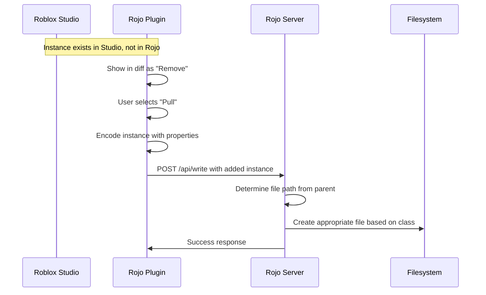

# Pull Instances to Rojo Filesystem

## Problem

When an instance exists in Roblox Studio but not in Rojo's filesystem (appears as "to be deleted" in the sync diff):

- **Push** = Delete from Studio (works correctly)
- **Pull** = Should create file in Rojo (currently does nothing)
- **Skip** = Do nothing (works correctly)

The "Pull" option for removed items is currently ignored in [plugin/src/ServeSession.lua](plugin/src/ServeSession.lua) (lines 663-674).

## Scope: ALL Instance Types

This feature supports pulling **all instance types** from Studio to Rojo, not just scripts:


| Instance Type      | No Children          | With Children                               |
| ------------------ | -------------------- | ------------------------------------------- |
| ModuleScript       | `.luau`              | dir + `init.luau` + `init.meta.json5`*      |
| Script†            | `.{suffix}.luau`     | dir + `init.{suffix}.luau` + `init.meta.json5`* |
| LocalScript        | `.client.luau`       | dir + `init.client.luau` + `init.meta.json5`* |
| Folder             | dir + `.gitkeep`     | dir + `init.meta.json5`*                    |
| Configuration      | dir + `.gitkeep`     | dir + `init.meta.json5`*                    |
| Tool               | dir + `.gitkeep`     | dir + `init.meta.json5`*                    |
| ScreenGui          | dir + `.gitkeep`     | dir + `init.meta.json5`*                    |
| SurfaceGui         | dir + `.gitkeep`     | dir + `init.meta.json5`*                    |
| BillboardGui       | dir + `.gitkeep`     | dir + `init.meta.json5`*                    |
| AdGui              | dir + `.gitkeep`     | dir + `init.meta.json5`*                    |
| StringValue        | `.txt`               | dir + `init.meta.json5`                     |
| LocalizationTable  | `.csv`               | dir + `init.csv`                            |
| All other classes  | `.model.json5`       | dir + `init.meta.json5`                     |

\* `init.meta.json5` only created if instance has properties (Attributes, etc.)
\* Empty directories get `.gitkeep` file (matching dedicated syncback behavior)

† **Script RunContext determines file suffix:**
- `RunContext: Client` → `.client.luau`
- `RunContext: Server` → `.server.luau`
- `RunContext: Legacy` → `.server.luau`
- `RunContext: Plugin` → `.plugin.luau`
- No RunContext → `.server.luau` (default)

This ensures proper round-tripping regardless of `emitLegacyScripts` mode in the project configuration.

**Important:** 
- We do NOT use `.rbxm` binary files as that would be a regression for version control.
- This matches the dedicated syncback system's middleware selection logic in `src/syncback/mod.rs`.

## Solution Overview




## Changes Required

### 1. Server: Update WriteRequest Structure

**File:** [src/web/interface.rs](src/web/interface.rs)

Change `added` from `HashMap<Ref, ()>` to include instance data:

```rust
pub struct AddedInstance {
    pub parent: Ref,
    pub name: String,
    pub class_name: String,
    pub properties: UstrMap<Variant>,
}

pub struct WriteRequest {
    // ... existing fields ...
    pub added: HashMap<Ref, AddedInstance>,  // Changed from HashMap<Ref, ()>
}
```

### 2. Server: Implement Syncback in Write Handler

**File:** [src/web/api.rs](src/web/api.rs)

In `handle_api_write`, process `added` instances:

- Determine the filesystem path based on parent instance's path
- Use syncback middleware to create the appropriate file (`.luau` for scripts)
- Trigger a re-snapshot so Rojo picks up the new file

### 3. Plugin: Encode and Send Added Instances

**File:** [plugin/src/ServeSession.lua](plugin/src/ServeSession.lua)

In `__confirmAndApplyInitialPatch`, handle "pull" for removed items:

```lua
elseif selection == "pull" and self.__twoWaySync then
    local instance = <get instance from idOrInstance>
    if instance and isScriptClass(instance.ClassName) then
        local encoded = encodeInstance(instance, parentId)
        pullPatch.added[<new ref>] = encoded
    end
end
```

### 4. Plugin: Create Instance Encoder

**New file:** `plugin/src/ChangeBatcher/encodeInstance.lua`

Encode a Studio instance for transmission to the server:

- Serialize Name, ClassName, Parent ref
- Encode Source property for scripts
- Handle other relevant properties

## Key Considerations

1. **Parent Resolution:** The server needs to know where to create the file. The parent instance must already exist in Rojo's tree to determine the filesystem path.
2. **All Instance Types Supported:** Scripts use `.luau`, Folders become directories, all other instances use `.model.json` (human-readable, version-control friendly).
3. **No Binary Files:** We explicitly avoid `.rbxm` files as they are not version-control friendly.
4. **Two-Way Sync Required:** This feature only activates when `twoWaySync` is enabled (already checked in the code).
5. **File Naming:** Instance Name + appropriate extension based on class type.
6. **Universal Children Support:** ANY instance can have children in Roblox. When an instance has children, it MUST become a directory:
   - Scripts with children → directory + `init.luau`/`init.server.luau`/`init.client.luau` + `init.meta.json5` if has non-Source properties
   - Directory classes (Folder, etc.) → directory + `init.meta.json5` if has properties
   - StringValue with children → directory + `init.meta.json5` (not .txt)
   - LocalizationTable with children → directory + `init.csv`
   - All other classes with children → directory + `init.meta.json5`
7. **Attributes on All Types:** All instances (including Folders) can have Attributes. These are encoded and saved in `init.meta.json5`.
8. **Script Properties:** Scripts with children also get `init.meta.json5` for non-Source properties (like Attributes).
9. **Empty Directories:** Empty directories with no metadata get `.gitkeep` file (matching dedicated syncback behavior).
10. **Attributes Filtering:** Internal Roblox attributes (prefixed with `RBX`) are filtered out (matching dedicated syncback).
11. **Property Filtering:** `Ref` and `UniqueId` properties are not serialized to JSON (matching dedicated syncback).
12. **Sorted JSON:** Meta files use sorted JSON5 format with keys in alphabetical order (matching dedicated syncback).
13. **RunContext-Based Script Suffix:** For `Script` class, the file suffix is determined by `RunContext` property:
    - `RunContext: Client` → `.client.luau`
    - `RunContext: Server` → `.server.luau`
    - `RunContext: Legacy` → `.server.luau`
    - `RunContext: Plugin` → `.plugin.luau`
    - This ensures proper round-tripping regardless of `emitLegacyScripts` mode.
14. **Adjacent Meta Files:** Scripts WITHOUT children create adjacent meta files (`{name}.meta.json5`) next to the script file, preserving non-Source properties like `RunContext`. Scripts WITH children use `init.meta.json5` inside their directory.

## Confirmation Dialogue Hardening

The dialogue must be the single source of truth - nothing changes without explicit user approval.

### 7. Pause ChangeBatcher During Confirmation

**File:** [plugin/src/ChangeBatcher/init.lua](plugin/src/ChangeBatcher/init.lua)

Add pause/resume functionality to prevent change accumulation during confirmation:

- Add `__paused` flag
- Skip `__cycle` when paused
- Pause when confirmation opens, resume after

### 8. Defense-in-Depth: Block Patch Application During Confirmation

**File:** [plugin/src/ServeSession.lua](plugin/src/ServeSession.lua)

Add explicit check in `__applyPatch` to prevent application during confirmation in one-shot mode:

```lua
if Settings:get("oneShotSync") and self.__confirmingPatch ~= nil then
    error("Cannot apply patch during confirmation in one-shot mode")
end
```

### 9. Add Confirmation State Flag

**File:** [plugin/src/ServeSession.lua](plugin/src/ServeSession.lua)

Add `__isConfirming` flag for explicit state tracking:

- Set `true` when confirmation dialogue opens
- Set `false` when confirmation completes
- Verify state before any patch application

### 5. UI: Rename "Commit" to "Accept"

**File:** [plugin/src/App/StatusPages/Confirming.lua](plugin/src/App/StatusPages/Confirming.lua)

Rename the button from "Commit" to "Accept" since the action now covers both directions (pushing to Studio AND pulling to Rojo).

```lua
-- Line 168-169, change:
Commit = e(TextButton, {
    text = "Commit",
-- To:
Accept = e(TextButton, {
    text = "Accept",
```

### 6. UI: Forced Review System

**Files:** 

- [plugin/src/PatchTree.lua](plugin/src/PatchTree.lua)
- [plugin/src/App/StatusPages/Confirming.lua](plugin/src/App/StatusPages/Confirming.lua)
- [plugin/src/App/Components/PatchVisualizer/DomLabel.lua](plugin/src/App/Components/PatchVisualizer/DomLabel.lua)

Implement forced review where every item must be explicitly selected:

**A. Default to unselected (no radio button checked):**

```lua
-- Lines 325, 378, 456 - change:
defaultSelection = "push",
-- To:
defaultSelection = nil,  -- No selection
```

**B. Accept button behavior based on selection state:**

- **All items selected:** Accept works immediately, no popup
- **Some items unselected:** Show confirmation popup:
  - "X items have not been reviewed. Accept selected changes and skip the rest?"
  - Options: "Accept and Skip Rest" / "Cancel" (go back to review)
- This allows users to select only the changes they want without manually skipping hundreds of items

**C. Visual indicator for unselected items:**

- No radio button checked (all three Push/Pull/Skip unchecked)
- Possibly highlight row to indicate needs review

### 6b. Dynamic Dialogue Updates

**File:** [plugin/src/ServeSession.lua](plugin/src/ServeSession.lua)

Allow new changes to flow into the confirmation dialogue:

**A. Merge incoming changes into `__confirmingPatch`:**

- When new WebSocket messages arrive during confirmation, merge them into the current patch
- Update the UI to show new items

**B. Unselect changed items:**

- If an item that was already selected (Push/Pull/Skip) is updated by a new change, reset its selection to unselected
- User must re-review the updated item

**C. Block all background syncing:**

- While dialogue is open, no changes apply automatically
- Everything goes through the dialogue

## Files to Modify

- [src/web/interface.rs](src/web/interface.rs) - Update `WriteRequest.added` type
- [src/web/api.rs](src/web/api.rs) - Implement syncback in `handle_api_write`
- [plugin/src/ServeSession.lua](plugin/src/ServeSession.lua) - Handle "pull" for removed items, dynamic dialogue updates, confirmation state, defense-in-depth
- [plugin/src/ChangeBatcher/encodeInstance.lua](plugin/src/ChangeBatcher/encodeInstance.lua) - New file to encode instances
- [plugin/src/ChangeBatcher/init.lua](plugin/src/ChangeBatcher/init.lua) - Add pause/resume functionality
- [plugin/src/App/StatusPages/Confirming.lua](plugin/src/App/StatusPages/Confirming.lua) - Rename "Commit" to "Accept", disable until all reviewed, show unreviewed count
- [plugin/src/PatchTree.lua](plugin/src/PatchTree.lua) - Default to unselected, track selection completeness
- [plugin/src/App/Components/PatchVisualizer/DomLabel.lua](plugin/src/App/Components/PatchVisualizer/DomLabel.lua) - Support unselected state visually

## Testing

### Server-side Tests (Rust)

**File:** [src/web/api.rs](src/web/api.rs) - `#[cfg(test)]` module

Tests for `variant_to_json`:
- String, Bool, Int32, Int64, Float32, Float64
- Vector2, Vector3, Color3
- UDim, UDim2
- Enum, NumberRange, Rect
- Unsupported types return None

Tests for syncback file naming:
- ModuleScript → `.luau`
- Script → `.server.luau`
- LocalScript → `.client.luau`
- Folder → directory (no file)
- Other instances → `.model.json`

Tests for model.json structure:
- Basic structure (className, properties)
- With properties

### Plugin Tests (Lua - TestEZ)

**File:** [plugin/src/ChangeBatcher/init.spec.lua](plugin/src/ChangeBatcher/init.spec.lua)
- `pause/resume` tests:
  - Start unpaused by default
  - Pausable
  - Resumable after pause
  - No flush when paused
  - Flush after resume

**File:** [plugin/src/ChangeBatcher/encodeInstance.spec.lua](plugin/src/ChangeBatcher/encodeInstance.spec.lua)
- Script encoding (ModuleScript, Script, LocalScript)
- Folder encoding
- Other instance encoding (Part, StringValue, Configuration)
- Parent ID handling
- Edge cases (special characters, empty name)

**File:** [plugin/src/PatchTree.spec.lua](plugin/src/PatchTree.spec.lua)
- `buildInitialSelections` - verifies nil defaultSelection behavior
- `countUnselected` - counts nodes without selections
- `allNodesSelected` - checks all/some/none selected
- `getSelectableNodeIds` - returns selectable node IDs

### Integration Tests

**Test fixture:** [rojo-test/serve-tests/syncback_write/](rojo-test/serve-tests/syncback_write/)

### Running Tests

```bash
# Rust tests
cargo test

# Plugin tests (in Roblox Studio)
# Run plugin/src/runTests.lua
```

