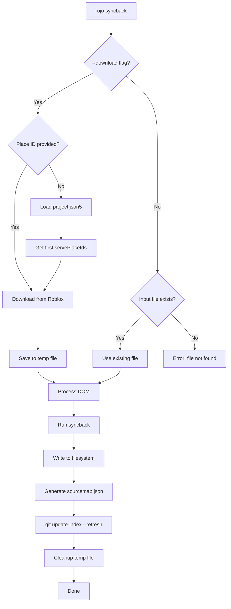

# Syncback Auto-Downloader Feature

## Overview

Enhance the `rojo syncback` command to automatically download place files from Roblox's asset delivery API, generate sourcemaps after completion, and refresh the git index. The goal is to make `rojo syncback` work with zero arguments.

## Key Files to Modify

- `[src/cli/syncback.rs](src/cli/syncback.rs)` - Main syncback command implementation
- `[Cargo.toml](Cargo.toml)` - Add compression features to reqwest, move tempfile to dependencies

## Implementation Details

### 1. Update Dependencies in `Cargo.toml`

```toml
# Add compression features to reqwest
reqwest = { version = "0.11.27", default-features = false, features = [
    "blocking",
    "json",
    "rustls-tls",
    "gzip",
    "brotli",
    "deflate",
] }

# Move tempfile from dev-dependencies to dependencies
tempfile = "3.24.0"
```

### 2. Add Download Arguments to `SyncbackCommand`

In `src/cli/syncback.rs`, modify the struct:

```rust
pub struct SyncbackCommand {
    /// Path to the project to sync back to.
    #[clap(default_value = "default.project.json5")]
    pub project: PathBuf,

    /// Path to the Roblox file to pull Instances from.
    #[clap(long, short, default_value = "Project.rbxl")]
    pub input: PathBuf,

    /// Download the place file from Roblox. If no place ID is provided,
    /// uses the first ID from servePlaceIds in the project file.
    #[clap(long, short = 'd')]
    pub download: Option<Option<u64>>,

    /// Interactive mode - prompts before writing. Disabled by default.
    #[clap(long, short = 'i')]
    pub interactive: bool,
    
    // ... rest of existing fields
}
```

Note: Flip `--non-interactive` to `--interactive` (new default is non-interactive).

### 3. Download Function Implementation

Create the download logic with these characteristics:

- **URL**: `https://assetdelivery.roblox.com/v1/asset/?id={PLACEID}`
- **Auth**: `ROBLOSECURITY` cookie from environment variable
- **No-cache headers**:
  - `Cache-Control: no-cache, no-store, must-revalidate`
  - `Pragma: no-cache`
  - `Expires: 0`
- **Compression**: Request `Accept-Encoding: gzip, deflate, br` (reqwest handles decompression)
- **Temp file**: Use `tempfile::NamedTempFile` with `.rbxl` extension, keep it alive during processing

```rust
fn download_place(place_id: u64) -> anyhow::Result<tempfile::NamedTempFile> {
    let cookie = std::env::var("ROBLOSECURITY")
        .context("ROBLOSECURITY environment variable not set")?;
    
    let url = format!("https://assetdelivery.roblox.com/v1/asset/?id={}", place_id);
    
    let client = reqwest::blocking::Client::builder()
        .gzip(true)
        .brotli(true)
        .deflate(true)
        .no_proxy()  // Avoid proxy caching
        .build()?;
    
    let response = client
        .get(&url)
        .header(COOKIE, format!(".ROBLOSECURITY={}", cookie))
        .header(CACHE_CONTROL, "no-cache, no-store, must-revalidate")
        .header(PRAGMA, "no-cache")
        .header("Expires", "0")
        .header(USER_AGENT, "Rojo")
        .send()?;
    
    // Create temp file with .rbxl extension
    let mut temp_file = tempfile::Builder::new()
        .suffix(".rbxl")
        .tempfile()?;
    
    // Stream response to file
    let bytes = response.bytes()?;
    std::io::copy(&mut bytes.as_ref(), &mut temp_file)?;
    
    Ok(temp_file)
}
```

### 4. Resolve Place ID Logic

When `--download` is provided without a value:

1. Load the project file first
2. Extract `serve_place_ids` from the project
3. Take the first place ID from the set (convert HashSet to Vec, sort for determinism, take first)
4. Error if `servePlaceIds` is empty or not set

### 5. Input File Resolution Logic

In the `run()` method:

```rust
// Determine the actual input path
let input_path = if let Some(download_opt) = &self.download {
    // --download was specified
    if !self.input_exists() || download_opt.is_some() {
        // Download needed: either file doesn't exist or explicit place ID
        let place_id = match download_opt {
            Some(id) => *id,
            None => {
                // Load project to get servePlaceIds
                let project = Project::load_fuzzy(&path_old)?;
                project.serve_place_ids
                    .as_ref()
                    .and_then(|ids| ids.iter().min().copied())
                    .context("No servePlaceIds in project and no place ID provided")?
            }
        };
        
        eprintln!("Downloading place {}...", place_id);
        let temp_file = download_place(place_id)?;
        // Keep temp_file alive during processing
        DownloadedInput::Temp(temp_file)
    } else {
        DownloadedInput::Existing(resolve_path(&self.input).into_owned())
    }
} else if self.input.exists() {
    DownloadedInput::Existing(resolve_path(&self.input).into_owned())
} else {
    anyhow::bail!("Input file {} not found. Use --download to fetch from Roblox.", self.input.display())
};
```

### 6. Sourcemap Generation After Syncback

After successful syncback, generate `sourcemap.json` in the project root:

```rust
// After snapshot.write_to_vfs()
let sourcemap_path = session_old.root_project().folder_location().join("sourcemap.json");
write_sourcemap(&session_old, Some(&sourcemap_path), filter_nothing, false)?;
eprintln!("Generated sourcemap at {}", sourcemap_path.display());
```

This requires extracting or sharing the `write_sourcemap` function from `sourcemap.rs` (likely needs to be made `pub(crate)`).

### 7. Git Index Refresh

After syncback completes, check if in a git repo and refresh the index:

```rust
fn refresh_git_index(project_dir: &Path) {
    // Check if .git exists in project dir or any parent
    let mut check_dir = Some(project_dir);
    let mut is_git_repo = false;
    while let Some(dir) = check_dir {
        if dir.join(".git").exists() {
            is_git_repo = true;
            break;
        }
        check_dir = dir.parent();
    }
    
    if is_git_repo {
        let result = std::process::Command::new("git")
            .arg("update-index")
            .arg("--refresh")
            .current_dir(project_dir)
            .stdout(std::process::Stdio::null())
            .stderr(std::process::Stdio::null())
            .status();
        
        if let Err(e) = result {
            log::warn!("Failed to refresh git index: {}", e);
        }
    }
}
```

### 8. Summary of Default Changes


| Argument            | Old Default        | New Default                                                       |
| ------------------- | ------------------ | ----------------------------------------------------------------- |
| `project`           | `""` (current dir) | `default.project.json5`                                           |
| `--input`           | Required           | `Project.rbxl`                                                    |
| `--non-interactive` | `false`            | Removed, replaced with `--interactive` (default: non-interactive) |


## Flow Diagram




## Edge Cases

- If `--input` file exists and `--download` not specified: use existing file (no download)
- If `--input` file exists but `--download <placeid>` explicitly given: download anyway (override)
- If `--download` with no arg and no `servePlaceIds` in project: error with helpful message
- If `ROBLOSECURITY` not in environment: error with helpful message
- If download fails: error with status code and helpful message
- If not a git repo: silently skip git refresh

