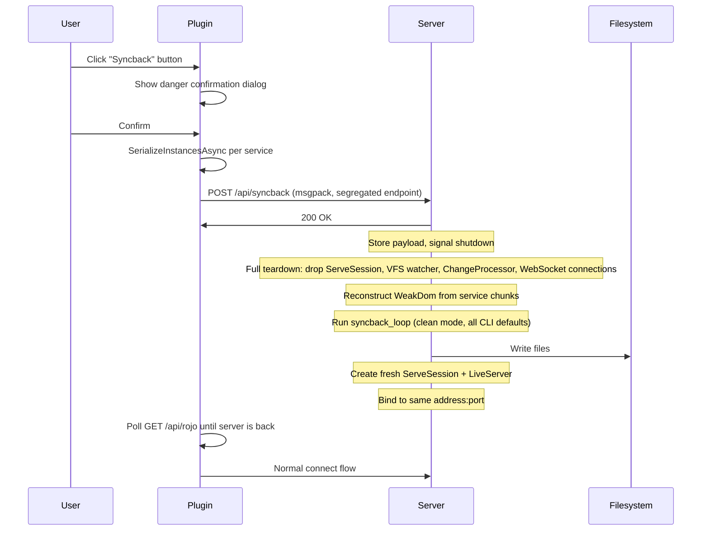

# Syncback via RBXM

## Architecture




## Server Changes

### 1. Make `LiveServer::start()` return instead of blocking forever

`[src/web/mod.rs](src/web/mod.rs)`: Change `start()` to return a `ServerExitReason` enum. Add a shutdown mechanism via `Arc<SyncbackSignal>` (wrapping a `Mutex<Option<SyncbackPayload>>` + `tokio::sync::Notify`). The accept loop uses `tokio::select!` to watch for the notify signal alongside `listener.accept()`. When signaled, it breaks and returns.

```rust
pub enum ServerExitReason {
    SyncbackRequested(SyncbackPayload),
}

pub struct SyncbackSignal {
    payload: Mutex<Option<SyncbackPayload>>,
    notify: tokio::sync::Notify,
}
```

The `SyncbackSignal` is shared between `LiveServer` (which watches it) and the API handler (which deposits data into it). When the accept loop exits, the Tokio runtime drops, all spawned tasks (including active WebSocket connections) are cancelled, and the `Arc<ServeSession>` drops -- tearing down the ChangeProcessor thread, VFS watcher, and all in-memory state.

### 2. New segregated API endpoint: `POST /api/syncback`

`[src/web/api.rs](src/web/api.rs)`: Totally separate from the connect/sync flow. No session ID needed -- the plugin doesn't need to be "connected" to use this. But it does validate version and place ID.

Request body is msgpack-encoded:

```rust
pub struct SyncbackRequest {
    pub protocol_version: u64,
    pub server_version: String,
    pub place_id: Option<u64>,
    pub services: Vec<ServiceChunk>,
}
pub struct ServiceChunk {
    pub class_name: String,
    pub data: Vec<u8>, // raw rbxm bytes
}
// Payload passed to the serve loop (version info stripped after validation)
pub struct SyncbackPayload {
    pub services: Vec<ServiceChunk>,
}
```

Types live in `[src/web/interface.rs](src/web/interface.rs)`.

Handler flow:

1. Deserialize msgpack body into `SyncbackRequest`
2. **Validate protocol version** -- reject with 400 if `request.protocol_version != PROTOCOL_VERSION`
3. **Validate server version** -- reject with 400 if major.minor doesn't match `SERVER_VERSION`
4. **Validate place ID** against the project's `servePlaceIds` (whitelist) and `blockedPlaceIds` (blocklist). Reject with 403 if not allowed.
5. Extract `SyncbackPayload` (just the services), store in `SyncbackSignal` -> notify -> return 200 `{"status": "syncback_initiated"}`

The response is sent before any teardown begins (the API handler is a separate tokio task from the accept loop).

### 3. Wrap `ServeCommand::run()` in a loop

`[src/cli/serve.rs](src/cli/serve.rs)`: The `run()` method becomes a loop. Each iteration creates a fresh VFS, ServeSession, and LiveServer. When `start()` returns `SyncbackRequested`, the old session is fully dropped (VFS watcher stops, ChangeProcessor thread joins, tree is freed), syncback runs, and the loop continues to create everything fresh:

```rust
loop {
    let (vfs, errors) = Vfs::new_default_with_errors();
    let session = Arc::new(ServeSession::new(vfs, project_path.clone(), Some(errors))?);
    let server = LiveServer::new(session);

    match server.start(addr) {
        ServerExitReason::SyncbackRequested(payload) => {
            log::info!("Live syncback requested, running...");
            run_live_syncback(&project_path, payload)?;
            log::info!("Syncback complete, restarting serve...");
            continue;
        }
    }
}
```

IP and port are resolved once before the loop (they don't change).

### 4. Reconstruct WeakDom + run syncback (CLI-equivalent)

New function `run_live_syncback(project_path: &Path, payload: SyncbackPayload) -> anyhow::Result<()>` in `src/cli/serve.rs`:

1. **Build WeakDom** -- Create `DataModel` root, for each `ServiceChunk` parse rbxm via `rbx_binary::from_reader`, create a service instance of the correct class, deep-clone all children from the parsed dom into the target dom. Maintain a `HashMap<Ref, Ref>` ref-map to fix up Ref properties across chunks.
2. **Run syncback** -- Identical to what CLI `atlas syncback` does:
  - Create oneshot VFS: `Vfs::new_oneshot()`
  - Load old tree: `ServeSession::new_oneshot(vfs, project_path)`
  - Call `syncback_loop(vfs, &mut old_tree, new_dom, project, incremental: false)` -- clean mode
  - Write: `fs_snapshot.write_to_vfs_parallel(base_path, vfs)`
  - `refresh_git_index(base_path)`

Same code path as CLI syncback, same defaults, same clean mode. The only difference is the WeakDom source.

## Plugin Changes

### 5. Syncback button on NotConnected page

`[plugin/src/App/StatusPages/NotConnected.lua](plugin/src/App/StatusPages/NotConnected.lua)`: Add "Syncback" button with `style = "Danger"` and `layoutOrder = 2`, shift "Sync" to `layoutOrder = 3`:

```
[Settings]  [Syncback]  [Sync]
```

Fires `self.props.onSyncback`.

### 6. Confirmation dialog

`[plugin/src/App/init.lua](plugin/src/App/init.lua)`: Floating `StudioPluginGui` dialog (same pattern as `AcceptConfirm` in Confirming.lua):

- Title: "Full Syncback"
- Message: "This will overwrite your project files with the current Studio state. This cannot be undone."
- Buttons: "Cancel" (Bordered) | "Syncback" (Danger)
- State: `self.state.showingSyncbackConfirm`

### 7. DataModel serialization

After confirmation, serialize per-service. Hardcode the same `VISIBLE_SERVICES` list from the Rust side:

```lua
local SYNCBACK_SERVICES = {
    "Lighting", "MaterialService", "ReplicatedFirst", "ReplicatedStorage",
    "ServerScriptService", "ServerStorage", "SoundService", "StarterGui",
    "StarterPack", "StarterPlayer", "Teams", "TextChatService",
    "VoiceChatService", "Workspace",
}

local services = {}
for _, className in SYNCBACK_SERVICES do
    local service = game:FindService(className)
    if service and #service:GetChildren() > 0 then
        local buf = SerializationService:SerializeInstancesAsync(service:GetChildren())
        table.insert(services, {
            className = className,
            data = buf, -- msgpack-luau natively encodes buffer as bin format (zero-copy)
        })
    end
end
```

The msgpack-luau library handles `buffer` types natively -- when `type(data) == "buffer"`, it encodes as msgpack bin 8/16/32 using `buffer.copy` directly. No string conversion needed. On the Rust side, `rmp_serde` deserializes msgpack bin into `Vec<u8>` automatically.

### 8. Direct HTTP post (no ApiContext needed)

Since this endpoint is fully segregated and doesn't need a session, the plugin just needs host:port from the address entry fields. A standalone function posts directly:

```lua
local function postSyncback(host, port, services)
    local url = ("http://%s:%s/api/syncback"):format(host, port)
    local body = Http.msgpackEncode({
        protocolVersion = Config.protocolVersion,
        serverVersion = Config.expectedServerVersionString,
        placeId = game.PlaceId,
        services = services,
    })
    return Http.post(url, body):andThen(rejectFailedRequests)
end
```

No `ApiContext` instance needed. This keeps it completely independent from the connect flow.

### 9. Full flow in App

`[plugin/src/App/init.lua](plugin/src/App/init.lua)`: The `onSyncback` handler:

1. Show confirmation dialog
2. On confirm: serialize DataModel per-service
3. POST to `/api/syncback` with the chunks
4. On 200: show a notification ("Syncback data sent. Server is processing.")
5. Done. Stay on NotConnected page. User clicks "Sync" manually whenever they're ready.

Fire and forget -- the plugin's job ends after the POST succeeds. No polling, no auto-reconnect, no special state.

## Key Design Decisions

- **Fully segregated endpoint**: `/api/syncback` has zero coupling to the session/connect system. No session ID, no auth. Plugin fires and forgets.
- **Complete teardown**: When the signal fires, the entire serve system is destroyed -- Tokio runtime drops, ServeSession drops (joining the ChangeProcessor thread, stopping VFS watcher), all WebSocket connections are cancelled. Nothing survives from the previous serve.
- **CLI-equivalent syncback**: Uses `syncback_loop` with `incremental: false` (clean mode), non-interactive. Identical behavior to `atlas syncback --input file.rbxl` with all defaults.
- **Same process, same port**: The `atlas serve` process never exits. After syncback completes, a fresh serve starts on the same address:port. The user sees log output in their terminal throughout.
- **Danger styling**: Uses existing `Danger` theme (`#E74C3C` red) defined in `[plugin/src/App/Theme.lua](plugin/src/App/Theme.lua)`.
- **Per-service serialization**: 14 visible services from `VISIBLE_SERVICES` constant, matching both Rust and Lua sides. Cross-service Ref properties are lost in transit but syncback's `Rojo_Ref_`* system resolves refs from filesystem structure.

## Tests

The core invariant: **live syncback must produce byte-identical filesystem output to CLI syncback given the same input data.** If it doesn't, something is broken in the serialize -> transmit -> reconstruct -> syncback pipeline. Every test that verifies data accuracy runs BOTH live syncback and CLI syncback on the same input, then compares output with `assert_dirs_equal` (byte-for-byte file comparison from `[tests/rojo_test/roundtrip_util.rs](tests/rojo_test/roundtrip_util.rs)`).

Tests go in a dedicated `tests/tests/live_syncback.rs`. They use `run_serve_test` from `[tests/rojo_test/serve_util.rs](tests/rojo_test/serve_util.rs)` plus the round-trip utilities.

### Test helpers (add to `serve_util.rs`)

`**post_api_syncback_raw`** -- Sends a raw msgpack body to `POST /api/syncback`. Returns the full `reqwest::blocking::Response` so tests can assert on status codes and error bodies.

`**post_api_syncback`** -- Convenience wrapper that fills in correct protocol version + server version. Takes `place_id: Option<u64>` and `services: Vec<ServiceChunk>`. Panics if response is not 200.

`**wait_to_come_back_online`** -- Polls `GET /api/rojo` with exponential backoff (longer timeout than initial startup since syncback runs between teardown and restart). Returns the new `ServerInfoResponse`. Panics if server doesn't come back.

`**make_service_chunk`** -- Builds a `ServiceChunk` from `InstanceBuilder` children:

```rust
fn make_service_chunk(class_name: &str, children: Vec<InstanceBuilder>) -> ServiceChunk {
    let mut dom = WeakDom::new(InstanceBuilder::new("DataModel"));
    let root = dom.root_ref();
    for child in children {
        dom.insert(root, child);
    }
    let refs: Vec<Ref> = dom.root().children().to_vec();
    let mut buf = Vec::new();
    rbx_binary::to_writer(&mut buf, &dom, &refs).unwrap();
    ServiceChunk { class_name: class_name.to_string(), data: buf }
}
```

`**make_rbxl_from_chunks**` -- Builds a complete rbxl file from the same service chunks, for CLI parity testing. Creates a WeakDom with DataModel root + properly-classed service instances + children, serializes to rbxl. This gives CLI syncback the exact same input data as live syncback received.

`**run_cli_syncback_on_chunks**` -- End-to-end helper: copies a fixture to a fresh temp dir, calls `make_rbxl_from_chunks`, runs `run_rojo_syncback_clean`, returns the temp dir path. Used by every parity test as the CLI reference.

### Fixtures

`**rojo-test/serve-tests/live_syncback/**` -- Multi-service project:

```
default.project.json5    # RS -> src/shared, SSS -> src/server, Workspace -> src/workspace
src/shared/OldModule.luau
src/server/OldScript.server.luau
src/workspace/OldPart.model.json5
```

`**rojo-test/serve-tests/live_syncback_place_ids/**` -- Same layout + `servePlaceIds: [123]`, `blockedPlaceIds: [999]`.

`**rojo-test/serve-tests/live_syncback_complex/**` -- All 14 visible services mapped to separate `$path` dirs. Used for comprehensive parity tests.

### CLI parity tests (data accuracy)

Every parity test follows this pattern:

```rust
fn assert_live_matches_cli(
    fixture_name: &str,
    chunks: Vec<ServiceChunk>,
    place_id: Option<u64>,
) {
    run_serve_test(fixture_name, |session, _| {
        // 1. Live syncback
        session.post_api_syncback(place_id, chunks.clone());
        session.wait_to_come_back_online();

        // 2. CLI syncback on fresh copy of same fixture with same data
        let cli_dir = run_cli_syncback_on_chunks(fixture_name, &chunks);

        // 3. Byte-for-byte comparison of every file
        assert_dirs_equal(session.path(), &cli_dir);
    });
}
```

`**parity_scripts**` -- ModuleScript (`return {}`), Script/Server (`print("server")`), Script/Client (`print("client")`), LocalScript. Verifies Source content preserved exactly, correct file extensions (`.luau`, `.server.luau`, `.client.luau`, `.local.luau`), RunContext encoded in extension.

`**parity_models_with_properties**` -- Model containing Parts with: Anchored (Bool), Size (Vector3), Position (Vector3), Color (Color3), BrickColor, Shape (Enum), Transparency (Float64). Verifies every property value round-trips through rbxm -> reconstruct -> syncback -> meta/model files identically.

`**parity_ref_properties**` -- Model with PrimaryPart -> child Part. ObjectValue with Value -> sibling Part. Verifies `Rojo_Ref_*` attribute paths in meta/model files match CLI output exactly.

`**parity_special_names**` -- Instances named `"What?"`, `"Key:Value"`, `"A/B"`, `"<Angle>"`, `'He said "hi"'`. Verifies slugified filenames (`What_`, `Key_Value`, `A_B`, etc.) and meta `name` fields match CLI.

`**parity_duplicate_names**` -- 3x Folder named `"Data"`, 2x Script named `"Handler"`. Verifies dedup suffixes (`Data/`, `Data~2/`, `Data~3/`, `Handler.server.luau`, `Handler~2.server.luau`) and meta files match CLI.

`**parity_deep_hierarchy**` -- 6 levels: Folder > Folder > Folder > Folder > Model > Part. Verifies nested directory structure is identical.

`**parity_mixed_file_types**` -- StringValue (-> `.txt`), LocalizationTable (-> `.csv`), JSON data module (-> `.json5`), binary model (-> `.rbxm`), Folder (-> directory). All under one service. Byte-for-byte match with CLI.

`**parity_comprehensive_properties**` -- Single Part with every testable property type set to non-default values: Bool, Int32, Float32, Float64, String, Vector2, Vector3, Vector2int16, Vector3int16, UDim, UDim2, Color3, Color3uint8, BrickColor, NumberRange, Rect, Enum, Font, Tags, Attributes (with nested types). Verifies meta.json5 property serialization matches CLI exactly.

`**parity_multi_service**` -- Data under all 14 visible services simultaneously. Each service gets a unique set of instances (scripts, models, folders). Verifies every service's `$path` directory matches CLI output.

`**parity_empty_services_mixed**` -- Some services have children, some don't, some are absent from the payload entirely. Verifies populated services are correct and empty/absent services result in clean directories.

### Validation / rejection tests

`**rejects_bad_protocol**` -- Send `protocol_version: 999`. Expect non-200. GET /api/rojo still returns same session ID (server unaffected).

`**rejects_bad_version**` -- Send `server_version: "0.0.0"`. Expect non-200. Server unaffected.

`**rejects_blocked_place**` -- Fixture has `blockedPlaceIds: [999]`. Send `placeId: 999`. Expect 403. Server unaffected.

`**rejects_unlisted_place**` -- Fixture has `servePlaceIds: [123]`. Send `placeId: 456`. Expect 403. Server unaffected.

`**allows_whitelisted_place**` -- `servePlaceIds: [123]`, send `placeId: 123`. Expect 200. Syncback runs, server restarts.

`**allows_any_place_when_unrestricted**` -- No servePlaceIds/blockedPlaceIds. Send `placeId: 99999`. Expect 200.

### Lifecycle / edge case tests

`**server_comes_back_functional**` -- After live syncback, verify the restarted server is fully operational: GET /api/rojo works, can read instances via /api/read, WebSocket connects and receives patches when a file is modified on disk.

`**syncback_twice_different_data**` -- Run live syncback with data A. Wait for restart. Run live syncback AGAIN with data B. Wait for restart. Verify filesystem matches data B (not A). Verify server is functional. Tests the serve loop handles multiple iterations.

`**syncback_replaces_all_old_files**` -- Pre-populate the fixture with files that should NOT survive clean mode (orphan scripts, old models). After live syncback, verify none of the old files remain. Only files from the new data exist.

### Round-trip identity test

The ultimate accuracy test:

`**roundtrip_build_syncback_rebuild**` -- Using the `live_syncback_complex` fixture:

1. `atlas build` -> rbxl_A
2. Decompose rbxl_A into per-service chunks (parse with `rbx_binary::from_reader`, extract children of each service, re-serialize as rbxm chunks)
3. POST chunks to live syncback, wait for restart
4. `atlas build` -> rbxl_B
5. Parse both rbxl_A and rbxl_B into WeakDoms
6. Walk both trees recursively: compare instance names, classes, property values (using the same fuzzy equality from `variant_eq` for floats/CFrames), and child counts
7. Any divergence = test failure with detailed diff

This tests the full pipeline: build -> decompose into service chunks -> transmit -> reconstruct -> syncback -> build again. If the output matches, the live syncback system preserves 100% data fidelity.