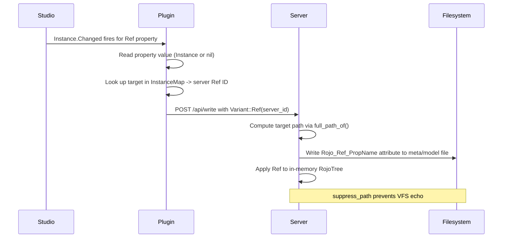
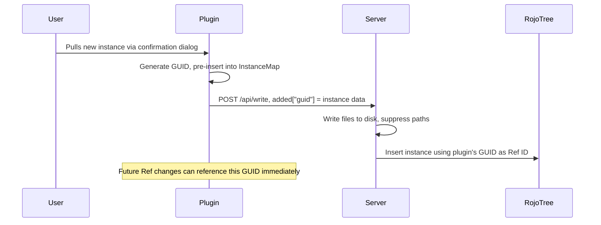

# Two-Way Sync Ref Property Support

## Current Problem

Ref properties are blocked at two layers:

1. **Plugin** -- `Ref` is in `UNENCODABLE_DATA_TYPES` ([propertyFilter.lua](plugin/src/ChangeBatcher/propertyFilter.lua)), so `encodePatchUpdate.lua` skips them entirely.
2. **Server** -- `filter_properties_for_meta()` in [api.rs](src/web/api.rs) line 2288-2291 skips `Variant::Ref(_)`.

Additionally, newly added instances (via "pull") do not get stable IDs that the plugin can use for Ref encoding. The server ignores the plugin-generated temp GUID and lets the VFS watcher assign a different ID asynchronously.

## Design Principles

- **Plugin sends ephemeral IDs, server resolves to paths.** The plugin encodes Ref properties using server-side Ref IDs from the InstanceMap. The server maps these IDs to instance paths and writes `Rojo_Ref_*` attributes to disk.
- **Only `Rojo_Ref_*` on disk.** No `Rojo_Target_*` or `Rojo_Id` system. Path-based references only.
- **Immediate ID assignment for new instances.** When the plugin pulls a new instance, it gets a GUID that the server honors as the tree Ref ID. The plugin pre-inserts this into the InstanceMap so Ref encoding works without waiting for the VFS round-trip.

## Existing Infrastructure to Leverage

- [ref_properties.rs](src/syncback/ref_properties.rs) -- CLI syncback's path computation and `Rojo_Ref_*` attribute writing
- [patch_compute.rs](src/snapshot/patch_compute.rs) `compute_ref_properties()` -- reads `Rojo_Ref_*` attributes and resolves to `Variant::Ref` during forward-sync
- `WeakDom::full_path_of(ref, "/")` -- computes slash-separated instance path (root excluded)
- `RojoTree::get_instance_by_path()` in [tree.rs](src/snapshot/tree.rs) -- resolves path back to Ref
- [rojo_ref.rs](src/rojo_ref.rs) -- `REF_PATH_ATTRIBUTE_PREFIX = "Rojo_Ref_"`

## Data Flow

### Ref property change on existing instances



### New instance addition with immediate ID



## Changes

### Part A: Ref Encoding for Existing Instances

#### 1. Plugin: Remove Ref from filter

**File:** [propertyFilter.lua](plugin/src/ChangeBatcher/propertyFilter.lua)

Remove `Ref = true` from `UNENCODABLE_DATA_TYPES`. Only `UniqueId = true` remains.

#### 2. Plugin: Encode Ref properties with InstanceMap

**File:** [encodePatchUpdate.lua](plugin/src/ChangeBatcher/encodePatchUpdate.lua)

- Accept `instanceMap` as a new parameter
- When `descriptor.dataType == "Ref"`:
  - Read the property value from the Studio instance (returns a Roblox Instance or nil)
  - If nil: encode as `{ Ref = "00000000000000000000000000000000" }` (null ref)
  - If Instance: look up `instanceMap.fromInstances[value]` to get the server Ref ID string, encode as `{ Ref = serverIdHex }`
  - If Instance not in InstanceMap: mark property as **deferred** (return it separately so the ChangeBatcher can retry next batch)
- For non-Ref properties: existing `encodeProperty()` path unchanged

#### 3. Plugin: Pass InstanceMap and handle deferred Refs

**File:** [createPatchSet.lua](plugin/src/ChangeBatcher/createPatchSet.lua)

- Pass `instanceMap` to `encodePatchUpdate()`
- `encodePatchUpdate` returns both the update AND any deferred property names
- `createPatchSet` collects deferred properties and returns them alongside the patch

**File:** [ChangeBatcher/init.lua](plugin/src/ChangeBatcher/init.lua)

- In `__flush()`, receive deferred properties from `createPatchSet`
- Re-add deferred properties to `__pendingPropertyChanges` so they're retried in the next batch cycle
- This handles the case where a Ref target hasn't appeared in the InstanceMap yet (e.g., new instance not yet synced)

### Part B: Immediate ID Assignment for New Instances

#### 4. Plugin: Pre-insert new instances into InstanceMap

**File:** [ServeSession.lua](plugin/src/ServeSession.lua) (around line 770-784)

Currently the plugin generates a GUID for pulled instances but does NOT insert them into the InstanceMap:

```lua
local guid = HttpService:GenerateGUID(false)
local tempRef = string.gsub(guid, "-", ""):lower()
pullPatch.added[tempRef] = encoded
```

The `GenerateGUID` approach is kept as-is (Option D) -- it already produces a valid 32-char hex `Ref` with no conversion cost and no server-side changes needed. Stability across multiple pulls is not required since these are ephemeral session-scoped IDs.

**Change:** After generating the GUID, immediately insert the Studio instance into the InstanceMap:

```lua
self.__instanceMap:insert(tempRef, instance)
```

This makes the GUID available for Ref encoding immediately. When the server later broadcasts the applied patch (with the same GUID as the instance ID), the reconciler will find the existing InstanceMap entry and reuse the Studio instance rather than creating a duplicate.

#### 5. Server: Honor plugin-provided Ref IDs for additions

**File:** [api.rs](src/web/api.rs) in `handle_api_write()`

Currently the server ignores the `added` map keys (plugin-generated GUIDs) and sends an empty `added_instances` in the PatchSet:

```rust
added_instances: Vec::new(),  // line 647
```

**Changes:**

- After writing files via `syncback_added_instance`, also insert the instance into the RojoTree directly, using the plugin's GUID (the map key) as the Ref ID
- Build an `InstanceSnapshot` from the `AddedInstance` data (name, className, properties)
- Set `InstigatingSource::Path` to the written file path
- Suppress the file paths for the VFS watcher (prevents duplicate detection)
- Include the instance in the PatchSet's `added_instances` so it's applied to the tree and broadcast

This ensures the GUID is the canonical ID for the instance in the tree, matching what the plugin pre-inserted into its InstanceMap.

#### 6. Server: Process additions before updates

**File:** [api.rs](src/web/api.rs) in `handle_api_write()`

Ensure additions are fully processed (files written + tree insertion) **before** processing updates. This allows Ref properties in the `updated` list to reference instances from the `added` list within the same write request.

### Part C: Server-Side Ref-to-Path Resolution

#### 6.5. Shared helper: Ref-to-attribute conversion

**File:** [rojo_ref.rs](src/rojo_ref.rs) or a new helper module

Extract the core logic of "given a Ref target and a property name, produce the `Rojo_Ref_*` attribute name and path value" into a shared function. This avoids duplicating the pattern between [ref_properties.rs](src/syncback/ref_properties.rs) (CLI syncback bulk mode) and [api.rs](src/web/api.rs) (two-way sync per-instance mode). Both call sites compute `format!("{REF_PATH_ATTRIBUTE_PREFIX}{}", prop_name)` and resolve the target path -- this should live in one place.

Also clean up the now-dead `Variant::Ref(_)` skip in `filter_properties_for_meta()` (line 2289) -- after this change, Ref properties are extracted before reaching that function, so the skip is unreachable in the two-way sync path. Remove it and add a comment explaining that Ref properties are handled upstream.

#### 7. Server: Convert Ref properties to Rojo_Ref_* attributes

**File:** [api.rs](src/web/api.rs) in `syncback_updated_properties()` (line 2490+)

Before calling `filter_properties_for_meta`:

- Extract `Variant::Ref` properties from the update's `changed_properties`
- For each Ref property, use the shared helper:
  - If ref is null (`Ref::none()`): mark `Rojo_Ref_PropertyName` for removal from the meta file
  - If ref is valid: compute target path via `tree.inner().full_path_of(target_ref, "/")`, add `Rojo_Ref_PropertyName = path` to the attributes map
  - If target not found in tree: log warning and skip (still apply Ref to in-memory tree so session works)
- Remove the Ref entries from the props map before passing to `filter_properties_for_meta`
- Merge the computed `Rojo_Ref_*` entries into the `attributes` map returned by `filter_properties_for_meta`

#### 8. Server: Support attribute removal in merge_or_build_meta

**File:** [api.rs](src/web/api.rs) in `merge_or_build_meta()` (line 2659)

Add a `remove_attributes: &[String]` parameter. When merging into an existing file, remove any attributes whose keys are in this list from the `attributes` object. This handles nil Ref cleanup (removing a stale `Rojo_Ref_PrimaryPart` when PrimaryPart is set to nil).

## Edge Cases

- **Target not in tree:** Skip with warning. The deferred-ref mechanism on the plugin side will retry.
- **Target is nil:** Remove the `Rojo_Ref_*` attribute from the meta file via `remove_attributes`.
- **Ambiguous paths (duplicate-named siblings):** For this initial implementation, path-based refs are written as-is. If the path is ambiguous (duplicate-named siblings at any ancestor level), the Ref will still be written to the in-memory tree (so the current session works correctly), but the filesystem representation may resolve to the wrong sibling on rebuild. A follow-up will add proper disambiguation support. Log a warning when an ambiguous path is detected so it's visible.
- **VFS echo prevention:** `suppress_path()` prevents the VFS watcher from re-triggering on files we just wrote.
- **Reconciler receiving already-known instances:** When the applied patch includes an instance the plugin pre-inserted, `InstanceMap:insert()` calls `removeId`/`removeInstance` first, cleanly replacing the entry. The reconciler should detect the existing Studio instance and reuse it rather than creating a duplicate.
- **ProjectNode instances:** Already handled -- `syncback_updated_properties` returns early for `InstigatingSource::ProjectNode` (line 2523-2531).

